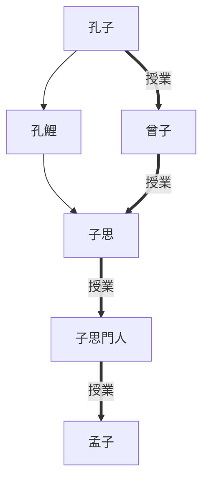

# 孟子

> 2022/10/8->2022/10/20

- 孟子師承

## 卷一 梁惠王上
- 共7章，1-5章對梁惠王，6章對梁襄王，7章對齊宣王
- 主講義利、仁政
- 開篇抨擊始作俑者，贊成以羊易牛的奇怪仁義
> 汤誓曰：‘时日害丧？予及女偕亡。’

## 卷二 梁惠王下
- 共16章，1-11章對齊宣王，12章對鄒穆公，13-15章對滕文公，16章對魯平公
- 主張與民同樂、民貴君輕的民本思想，堅決仁政不動搖
> 行止，非人所能也。吾之不遇鲁侯，天也。：凡事歸命於天，孟子所開先河，為項羽繼承

## 卷三 公孫丑上
- 共9章，1-2章與公孫丑問答，3-9章為語録
- 主講仁政、個人修養及人性
- 治進亂退：伯夷；治亂皆進：伊尹；可進可退：孔子

## 卷四 公孫丑下
- 共12章語録
- 孟子仕齊去齊事。主講天時地利人和、君臣關係、靈活處事（擡槓）
> 天下有达尊三：爵一，齿一，德一。朝廷莫如爵，乡党莫如齿，辅世长民莫如德。

## 卷五 滕文公上
- 共5章，1-3章對滕文公，4章駁農家許行，5章駁墨家夷之
- 主講井田制、行仁由己，批駁農家墨家

## 卷六 滕文公下
- 共10章語録，2章批縱橫家，9章批楊朱墨翟
- 主講中庸，士的為官原則
> 曾子曰：‘胁肩谄笑，病于夏畦。’

## 卷七 離婁上
- 共28章短篇語録
- 主講仁義的價值，反求諸己等
> 为政不难，不得罪于巨室。
> 一正君而国定矣
> 有不虞之誉，有求全之毁。

## 卷八 離婁下
- 共33章短篇語録
- 主講個人修養、待人接物、學習方法等
> 故为政者，每人而悦之，日亦不足矣。

## 卷九 萬章上
- 共9章答萬章之問，除第4章論詩
- 主講孝悌、民本思想、潔身自好

## 卷十 萬章下
- 共9章論述，2章答北宮錡之問，3-4、6-8章萬章，9章對齊宣王
- 主講交友、匡君諫主，評論人物、文藝
- 就職三層次：行可，可實現自身理想；際可，受到重用；公養，待遇不錯

## 卷十一 告子上
- 共20章，1-4章對告子，5-6章答公都子，7-20章論述，唯15章答公都子
- 辯論性善、保護本性、魚與熊掌不可兼得
> 富岁，子弟多赖；凶岁，子弟多暴
> 仁，人心也；义，人路也。舍其路而弗由，放其心而不知求，哀哉！人有鸡犬放，则知求之；有放心，而不知求。学问之道无他，求其放心而已矣。

## 卷十二 告子下
- 共16章，1章答屋盧子，2章答曹交，3章答公孫丑，4章答宋鈃（宋牼），5章答屋盧子，6章對淳于髡，7章論五霸，8章對禽滑釐（慎子），9章論民賊，10-11章答白圭，12章論守信，13章答公孫丑，14章答陳臻，15章論生於憂患死於安樂，16章講教育
- 與眾人問答，主講禮儀修身、尊王抑霸等

## 卷十三 盡心上
- 共46章短篇語録
- 主講自身修養、羞恥心、仁政、民本思想、君子之道等
- 舜父殺人，孟子建議舜棄國劫獄逃匿，如此則正義不得伸張，且國家失一賢君而大亂
> 孟子曰：“人之有德慧术知者，恒存乎疢疾。独孤臣孽子，其操心也危，其虑患也深，故达。”

## 卷十四 盡心下
- 共38章短篇語録
- 主講仁者無敵、民貴君輕、個人修養
> 舜之饭糗茹草也，若将终身焉；及其为天子也，被袗衣，鼓琴，二女果，若固有之。
> 人病舍其田而芸人之田，所求于人者重，而所以自任者轻