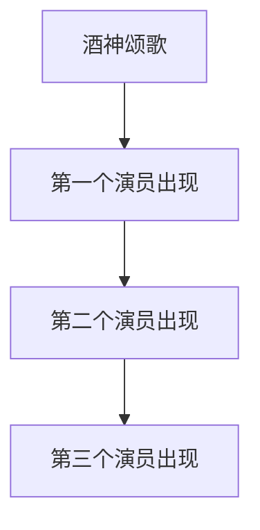
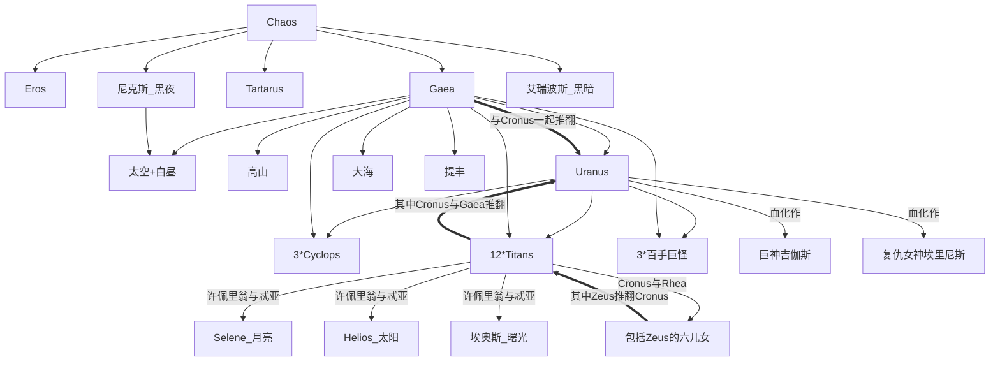
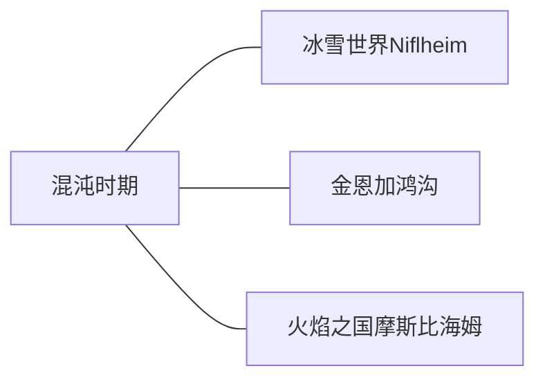
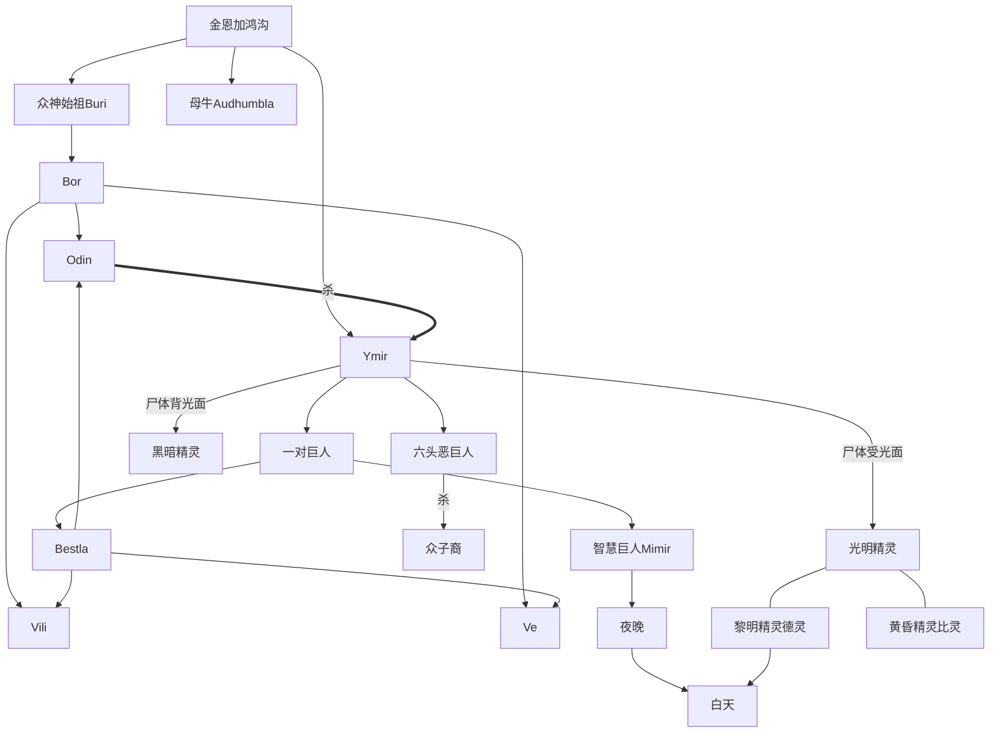
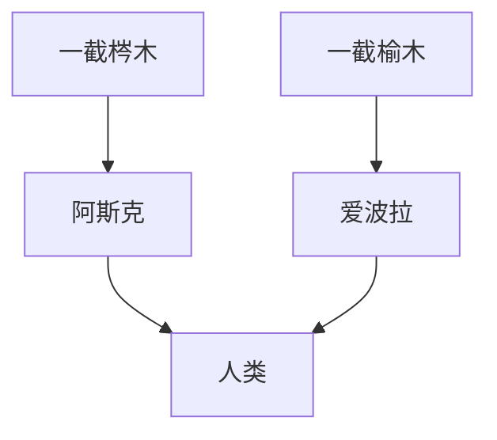

# 古希腊文学

## 一 位置
- 包括希腊半岛、爱琴海各岛屿和小亚西亚沿海地带、意大利南部、西西里岛等地。

## 二 各个时期

### 1. 荷马时代（英雄时代）
- 从氏族公社制向奴隶制社会过渡，BC11c－BC9c
- 主要成就：神话、史诗
    - （1）荷马（Homer）史诗：BC9c－BC8c流传
    - （2）赫西俄德（Hesiod）：
        - 教诲诗《工作与时日》，以现实为题材的长篇叙事诗。将世界分为“金、银、铜、英雄、铁”五个时代。
        - 《神谱》（BC8c末－BC7c初）
    - （3）神话
        - 内容：神的故事；英雄传说（源于祖先崇拜）
        - 特点：人神同形同性

### 2. 古风时期（大移民时代）
- 氏族社会进一步解体，奴隶制城邦逐渐形成，BC8c－BC6c
- 主要成就：抒情诗、寓言
    - （1）抒情诗
        - 笛歌（哀歌）：双管笛伴唱，包括挽歌、战歌、情歌
        提尔泰奥斯－战歌、梭伦－政治诗、西摩尼得斯－墓志铭
        - 琴歌：竖琴伴奏
            - 独唱体（贵族阶层）：萨福、阿那克里翁、阿尔凯奥斯（饮酒歌）
            - 合唱体（颂神、竞技）：品达罗斯
        - 讽刺诗：阿耳喀罗科斯
    - （2）寓言：
        - 《伊索寓言》：反映平民思想感情，BC6c

### 3. 古典时期
- 奴隶制民主制发展鼎盛，尤其在伯利克里时期（BC443－BC429）异常兴盛，BC6c末－BC4c初
- 主要成就：戏剧、散文、文学理论
    - （1）戏剧
        - 三大悲剧诗人
        - 喜剧作家：阿里斯托芬（旧喜剧），“喜剧之父”
    - （2）散文
        - 历史作家
            - “历史之父”希罗多德：《历史》（希波战争）
            - 修昔底德
            - 色诺芬
        - 演说：狄摩西尼、伊索克拉底
    - （3）文艺理论
        - 柏拉图（Plato）：奴隶主贵族派思想家，客观唯心主义哲学的鼻祖（核心：理念论）。
            - 文艺论著：《斐德诺》、《会饮》
            - 政治纲领：《理想国》
        - 亚里士多德（Aristotle）：《诗学》、模仿说

### 4. 希腊化时期
- 希腊被马其顿征服，衰落阶段，BC4c－BC2c
- 主要成就：新喜剧（事态剧）、田园诗
    - （1）米南德（Menandros）：现仅存新喜剧《恨世者》、《萨摩斯女子》、《公断》（残）
    - （2）忒奥克里托斯：田园诗人

## 三 古代希腊戏剧

### 1. 起源
- 酒神Dionysos的祭典：
    - （1）“酒神颂歌”－“悲剧”（“山羊之歌”）
    - （2）狂欢歌舞活动－“喜剧”（“狂欢之歌”）

### 2. 发展

- 酒神颂歌：“酒神颂歌”合唱队
- 第一个演员出现：“应和人”
- 第二个演员出现：始于埃斯库罗斯
- 第三个演员出现：始于索福克勒斯

### 3. 组成与结构
- （1）组成
    - 戏剧
    - 合唱队的抒情
- （2）结构
    - 开场
    - 进场曲
    - 三至七个戏剧场面，与相应数目的合唱歌
    - 退场

### 4. 三大悲剧诗人
- （1）埃斯库罗斯
    - 使戏剧脱离祭典而成为一种独自的艺术形式；“悲剧之父”
    - 《被缚的普罗米修斯》
- （2）索福克勒斯
    - 标志着希腊悲剧发展的成熟阶段；“戏剧界的荷马”
    - 《俄狄浦斯王》
- （3）欧里庇得斯
    - “舞台上的哲学家”
    - 《美狄亚》

### 5. 喜剧
- 阿里斯托芬
    - 主要作品：《阿哈奈人》、《骑士》、《鸟》

## 四 希腊神话
### 1. 旧神谱系
- 体现了原始社会的杂婚制及母权制。
- 旧神谱系
    - 包括Zeus的六儿女：女灶神赫斯提亚、Hera、Demeter、Hades、Poseidon、Zeus

### 2. 新神谱系
- 与旧神谱系以宙斯为划分界线
- 十二位主要神祇：
    - 宙斯（Zeus）：众神之王、雷电之王、保障宾主间道义，圣鸟为鹰
    - 波赛冬（Poseidon）：海神，Zeus兄弟
    - 哈德斯（Hades）：冥王，Zeus兄弟
    - 赫拉（Hera）：天后，婚姻的庇护神，Zeus姐姐（当然也是他老婆……）
    - 得墨忒尔（Demeter）：农业女神、丰产女神，Zeus姐姐
    - 雅典娜（Athena）：智慧女神、战斗女神、雅典城邦保护者，Zeus女儿
    - 阿波罗（Apollo）：太阳神、光明之神、预言之神、射神、诗神、保护牲畜之神，Zeus与勒托之子
    - 阿尔忒弥斯（Artemis）：月亮女神、狩猎女神，Zeus与勒托之女
    - 阿芙洛蒂特（Aphrodite）：爱与美的女神，Zeus之女
    - 阿瑞斯（Ares）：战神，Zeus之子
    - 赫淮斯托斯（Hephaestus）：火神、工匠神，Zeus之子
    - 赫尔墨斯（Hermes）：众神使者，Zeus之子
- 其余重要神祇或其它：
    - 命运三女神：
        - 克罗托－纺织命线
        - 阿特洛波斯－严厉
        - 拉刻西斯－分配命运
    - 九位文艺女神缪斯（Muse）
    - 赫柏（Hebe）：青春女神。赫拉克勒斯（Heracles）之妻
    - 厄里斯：纷争女神
    - Iris：彩虹、神使
    - 刻戎：医药祖师。Cronus之子，半人马
    - 狄奥尼索斯（Dionysos）：酒神、自然之神
    - 埃俄罗斯：风神
    - 地狱四河：
        - 恨河Styx
        - 怨河Acheron
        - 叹河Cocytus
        - 火河Phlegethon
        - 另有较小的忘河Lethe

## BC146，希腊被罗马灭亡。

---

# 北欧神话

## 神谱
- Odin(Odhinn)杀Ymir，流血成洪，淹没众巨人，贝各尔密夫妇幸存。用Ymir尸体创造世界，东西南北四侏儒撑天。
- 月亮(m)、太阳(f)来自巨人国。
- 黑暗精灵即侏儒，光明精灵即精灵。

## 人类的诞生

## 众神及其它
1. 奥丁（Odin）：众神之主、暴风之神、战斗之神、永恒的放浪者、诗神，掌管诗歌与死亡，独眼。宫殿为瓦尔哈尔宫（Valhalla）。左右侍女为列斯特、密斯特。双肩有乌鸦胡晋（象征思想）与穆宁（象征记忆）。膝下两狼格里与弗雷克。坐骑八腿斯雷普内尔（Sleipmir），为神骏斯华尔帝尔弗利所生
2. 大地：女巨人。与Odin生长子托尔
3. 托尔（Thor）：力量之神、雷神（雷霆之槌），负责保卫亚萨园（Asgard）
4. 乌尔（Ull）：弓箭之神、狩猎之神、滑雪之神。Thor与西芙之子。住在紫衫树谷。与人类友好
5. 弗丽格（Frigg）：婚姻爱情的女神，女巨人，Odin之妻
6. 巴尔德尔（Balder）：光神，Odin与Frigga的长子，性情温和，正直、忠实。
7. 蒂尔（Tyr）：战神，牺牲右手以摆脱芬瑞尔狼（Fenrir）
8. 布拉吉（Bragi）：诗歌之神，人称“长胡子亚萨”
9. 海姆道尔（Heimdall）：亚萨园大门的守卫者
10. 霍德尔：眼盲，忠厚老实，亚萨园力量第三
11. 维达尔：力量第二，沉默，乐于助人
12. 莎加：Odin最宠爱的女儿
> 6－12为Odin与Frigga的众子裔
13. 洛基（Loki）：霜的巨人，Odin的结拜兄弟，后从魔道
14. 芙蕾雅（Freya）美神、爱情女神，尤其是初恋
15. 雷加鲁克（Ragnarok）：即世界末日，唯Odin夫妇及智慧巨人密密尔（Mimir）知此
16. 瓦尔哈尔宫：亚萨园最大的建筑，用于召唤人间牺牲的战士。Odin希望以这些死亡战士的力量，与雷加鲁克进行最后的决战
17. 瓦格雷（Valkyries）：Odin的众女侍，以山羊海德伦的奶喂养死亡战士们
18. 安德里门尔：死亡战士的厨师，以不死的野猪山里姆尔的肉喂养他们
19. 命运三女神（Norns）：守护宇宙树Yggdrasil
    - 乌达（Urd）－纺线－知过去
    - 维丹蒂（Verlandi）－捻线－知现在
    - 丝可特（Skuld）－剪线－知未来

---

# 古代罗马文学
- BC3c－AD5c中叶

## 一 共和国时期
- BC3c－BC2c
- 发端：李维乌斯将《奥德修记》译成拉丁文
- 主要成就：戏剧
    - 喜剧作家：
        - 普劳图斯：《一坛黄金》、《孪生兄弟》、《吹牛的军人》
        - 泰伦提乌斯：《婆母》、《两兄弟》

## 二 共和国晚期和“奥古斯都”时期（“黄金时期”）
- BC1c－AD1c
- 共和国晚期：
    - 主要成就：散文、诗歌
    - 散文：西塞罗（Cicero）
    - 诗歌：卢克莱修，哲理诗《物性赋》
- “奥古斯都”时期（“麦凯纳斯文学集团”）
    - （1）维吉尔：
        - 史诗《埃涅阿斯记》
        - 《牧歌》、《农事诗》
    - （2）贺拉斯：树立了罗马抒情诗的典范，是继承亚里士多德的文艺理论家
        - 《歌集》、《诗艺》（文艺理论）
    - （3）奥维德
        - 神话故事诗《变形记》

## 三 帝国时期（“白银时期”）
- AD1c－AD5c
- （1）悲剧：塞内加
- （2）社会讽刺诗：尤维纳利斯
- （3）传记文学：
    - 塔西陀
    - 普卢塔克《希腊、罗马名人传》
- （4）长篇小说：
    - 阿普列尤斯（北非）《金驴记》：欧洲最早的一部完整的长篇小说
- 晚期，基督教成为罗马的国教，基督教文学占据文坛的统治地位。

# 公元476年，西罗马帝国灭亡。

---

# 中世纪文学
- 5c－15c

## 一 中世纪早期的欧洲文学
- 5c－11c

### 1. 教会统治和教会文学
- （1）基督教的发展
    - 起源：BC1c初的罗马帝国
    - 392年，罗马皇帝宣布基督教为国教
    - 1054年基督教内东西两派正式分裂，天主教在中世纪欧洲各国的思想领域中享有无上权威的地位。
- （2）圣经
    - 《旧约》：犹太教的正式经典（见东方文学部分）
    - 《新约》

### 2. 人民英雄史诗
- 歌颂部落英雄（民族大迁徙时期）
- 盎格鲁·撒克逊人的《贝奥武甫》（Beowulf）
- 冰岛的《埃达》（Edda）和《萨迦》（Saga）
- 芬兰的《卡列瓦拉》（即《英雄国》）

## 二 中世纪中期的欧洲文学
- 11c－14c末

### 1. 英雄史诗和民间谣曲
- 歌颂爱国思想为主
- 法国的《罗兰之歌》
- 西班牙的《熙德之歌》（Poema de mio Cid）
- 德意志的《尼伯龙根之歌》（Nibelungenslied）
- 古罗斯的《伊戈尔远征记》
- 谣曲：英国的《罗宾汉谣曲》

### 2. 骑士文学
- 世俗封建主的主要成就
- 骑士的信条：忠君、护教、行侠
- 主要体裁
    - a.骑士抒情诗：普罗旺斯抒情诗，歌颂“典雅爱情”
        - “破晓歌”最为有名
    - b.骑士叙事诗：骑士文学的主要形式，受十字军战争的影响使其带有国际性
        - 来源：三个系统
            - （a）古克尔特人的亚瑟王与他的圆桌骑士的不列颠故事诗
                - 法国诗人克雷蒂安·德·特罗阿《郎斯洛》
                - “特里斯丹与依瑟”的故事
            - （b）希腊晚期传说为题材的拜占庭故事诗
            - （c）模仿古希腊罗马文学作品的叙事诗

### 3. 城市文学
- 反映市民意识，是近代文学的先声
- 主要手法：讽刺
- 主要形式
    - 韵文故事（笑话）：如《驴的遗嘱》、《神父阿米斯》
    - 讽刺叙事诗：代表作法国《列那狐传奇》
    - 寓言诗
- 其它代表作
    - 法国的《玫瑰传奇》
    - 诗人：
        - 吕特博夫（法）
        - 维庸《大遗言集》：被看做中世纪最优秀的抒情诗人
    - 城市戏剧
        - 道德剧
        - 闹剧（幕间剧）：法国的《巴特兰律师》

### 4. 但丁（Dante）
- 《新生》：用散文连缀的30首献给贝亚德丽斯的诗
- 《神曲》

---

# 文艺复兴时期欧洲文学

## 一 概述
- 1. 文艺复兴：14c－17c初，在欧洲出现的资产阶级以复兴古代文化为旗号的反封建反教会的思想文化解放运动。
- 2. 人文主义：文艺复兴时期形成的资产阶级世界观。性质：反封建反教会

## 二 文艺复兴时期的各国文学
### 1. 意大利文学
- （1）早期人文主义（14c下半期）
    - 特点：提倡复古、反对禁欲，肯定人有权享受现世幸福；将个人幸福、利益看得至高无上
    - a.彼得拉克：“第一个人文主义者”“桂冠诗人”
        - 主要成就：抒情诗集《歌集》
    - b.薄伽丘
        - 《十日谈》：欧洲近代文学史上第一部现实主义作品。
- （2）晚期人文主义（15c以后）
    - 特点：古籍研究的成绩突出。15c后期衰落。
    - a.阿里奥斯托
        - 长篇叙事诗《疯狂的罗兰》
    - b.塔索（Tasso）：意大利文艺复兴运动的最后一个代表作家
        - 长诗《被解放的耶路撒冷》

### 2. 法国文学
- （1）早期人文主义（16c兴起）
    - 特点：受到王权的支持，1530年建立专门研究古代语言的法兰西学院。
    - a.龙沙为首的贵族派人文主义集团“七星诗社”
    - b.拉伯雷：强烈的反封建反教会的倾向，创作与人民保持着密切的联系。代表作《巨人传》
- （2）后期人文主义（16c后半期）
    - 特点：人文主义运动逐渐消亡
    - a.蒙田：主张宗教宽容和阶级妥协
        - “怀疑论”：大变动时代的一种反映
        - 《随笔集》：反映人文主义思想和中庸观点

### 3. 西班牙文学
- （1）发展
    - 15c末－16c初：结束了反侵略斗争，摆脱了长期以来摩尔人的侵略，完成国内统一。
    - 16c：进入其繁荣时期，称为“黄金时代”
    - 16c中－17c初：全盛时期
    - 17c20年代后：由于西班牙人文主义者摆脱不了封建的宗教的思想影响，文艺复兴运动趋于衰落
- （2）成就
    - a.戏剧
        - 维加：“黄金时代”西班牙民族戏剧的代表，题材以社会政治剧、爱情家庭剧和宗教剧为主
            - 《羊泉村》、《当代编剧新艺术》（总结创作经验）
            - 强调“模仿真实”
    - b.小说
        - 流浪汉小说：西班牙独有的，欧洲现实主义小说的重要渊源。
            - 最早且最好的流浪汉小说：《托梅斯河上的小拉撒路》（《小癞子》）
        - 塞万提斯：《堂吉诃德》

### 4. 英国文学
- （1）14c（“曙光”）：封建社会向资本主义过渡
    - 乔叟（Chaucer）：《坎特伯雷故事集》
- （2）15c末
    - 托马斯·莫尔（Thomas Moore）：对话幻想体小说《乌托邦》－－近代空想社会主义小说的开端
- （3）16c中叶以后（兴盛时期）
    - 主要成就：诗歌、戏剧
    - a.诗歌
        - 莎士比亚（Shakespeare）：十四行诗
        - 斯宾塞（Spenser）：《仙后》－－当时英诗的代表作
    - b.戏剧：人文主义戏剧
        - “大学才子派”
            - 马洛：运用素体无韵诗写剧。
                - 三部悲剧《帖木儿》、《马尔他岛的犹太人》、《浮士德博士的悲剧》
        - 莎士比亚

## 三 重要作家
### 1. 塞万提斯（1547－1616）
- 主要成就：悲剧和小说
    - （1）悲剧：《努曼西亚》：反映青年时代塞万提斯爱自由、爱祖国的英雄主义精神
    - （2）短篇小说集《训诫小说》
        - 意大利小说型的作品：《吉普赛的姑娘》等
        - 西班牙流浪汉小说型的作品：更具现实性和揭露性。《玻璃硕士》等
    - （3）堂吉诃德
### 2. 莎士比亚（1564－1616）
- （1）第一时期（历史剧、喜剧时期）：从思想到艺术逐渐成熟，并且取得初步成就的时期。
    - 基调：明朗、乐观
    - 《亨利四世》（上、下），《威尼斯商人》、《罗密欧与朱丽叶》
- （2）第二时期（悲剧时期）：无论从思想的深刻性，还是从艺术的完美来讲，都达到了创作的最光辉时期。
    - 基调：悲愤、阴郁
    - 四大悲剧：《哈姆莱特》、《奥赛罗》、《李尔王》、《麦克白》
- （3）第三时期（传奇剧时期）：因为不可能从现实生活中找到解决矛盾的出路，便梦想用超自然的力量解决矛盾，实现理想。
    - 《暴风雨》：“诗的遗嘱”

---

# 十七世纪欧洲文学
- 各国文学的发展情况呈现出复杂的局面

## 一 各国文学
### 1. 意大利、德国、西班牙文学：衰微
- （1）格里美尔豪生（德）小说《西木卜里其西木斯奇遇记》（《痴儿西木传》）：“德国十七世纪文学高峰”
- （2）卡尔德隆（西）戏剧《萨拉梅亚的镇长》、《人生如梦》
- （3）夸饰主义文学流派（巴洛克文学）
    - 马里诺（意）－“马里诺诗派”－《阿童尼》
    - 贡戈拉（西）－“贡戈拉主义”
    - 特点：思想上的悲观主义和艺术上的浮夸风格。

### 2. 英国文学
- 反映了资产阶级革命前后复杂的社会矛盾
- （1）革命前夕：玄学派、骑士派vs清教徒诗人
- （2）革命时期：利尔本、温思特莱等人的“小册子”
- （3）复辟时期：宫廷古典主义盛行
    - 约翰·德莱顿
    - 清教徒作家约翰·班杨的讽喻小说《天路历程》
- （4）弥尔顿（Milton）：清教徒革命家
    - 口授：长诗《失乐园》、《复乐园》，诗剧《力士参孙》

### 3. 法国文学
- （1）17c上半期：混乱状态
    - “贵族沙龙文学”vs市民文学：保尔·斯卡龙，戴奥菲尔·德·维奥
- （2）“古典主义”出现
    - 主要成就：戏剧
    - 最早：马莱伯
    - 法兰西学士院成立
    - 六、七十年代达到隆盛时期
- （3）代表作家及理论家
    - a.高乃依：法国古典主义悲剧的创始人。塑造理想化的英雄形象，充满爱国主义精神。
        - 《熙德》：法国古典主义悲剧奠基作
        - 《贺拉斯》、《西娜》、《波利厄克特》
    - b.拉辛：代表古典主义悲剧的最高成就。揭露统治阶级。
        - 《安德罗马克》、《费德尔》
    - c.布阿洛：诗体文艺理论著作《诗的艺术》，被奉为古典主义的法规。
    - d.拉封丹：寓言
    - e.莫里哀Molière
        - 第一时期：初返巴黎，逐渐接近王权，接受古典主义。
            - 《妇人学堂》：开欧洲近代社会问题剧之先河，标志着法国古典主义喜剧的形成。
        - 全盛时期：《伪君子》（《Tartuffe》）、《唐璜》、《恨世者》、《悭吝人》（《Avare》）、《乔治·唐丹》
        - 后期：艺术上更多运用民间闹剧的手法
            - 《史嘉本的诡计》

## 二 古典主义
- 1. 政治上拥护王权，维护国家统一，具有鲜明的政治倾向
- 2. 唯理主义：崇尚理性。哲学基础：笛卡尔的理性主义
- 3. 提倡师法古人，模仿古典，遵循一定的规则
    - 布阿洛误解的“三一律”

---

# 十八世纪欧洲文学

## 一 启蒙运动和启蒙文学
- 1. 反对宗教迷信和专制制度，提出“契约论”，“法律面前人人平等”，“自然原则”，“天赋人权”，崇尚理性
- 2. 启蒙文学：鲜明的倾向性、教诲性。初期以古典主义形式表现新内容。特点：
    - 继承发展了文艺复兴时期的现实主义传统
    - 资产者和下层人民成为正面主人公
    - 作品带有政论性、哲理性、分析性
    - 新体裁出现，如正剧、文艺政论、哲理小说

## 二 感伤主义
- 首先于18c下半期产生于英国。崇尚感情，力图以情动人

## 三 人民群众诗歌
- 表现了人民高涨的革命热情
    - 法：《马赛曲》、《卡尔玛纽尔》、《撒伊拉》
    - 英：农民诗人罗伯特·彭斯（Robert Burns）

## 四 各国文学

### （一）英国文学
1. 初期的“温和派”：用古典主义方法写作。代表：蒲柏
2. 英国现实主义小说的产生：《鲁滨逊漂流记》
    - （爱尔兰）斯威夫特（Swift）：树立了民主的讽刺的传统
3. 18c四十年代后：主要写家庭生活，细腻写实
    - 撒谬尔·理查逊：首创书信体小说
    - 《帕美勒》、《克拉丽莎》
    - 多比亚斯·乔治·斯摩莱特：揭露社会丑恶。
    - 《蓝登传》、书信体小说《亨佛利·克林克》
4. 感伤主义文学：否定理性。批评贵族、大资产阶级的丑恶，同情劳动人民。创造了日记体、游记体等。反映中小资产阶级的情绪。
    - 哥尔斯密斯
    - 斯泰恩（感伤主义的名称来自其小说《感伤的旅行》）
5. 亨利·菲尔丁
    - 《约瑟·安德鲁传》、《大伟人江奈生·魏尔德传》
    - 《汤姆·琼斯》、《阿米利亚》
    - 将小说称为“散文体喜剧性的史诗”

### （二）法国文学
1. 初期：古典主义文学占统治地位；出现讽刺性写实文学：阿兰－列内·勒萨日《吉尔·布拉斯》
2. 启蒙文学：
    - 孟德斯鸠（Montesquieu）
        - 《波斯人信札》：开哲理小说之先河
        - 《论法的精神》（《Esprit des Lois》）
    - 伏尔泰（Voltaire）：信奉古典主义，宣传启蒙思想。
        - 26部哲理小说，如《查第格》、《老实人》（《Candide》）、《天真汉》
        - 十八世纪中叶，启蒙运动发展到成熟阶段
    - 狄德罗：美学理论家，主张“正剧”
        - 《修女》，《宿命论者雅克》、《拉摩的侄儿》
    - 卢梭（Jean-Jacques Rousseau）
        - 《论科学与艺术》、《论人类不平等的起源和基础》
        - 《社会契约论》：提出民主选举的共和制思想
        - 《新爱洛绮丝》、《爱弥儿》、《忏悔录》（《Confessions》）
3. 18c末
    - 博马舍《塞维勒的理发师》、《费加罗的婚礼》

### （三）德国文学
1. 启蒙思潮：高特舍特、莱辛
    - 莱辛（Lessing）：德国民族文学的奠基人
        - 戏剧理论著作《汉堡剧评》，美学著作《拉奥孔》
        - 喜剧《明娜·封·巴尔赫姆》，悲剧《爱米丽雅·迦洛蒂》
        - 诗剧《智者纳旦》
2. 七、八十年代的“狂飙突进运动”
    - 命名：克林格尔的剧本《狂飙突进》
    - 特点：强调文学的民族性，学习民间文学。反对封建束缚，强烈要求个性解放，强调“天才”。歌颂自然。
    - 赫尔德尔：理论家和精神领袖
    - 代表作家：
        - 青年歌德（Goethe）：《铁手骑士葛兹》、《少年维特的烦恼》（Die Leiden des Jungen Werthers）
        - 席勒（Schiller）：《强盗》、《阴谋与爱情》
3. 18c法国大革命后出现的“古典派”
    - 代表作家：
        - Goethe
        - Schiller：《华伦斯坦》、《奥尔良的姑娘》、《威廉·退尔》

---

# 十九世纪前期的西欧文学（浪漫主义）

## 一 浪漫主义文学思潮
1. 特征
    - 着重表现作家主观理想，抒发强烈的个人感情
    - 着力歌颂大自然
    - 重视民间文学
    - 喜欢用夸张、对比的手法，追求强烈的艺术效果
2. 主要成就：诗歌、历史小说
3. 首先兴起于18c末的德、英

## 二 各国文学
### （一）德国文学
1. 早期浪漫派：表现返回中世纪的倾向
    - 史雷格尔兄弟：德国浪漫主义理论的奠基者
    - 刊物《雅典娜神殿》，提出诗人创作可以为所欲为。
    - 诺伐里斯《夜的颂歌》
    - 蒂克：创立德语文学的童话小说《金黄头发的艾克贝尔特》
2. 晚期浪漫派：具有宗教思想和封建观念
    - 阿尔尼姆与布伦塔诺《儿童的神奇号角》
    - 格林兄弟的《儿童与家庭童话集》
    - 抒情诗人艾沁多尔夫
3. 拿破仑失败后，神圣同盟统治下：表现出反封建的民主倾向，向民主主义文学过渡
    - 沙米索：童话小说《彼得·史勒密奇遇记》：揭露金钱的罪恶
    - 霍夫曼（Hoffmann）：童话《侏儒查赫斯，绰号朱砂》：对社会揭露和讽刺，风格神秘怪诞
4. 海涅（Heine）（属19c中期）
    - 第一时期（1797－1830）
        - 《歌集》：奠定了抒情诗人的地位
        - 《哈尔茨山游记》、《观念－勒·格郎特文集》、《从慕尼黑到热那亚的旅行》、《璐珈浴场》，《英国断片》四部游记：抨击德国封建统治，同情人民，向往革命，像革命民主主义转化
        - 《颂歌》（我是剑，我是火焰……）
        - 刊印《新春诗》，离德赴法，结束爱情诗阶段
    - 第二时期（1831－1848）：高峰期，政治与艺术结合
        - 论文：《论浪漫派》、《论德国宗教和哲学的历史》
        - 长篇讽刺诗《阿塔·特罗尔》：嘲讽资产阶级激进派等人
        - 《德国－－一个冬天的童话》：一部诗体游记，矛头指向普鲁士政府。把对德国现实的描绘和幻想形象交织一体。
        - 政治诗集《时代的诗》：如《西里西亚的纺织工人》
    - 第三时期（1848－1856）
        - 《罗曼采罗》：史诗、悲歌、希伯来调。如《决死的哨兵》

### （二）英国文学
1. 第一代浪漫主义诗人（湖畔诗人）：早年欢迎法国大革命，后来遁世
    - 华兹华斯（Wordsworth）：
        - 与柯勒律治合写的《抒情歌谣集》，其《序言》成为英国浪漫主义文学的纲领
        - 《丁登寺》、《不朽的征兆》：探索自然和人生关系
        - 《序曲》：似回忆录
    - 柯勒律治：英国浪漫派莎评的重要代表
        - 叙事诗《古舟子咏》：探索人生的罪与罚
2. 第二代浪漫主义诗人：坚持启蒙理想，赞同法国大革命，支持工人运动及民族解放，反对统治集团及神圣同盟，反教会。
    - （1）雪莱（Shelley）：英诗领域第一个表现出空想社会主义理想，传播民主自由、平等博爱的思想，向往没有剥削与压迫的理想社会。
        - 长诗《麦布女王》、《伊斯兰起义》，诗剧《钦契》
        - 政治诗《写在卡瑟尔瑞执政时期》等
        - 诗剧《解放了的普罗米修斯》
        - 抒情诗《云》、《致云雀》、《西风颂》
    - （2）济慈（Keats）
        - 长诗《伊莎贝拉》、《安迪米恩》
        - 抒情诗《夜莺颂》、《希腊古瓷颂》、《秋颂》
    - （3）拜伦（Byron）
        - 早期的生活和创作（1788－1809）
            - 抒情诗《我愿作无忧无虑的孩子》
            - 诗集《懒散的时刻》
            - 讽刺诗《英格兰诗人和苏格兰评论家》
        - 第二时期的创作（1809－1816）
            - 长诗《恰尔德·哈洛尔德游记》（一、二章）
            - 讽刺诗《<制压破坏机器法案>制定者颂》
            - 《东方叙事诗》、《海盗》：体现“拜伦式英雄”
            - 《拿破仑颂》
        - 第三时期（1816－1824）
            - 哲理诗剧《曼弗雷德》
            - 与雪莱相会
            - 诗剧《该隐》，诗体小说《唐璜》
            - 政治讽刺诗《审判的幻景》
    - （4）斯可特（Scott）（苏格兰）：欧洲历史小说创始人。
        - 《艾凡赫》
    - （5）简·奥斯汀：现实主义文学的代表
        - 《理智与感情》、《傲慢与偏见》、《爱玛》
        - 描写英国乡间中产阶级的生活，青年恋爱婚姻故事
    - （6）艾米莉·勃朗特（属19c中期）
        - 《呼啸山庄》

### （三）法国文学
1. 倡导者：
    - a.夏多布里昂：守旧，拥护波旁王朝，矫揉造作
        - 中篇小说《阿达拉》、《勒内》：“世纪病”的典型
    - b.斯塔尔夫人：坚持民主自由。把西欧文学划分为南方文学（古典）和北方文学（浪漫）
        - 《黛尔菲娜》、《高丽娜》
        - 拉马丁《沉思集》、《诗与光的和谐》
        - 维尼《爱洛亚》、《摩西》、《洪水》，历史小说《散－马尔斯》
2. 20年代中期
    - （1）雨果（Victor Hugo）
        - 《克伦威尔序言》：成为浪漫主义的宣言，雨果成为浪漫主义运动的领袖。“浪漫主义其真正的定义不过是文学上的自由主义而已。”
        - 剧本《艾尔那尼》：标志着浪漫主义对古典主义斗争的胜利
        - 长篇历史小说《巴黎圣母院》（《Notre-Dame de Paris》）：对照原则充分体现
        - 中篇小说《克洛德·格》
        - 诗集《秋叶集》、《微明之歌》：有鲜明的时代烙印
        - 诗集《心声集》、《光与影》
        - 政治讽刺诗集《惩罚集》：洋溢革命气势
        - 《悲惨世界》（《Misérables》）
        - 《海上劳工》、《笑面人》：明显的浪漫主义特色
        - 《九三年》：晚期重要作品
    - （2）贝朗瑞：以政治歌谣为主，具有现实主义因素
        - 成名作《意弗托国王》
    - （3）大仲马（Alexandre Dumas Père）（属19c中期）：通俗小说作家。《三个火枪手》（《Trois Mousquetaires》）、《基督山伯爵》（《Comtede Monte-Gristo》）
    - （4）乔治·桑（属19c中期）：《安吉堡磨工》

---

# 十九世纪中期西欧文学（现实主义）

## 一 现实主义文学思潮
1. 基本特征
    - 反映生活的真实性
    - 强烈的暴露性和批判性（故高尔基称之为“批判的现实主义”）
    - 人道主义思想
    - 描写典型环境中的典型性格
2. 30年代最早在法国出现，使长篇小说空前繁荣

## 二 各国文学
### （一）法国文学
1. 司汤达（Stendhal）
    - 早期活动（1783－1814）
        - 从军至拿破仑失败，研究心理分析
    - 王政复辟时期的创作（1814－1830）
        - 音乐家传记《海顿、莫扎特、梅托斯太斯的生平》
        - 《意大利绘画史》，游记《罗马、那不勒斯、佛罗伦萨》
        - 文学评论集《拉辛与莎士比亚》：提出现实主义的创作原则。第一部现实主义理论著作。“文艺应像一面镜子”
        - 长篇小说《阿尔芒斯》（处女作）
        - 《红与黑》（《Le Rouge et le Noir》）：第一部真实地反映法国当代社会风貌的现实主义杰作。标志着现实主义文学的诞生
    - 七月王朝时期的创作（1830－1842）
        - 《巴马修道院》
        - 另：贯穿于2、3时期的中短篇小说集《意大利遗事》，如《法尼娜·法尼尼》
    - 评价：法国大革命以后第一个杰出的现实主义作家，法国现实主义文学的奠基者。
2. 巴尔扎克（Honoréde de Balzac）
    - 长篇小说《舒昂党人》：历史小说，成名作。从浪漫主义转向现实主义。
    - 《人间喜剧》（《Comédie humaine》）
    - 构思：
        - 将“作品联系起来”：
        - 分类整理：风俗研究、哲学研究、分析研究
        - 人物再现法
        - “完成一部描写十九世纪的作品”
    - 社会历史内容
        - 第一方面：封建贵族衰亡史
            - 《古物陈列室》、《农民》
        - 第二方面：资产阶级发家史
            - 《高利贷者》、《欧也妮·葛朗台》（《Engénie Grandet》）、《纽沁根银行》
        - 第三方面：揭露金钱的罪恶和资本主义社会中人与人之间冷酷的金钱关系
            - 《欧也妮·葛朗台》、《高老头》（《Père Goriot》）、《幻灭》（包括《两诗人》、《外省人在巴黎》、《发明家的苦恼》）
        - 第四方面：对共和主义者的赞美
            - 《卡金央王妃的秘密》、《幻灭》（其中的克雷斯吉安）、《农民》（其中的米雪龙老爹）
        - 第五方面：对理想社会的探索
            - 《乡下医生》
    - 现实主义特征
        - 把小说创作提高到社会研究和历史哲学的高度
        - 塑造了典型环境中的典型性格
        - 从经济角度去反映社会变革和阶级关系
    - 评价：反映了1789－1848年法国的历史，展现出广阔的社会画面，深刻地揭示历史趋势，是欧洲文学史上史无前例的巨著。
3. 梅里美（Mérimée）：以中短篇小说见长，莫泊桑之前欧洲最主要的短篇小说作家。擅长异国题材，作品精制。
    - 中篇小说《高龙巴》、《卡门》（《Carmen》）
    - 50年代后：现实主义批判性减弱，真实性加强
4. 福楼拜
    - 三、四十年代在浪漫主义的影响下的创作：忧郁、悲观
    - 五、六十年代法兰西第二帝国时期：转型现实主义
        - 《包法利夫人》：揭露资产阶级社会的庸俗、空虚、腐朽。表现了福楼拜独特的客观风格，语言准确而有高度表现力。
        - 历史小说《萨朗波》：体现其科学的考古精神
        - 《情感教育》：反映19c中期资产阶级日益庸俗、堕落
    - 七十年代的晚年创作：悲观思想愈发严重
        - 《圣安东尼的诱惑》、短篇《一颗简单的心》
    - 评价：真实地暴露七月王朝到第三共和国时期法国社会的庸俗和丑恶。艺术上客观、精确、完美。“客观而无动于衷”的创作原则。
5. 同时期“为艺术而艺术”的作家：主张超脱现实生活，表现精神世界
    - 戈蒂耶
        - 《<莫班小姐>序》：法国唯美主义产生的标志
    - 波德莱尔：象征主义流派的先驱
        - 十四行诗《相应》：体现“宇宙万物互相呼应，互为象征”
        - 《恶之花》：“从恶中发掘美”

### （二）英国文学
1. 宪章派文学：最早的无产阶级文学
    - 诗人艾内斯特·琼斯和威廉·林顿
2. 现实主义文学
    - （1）特点：
        - 最先以劳资矛盾为创作题材
        - 反映小资产阶级的个人奋斗
        - 人道主义改良主义色彩浓厚
    - （2）迪更斯（Dickens）
        - 第一时期（1833－1842）：基调乐观，作品幽默讽刺
            - 《匹克威克先生外传》、《雾都孤儿》（《Oliver Twist》）、《老古玩店》
        - 第二时期（1842－1850）：趋于成熟
            - 《马丁·瞿述伟》、《圣诞故事集》、《董贝父子》、《大卫·科波菲尔》（《David Copperfeld》）
        - 第三时期（1850－1870）：繁荣时期
            - 三部典型社会小说《荒凉山庄》、《小杜丽》、《艰难时世》
            - 历史小说《双城记》：明显借古喻今
            - 《远大前程》
        - 评价：资产阶级民主主义者，广泛反映19c中期英国社会，对资本主义制度的各个方面作了深刻揭露，表现出人道主义思想。
    - （3）萨克雷：强调“自然与真实”，揭露上流社会的腐败、自私、虚伪和势利，批判的矛头同时指向资产阶级和贵族。
        - 《名利场》
    - （4）夏绿蒂·勃朗特：描写小资产阶级人物的反抗和奋斗
        - 《简·爱》
    - （5）盖斯凯尔夫人
        - 《玛丽·巴顿》：反映宪章运动时期曼彻斯特的劳资矛盾
        - 传记《夏绿蒂·勃朗特》

### （三）德国文学
- 三十年代初：“青年德意志派”：路德维希·伯尔纳等
- 四十年代：德国早期无产阶级文学出现：格奥尔格·维尔特

### （四）东欧、北欧文学
1. （波兰）亚当·密茨凯维支：民族诗人
    - 长诗《塔杜施先生》
2. （匈牙利）革命诗人裴多菲：表现反对异族压迫和封建专制，争取独立自由的思想。
    - 长诗《使徒》：反映了匈牙利下层人民的悲惨遭遇和1848年革命者的本质特点。
3. （丹麦）安徒生

---

# 十九世纪后期西欧文学

## 一 巴黎工社文学：革命诗歌
- 鲍狄埃、克雷芒、米雪尔（女）、夏特兰、于葛等人
- 另瓦莱斯小说《雅克·万特拉》

## 二 现实主义文学：更注重描写真实性和具体性，也更悲观
1. 法国
    - （1）莫泊桑（Guy de aupoassant）
        - 《羊脂球》（《Boule de Suif》），收于《梅塘之夜》
        - “梅塘集团”：包括左拉、屠格涅夫、龚古尔、莫泊桑，以自然主义标榜，实质写现实主义
        - 长篇小说《一生》：反映地主贵族在生活和道德上必然瓦解的趋势
        - 《俊友》（《Bel ami》）：深刻揭露第三共和国时期法国资产阶级社会的种种丑恶
        - 中短篇小说：取材平凡、客观冷峻、构思巧妙、重视细节描写
            - 以普法战争为背景，揭露普鲁士侵略者的暴行和法国人民的爱国主义精神的。如《米隆老爹》、《蛮大妈》、《菲菲小姐》、《两个朋友》、《女疯子》、《羊脂球》
            - 描写资产阶级的风尚习俗。一方面揭露资产阶级的腐化堕落、拜金主义，一方面描写小资爱虚荣、尚浮华。如《遗产》、《珠宝》、《小酒桶》、《老人》、《我的叔叔于勒》、《项链》
            - 描写穷苦人民悲惨命运和赞颂劳动人民优秀品质的。如《瞎子》、《穷鬼》、《西蒙的爸爸》
    - （2）法朗士
        - 代表作：长篇小说《当代史话》：展现了第三共和国时代在德雷弗斯事件前后的广阔社会画面。包括《路旁榆树》、《柳条模型》、《红宝石戒指》、《贝日莱先生在巴黎》四部曲
        - 短篇小说《克兰克比尔》
        - 晚年《企鹅岛》、《诸神渴了》、《天使的反叛》
        - 文艺批评《文学生活》

2. 英国
    - （1）巴特勒的讽刺小说《埃瑞洪》，梅瑞狄斯的《利己主义者》
    - （2）哈代（Thomas Hardy），三类小说：
        - 人物与环境的小说“威塞克斯小说”
        - 罗曼史和幻想小说
        - 机敏和经验小说
            - 第一部“威”《绿荫下》：反映了作家对宗法制农村充满深厚的感情
            - 长篇小说《远离尘嚣》（放弃建筑师全力写作）
            - 《还乡》、《卡斯特桥市长》：对社会前途抱着悲观的认识
            - 《德伯家的苔丝》（《Tess of the D'Urbervilles》）：反映英国资本主义的发展给个体的小农经济带来的深重灾难，揭露资产阶级暴发户。
            - 《无名的裘德》：最后一部长篇小说。揭露资产阶级教育制度不合理及虚伪的伦理道德、婚姻制度和宗教。
            - （由于遭受攻击，重新致力于诗歌创作）
            - 史诗剧《列王》
            - 中短篇小说，如《三怪客》、《彼特利克夫人》：仿佛是其长篇小说的补充及说明
            - 评价：开辟了农村题材的领域，描写精确、真实，达到情景交融的境界
    - （3）箫伯纳（Bernard Shaw）
        - 费边社成员。（费边社否认阶级斗争，主张劳资合作，想用渐进的改良改革英国社会）
        - 90年代，三个戏剧集
            - 《不愉快的戏剧》：
                - 《鳏夫的房产》：揭露了资产阶级靠剥削穷人以维持其富裕生活的真相
                - 《华伦夫人的职业》：资产阶级的“高雅”生活都是靠肮脏的金钱换来的。
            - 《愉快的戏剧》
            - 《为清教徒写的戏剧》
        - 后期：《伤心之家》：反映资本主义精神危机
        - 政治讽刺剧《苹果车》：揭露资本主义社会议会民主的虚伪软弱
        - 评价：反对“艺术为艺术”的唯美主义倾向，始终主张探讨严肃的社会问题，富有社会批判力量。

## 三 自然主义文学（19c60年代产生于法国）
1. 泰纳：为自然主义打下思想基础，接受孔德实证论，“决定论”（决定文艺创作的是种族、环境、时代三因素）
2. 自然主义：反对浪漫主义的幻象和夸张，反对现实主义通过典型概括的手法反映现实，要求文学成为单纯记录各种平凡琐细事物的照相机，按照严格的科学的方法进行研究和创作，不应流露个人感情或给予评价。
3. 代表人物龚古尔兄弟的小说《日尔米尼·拉赛尔》：一部典型的自然主义作品
4. 左拉（Emile Zola）
    - 《黛莱丝·拉甘》、《玛德兰·费拉》：自然主义成分最明显的作品
    - 《人间喜剧》式的《卢贡－马卡尔家族》：“第二帝国时代一个家族的自然史和社会史”
    - 其中第一部小说《卢贡家族的家运》
    - 《贪欲》：揭露暴发户疯狂投机，猎取财富的丑恶行径
    - 《妇女乐园》：反映商业资本开始集中和大公司出现的情况
    - 《金钱》：描写法国金融资本的发展和竞争
    - 描写工人生活的《小酒馆》：描写工人堕落、落后、丑恶的方面
    - 《萌芽》（《Germinal》）：描写煤矿工人为了反抗资本家剥削而奋起斗争。第一次把无产阶级作为整体力量反映其反抗斗争。描写十分真实。具有粗犷雄浑的美。
    - 最后一部：《崩溃》：揭露资产阶级的卖国政策
    - 三部曲《三城市》：《鲁尔德》、《罗马》、《巴黎》：揭露宗教的欺骗，提倡科学改造社会。
    - 《四福音书》：表现其社会理想。
    - （《娜娜》（《Nana》））

## 四 颓废主义：象征主义和唯美主义
1. 象征主义（神秘主义、唯美主义、悲观主义之和）
    - 产生：七、八十年代的法国，以让·莫雷阿斯发表的一篇象征主义宣言为标志。波德莱尔被认为是象征主义的先驱。
    - 主张：反对现实主义和自然主义如实描写客观世界，表现超现实的“理想世界”。不重视语法和词汇的语意特性，强调音乐性。厌恶资产阶级现状。
    - 作家：
        - 魏尔仑：《无词的浪漫曲》
        - 兰波：十四行诗《母音》、《醉舟》
        - 马拉梅：《牧神的午后》、《天鹅》。主张诗歌不要让人理解，而是让人们去推测。
        - （比）梅特林克：独幕剧《闯入者》

2. 唯美主义：19c后期，英国出现的以王尔德为代表的唯美主义文学。宣扬享乐主义。
    - 童话《快乐王子集》
    - 长篇小说《道林·格雷的画像》
    - 剧本《莎乐美》

## 五 近代戏剧
- 易卜生：欧洲近代戏剧的创始人
    1. 早期创作：浪漫主义历史剧：通过对民族历史和古代英雄的歌颂，激发人民的爱国主义情感，为挪威当时的民族独立运动服务。
        - 《英格夫人》、《觊觎王位的人》
        - 侨居意大利后：
            - 哲理诗剧《布朗特》：一个为理想牺牲的悲剧
            - 哲理诗剧《培尔·金特》：揭露小资产阶级市侩身上的庸俗自私的特点
    2. 中期创作：“社会问题剧”：揭露资产阶级道德的堕落，家庭生活的虚伪，思想的庸俗偏狭以及资产阶级民主政治的欺骗性
        - 《青年同盟》：揭露资产阶级民主的虚伪和资产阶级政客的丑恶面目
        - 《社会支柱》
        - 《玩偶之家》：揭露了资产阶级婚姻和家庭生活中的内在的虚伪，提出了妇女的地位和妇女解放的问题。使用“追溯法”，戏剧矛盾集中突出。把“讨论”带进戏剧。心理描写出色。
        - 《群鬼》：作为攻击娜拉出走的人的回击
        - 《人民公敌》：着重揭露资产阶级民主的虚伪。
    3. 后期创作：悲观、神秘色彩浓重，着重表现人的内心活动和精神世界。
        - 《野鸭》
    4. 贡献：在欧洲戏剧处在衰落的时期，他却发扬了现实主义的优秀传统，使戏剧直接反映当代的现实生活，提出了生活中许多迫切问题，并且给戏剧艺术带来了很多革新和创造。

---

# 十九世纪美国文学

## 一 美国民族文学的先驱
- 欧文和库柏：美国最早的浪漫主义作家（早期浪漫主义）。反映出美国人摆脱欧洲文学影响的努力。
    - 欧文：以殖民时期的生活为背景，内容大部分写淳厚的风土人情及美丽动人的自然景色。
        - 《纽约外史》
        - 代表作《见闻札记》：包括散文、随笔、故事。如故事《瑞普·凡·温克尔》、《睡谷的传说》
    - 库柏：包括五篇小说的《皮袜子故事集》

## 二 30年代以后的后期浪漫主义
1. 歌颂人的价值、智慧和精神力量
    - 爱默生：与超验主义有密切关系，主张用对人的智慧和力量的崇拜代替对神的崇拜。以文章和演讲影响较大。
    - 梭罗：也是超验主义运动的代表人物。主张回到大自然中去。
        - 《华尔登，或林中生活》（《瓦尔登湖》）
2. 对抽象的探求，神秘、悲观
    - 霍桑（Hawthorne）
        - 代表作《红字》：表现了宗教对人们的戕害和摧残，心理活动刻画细腻，善于渲染气氛。
    - 梅尔维尔
        - 代表作《白鲸》
3. 创造“纯艺术”
    - 爱伦·坡：作品形式优美，诗富于音乐性。西方侦探小说的开拓者。
4. 惠特曼
- 《草叶集》：歌颂自我，提倡平等。第一次把科学的进步、城市的繁荣，物质文明的发展作为美的形象写进诗歌。反抗黑暗势力。采用自由体。
- 宇宙观：西方泛神论；印度古典哲学；超验主义
- 政治理想：个性主义；民主主义
5. 马克·吐温
- 成名作：散文集《傻子国外旅行记》
- 第一部长篇小说《镀金时代》（与查尔斯·华纳合写）
    - 《汤姆·索亚历险记》：揭露美国地方生活的停滞庸俗和宗教的伪善
    - 《王子与贫儿》
    - 《哈克贝利·费恩历险记》：反对种族压迫
    - 《在亚瑟王朝廷里的康涅狄格州美国人》
    - 中篇小说《败坏了哈德莱堡的人》：暴露资本主义的拜金主义，构思巧妙。

---

# 十九世纪俄国文学

## 一 初期：几种流派同时存在
- （1）茹科夫斯基：俄国浪漫主义的奠基人，著有《斯维特兰娜》
- （2）普希金
    - 早期以抒情诗为主，《自由颂》、《致恰达耶夫》、《乡村》
    - 流放南俄期间：《高加索的俘虏》、《茨冈》、《致大海》
    - 晚年：《青铜骑士》、《渔夫和金鱼的故事》、《死公主的故事》、《黑桃皇后》、《上尉的女儿》
    - 代表作《叶甫盖尼·奥涅金》：俄文学史上第一个“多余人”形象
    - 艺术特点
        - 划时代的独创性：俄文学史上第一部现实主义典范性的长篇小说
        - 重大严肃的主题：概括了20年代“多余人”脱离人民的特征
        - 描绘的画面广阔
        - 形式自由
    - 评价：俄国最伟大的民族诗人，既是俄国浪漫主义的主要代表，又是现实主义的奠基人。创造了俄罗斯民族的文学和文学语言。
- （3）莱蒙托夫
    - 为悼念普希金写的《诗人之死》
    - 代表作《当代英雄》：由五个中篇小说构成，塑造了30年代“多余人”的形象
- （4）（乌克兰）果戈里
    - 小说集《狄康卡近乡夜话》：反映乌克兰民间生活的故事集。
    - 小说集《密尔格拉得》
    - 《彼得堡故事集》
    - 描写小人物的小说《狂人日记》、《外套》
    - 喜剧《钦差大臣》：表现官僚内部的冲突（非本质），以暴露整个官僚集团和人民的本质冲突。
    - 《死魂灵》
    - 艺术特点：
        - 无情的讽刺
        - 人物形象的典型化和个性化
        - 抒情的议论
    - 评价：俄国现实主义文学奠基人之一，俄文学史上第一个把批判锋芒集中指向专制制度和农奴制度，成为俄国“自然派”文学的“鼻祖”

## 二 黄金时代（五、六十年代）
- （1）冈察洛夫《奥勃洛摩夫》：“奥勃洛摩夫性格”，50年代“多余人”
- （2）屠格涅夫
    - 长诗《巴拉莎》、《猎人笔记》
    - 中篇小说《罗亭》：40年代“多余人”
    - 中篇小说《贵族之家》
    - 与《现代人》分裂后：《前夜》
    - 《父与子》：真实地表现了贵族阶级的没落，同时真实地展示了平民知识分子的主要特征。
    - 艺术特点：
        - 以俄国社会的矛盾冲突为作品情节的基础
        - 以主要人物巴扎洛夫为中心组织全书的细节和人物
        - 情节简洁，历时不长，有起止的具体时日
        - 论辩占很大比重
    - 《处女地》：反映民粹主义运动
- （3）列夫·托尔斯泰
    - 早期
        - 自传体三部曲《童年》、《少年》、《青年》
        - 《塞瓦斯托波尔故事》：开创了俄国文学描写战争的传统
        - 《一个地主的早晨》：表现反农奴制倾向
        - 中篇小说《哥萨克》：表现贵族“平民化”的思想，把哥萨克人的生活写为理想的生活
    - 中期
        - 《战争与和平》、《安娜·卡列尼娜》
    - 晚期：训诲性增强，如《伊凡·伊里奇之死》、《克莱采奏鸣曲》
        - 《复活》
    - 艺术特点
        - “撕毁一切假面具”、“最清醒的现实主义”
        - 单线索情节
        - 讽刺手法突出
        - 对比手法
        - 心理描写
- （4）陀斯妥耶夫斯基：第一个把市民生活带入俄国文学
    - 《穷人》、《被侮辱与被损害的》、《罪与罚》、《卡拉玛卓夫兄弟》
- （5）涅克拉索夫
    - 长诗《在俄罗斯谁能快乐而自由？》

## 三 七十年代：民粹主义运动的影响
- 萨尔蒂科夫－谢德林《哥略夫里奥夫家族》
- 戏剧：
    - 阿·奥斯特洛夫斯基：“俄罗斯民族戏剧之父”
    - 《来得容易，去得快》、《森林》、《狼和羊》、《大雷雨》

## 四 八十年代
- 契诃夫
    1. 初期：
        - 短篇小说
            - 嘲笑普遍存在的奴性心理，暴露造成这种心理的沙皇专制警察制度。如《小公务员之死》、《变色龙》、《普里希别耶夫中士》
            - 写下层人民的悲惨生活。如《哀伤》、《苦恼》、《万卡》
    2. 梅里霍夫时期：主要表现知识分子的精神生活。从短篇过渡到中篇。幽默成分减少，悲喜剧因素更巧妙结合起来。如《第六号病房》、《跳来跳去的女人》、《文学教师》、《我的一生》、《带阁楼的房子》
        - 独幕剧：《蠢货》、《求婚》
    3. 世纪之交：
        - 小说《农民》：否定俄国宗法制农民生活的理想
        - 《在峡谷中》：揭露农村资本主义势力的猖獗
        - 《姚内奇》、《装在套子里的人》：暴露资产阶级知识分子的丑恶
        - 剧本《万尼亚舅舅》、《三姊妹》、《樱桃园》
- 车尔尼雪夫斯基 《怎么办？》
    - 艺术特点 1.鲜明的政论性 2.隐晦写法的应用 3.现实主义、浪漫主义的结合

---

# 苏联文学

## 一 高尔基
1. 早期
    - 浪漫主义短篇《伊则吉尔老婆子》：谴责个人主义，歌颂集体主义。
    - 《鹰之歌》
    - 现实主义短篇《切尔卡什》：描写流浪汉
2. 革命时期
    - 《海燕》
    - 剧本《小市民》、《在底层》：描写流浪汉，控诉资本主义。特点：哲理性，潜在的冲突
    - 《敌人》：描写工人暴动
    - 代表作：小说《母亲》：反映群众革命斗争，第一次塑造了具有社会主义觉悟的无产阶级形象
3. 两次革命之间的创作
    - 《意大利童话》：“革命的传单”
    - 《童年》、《在人间》
4. 十月革命后
    - 《我的大学》
    - 长篇小说《阿尔达莫诺夫家的事业》：概括地描述俄资本主义产生、发展和灭亡的过程
    - 长篇史诗《克里姆·萨姆金的一生》：反映十月革命前俄国哲学、政治等思想领域的斗争。
    - 剧本《耶戈尔·布雷乔夫和别的人》

## 二 马雅可夫斯基（格鲁吉亚）
- 讽刺诗《开会迷》
- 长诗《列宁》、《十二个》
- 《苏联护照》、长诗《好！》
- 讽刺喜剧《臭虫》：揭露资产阶级享乐思想
- 讽刺喜剧《澡堂》：讽刺官僚主义

## 三 法捷耶夫
- 《毁灭》、《青年近卫军》：塑造青年英雄群像，抒情色彩浓。

## 四 肖洛霍夫
- 《被开垦的处女地》、《静静的顿河》：具有史诗性地再现了顿河哥萨克及整个俄国命运的转折，真人真事与艺术虚构结合，民歌民谣大量运用及抒情的风景描写。
- 短篇小说《一个人的遭遇》：回味战争，从新角度反映卫国战争
- 评价：开创了“悲剧史诗”的艺术风格

## 五 吉皮乌斯
- 俄国象征派代表人物之一

## 六 三部苏联文学史上“里程碑式”的作品
- 绥拉菲莫维奇《铁流》、富尔曼诺夫《恰巴耶夫》、法捷耶夫《毁灭》

## 七 叶赛宁
- 诗集《俄罗斯与革命》、《苏维埃俄罗斯》
- 长诗《安娜·斯涅金娜》

## 八 奥斯特洛夫斯基
- 《钢铁是怎样炼成的》：揭示新人优秀品质

## 九 阿·托尔斯泰
- 历史小说《彼得大帝》
- 代表作《苦难的历程》：反映十月革命和国内战争
- 《俄罗斯性格》

## 十 幽默讽刺作家左琴科
- 《猴子奇遇记》

## 十一 阿赫玛托娃
- 俄国现代主义流派阿克梅派代表之一

## 十二 费定
- 《初欢》、《不平凡的夏天》、《篝火》三部曲：革命历史题材

---

# 二十世纪欧美文学
## 一 现实主义文学
### （一）较少结合现代各种新技巧，主要采用传统现实主义的创作方法的作家
#### （英）
1. 箫伯纳（见前）
2. 高尔斯华绥
    - 《福赛特世家》三部曲：反映英资产阶级的兴衰史。
    - 《有产业的人》
3. 威尔斯
    - 《大战火星人》……
4. 毛姆
    - 小说《人生的枷锁》、《月亮和六便士》
5. 格林
    - 《权利与荣耀》、《问题的核心》、《沉静的美国人》
    - 认为“真正的小说”：着力挖掘人物的内心世界，刻画人心中善恶灵肉间的冲突，表现人格的分裂。

#### （法）
1. 马丹·杜伽尔
    - 《蒂波一家》
2. 莫里亚克：天主教作家
    - 成名作《和麻风病人亲吻》、《爱的荒漠》：表现人与人之间难于沟通
    - 《苔蕾丝·德斯盖鲁》
    - 代表作《蝮蛇结》
3. 罗曼·罗兰（Romain Rolland）
    - 《革命戏剧》：《群狼》、《理性的胜利》、《罗伯斯庇尔》等
    - 传记《名人传》：包括《贝多芬传》、《米开朗琪罗传》、《托尔斯泰传》
    - 《约翰·克利斯朵夫》（《Jean Christophe》）：塑造了一个个人奋斗的知识分子形象。表达了对帝国主义时代德法反动统治和腐败文化的抗议。
    - 中篇小说《哥拉·布勒尼翁》
    - 《欣悦的灵魂》：包括以下四部
    - 《安耐特和西尔薇》
    - 《夏天》
    - 《母与子》：写一战经历，主人公的斗争转变为为人类为社会
    - 《女预言者》
4. 巴比塞
    - 《火线》：描述了战争的残酷，揭露金融资本集团和帝国主义战争贩子
    - 《光明》：写一个普通法国小市民在战争中逐渐觉醒的过程

#### （德）
1. 雷马克
    - 《西线无战事》：轰动全世界的反战作品
2. 布莱希特（Brecht）
    - “叙事剧”：强调戏剧的教育作用，应主要诉诸理性。
    - “间离效果”（陌生化效果）：演员必须和角色保持一定距离，避免化入角色。
    - 分类：
        - 教育剧：长于逻辑说理，人物概念化
        - 寓意剧：用别的民族文学的素材，对现实社会各种关系哲理性概括
        - 历史剧：借用历史题材，回答现实生活重大问题
3. 孚希特万格
4. 亨利希·曼（Heinrich Mann）
    - 《亨利四世》：借古讽今

#### （美）
1. 德莱塞
    - 《嘉利妹妹》：反映美国社会制度使人精神堕落并毁灭，揭露严重的贫富差距
    - 《珍妮姑娘》
    - 《欲望三部曲》：《金融家》、《巨人》、《斯多葛》：揭露美国大资产阶级巧取豪夺的罪恶
    - 《天才》：揭露资本主义社会毁灭艺术
    - 《美国的悲剧》：
    - 艺术成就：矛盾线索鲜明突出，心理描写细致，现实主义风景描写具体真实，对比运用。深刻揭露美国社会制度的罪恶。
2. 路易斯：美国第一个诺贝尔文学奖得主。作品揭示中产阶级矛盾。
    - 第一步代表作《大街》
    - 《巴比特》：塑造典型中产阶级庸人市侩的形象
3. 菲茨杰拉德：反映中层社会某些人梦想挤入上流社会却不能成功的那种感情，特别表现青年一代对大资产阶级既羡慕又憎恨的心理以及他们对“美国梦”的幻灭感。
    - 《了不起的盖茨比》：一方面暴露了特权阶层的骄奢淫逸，另一方面对盖茨比这一代中产阶级的进取和奋斗精神表示嘉许，对他们的失败表示同情。
4. 斯坦贝克：描写大萧条年代美国社会下层人民在失业、贫困中挣扎的情形以及他们的觉醒和斗争。
    - 《胜负未决的战争》、《人与鼠》、《愤怒的葡萄》（代表作）

### （二）继承传统的基础上较多地结合了各种新的表现手法，介于基本继承和丢弃传统两派之间。
####（英）
1. 康拉德（波兰）
    - 把人物复杂的心理结构纳入作品的结构中，强调讲述故事的人
    - 多采用象征手法
    - 《吉姆爷》、《青春》、《黑暗的中心》
    - 表达了一种对西方社会与政治深沉的幻灭感
2. 劳伦斯
    - 《儿子与情人》：以作者自己的家庭生活为原型，写矿工家庭生活的痛苦和不幸
    - 《虹》：通过自耕农一家三代的生活史揭示了人心中灵和肉的冲突。心理描写侧重分析人物潜意识中被压抑的欲望和冲动。
    - 《恋爱中的女人》
    - 后期《查特莱夫人的情人》

#### （法）
1. 纪德：
    - 散文诗《地粮》：具有象征主义的朦胧美和音乐美
    - 《背德者》、《梵蒂冈地窖》、《伪币制造者》：没有连贯的情节，没有主题，结构独特

#### （德）
1. 托马斯·曼（Thomas Mann）
    - 《布登勃洛克一家》：通过一个资产阶级家庭的没落，写德国资产阶级从兴盛到衰亡的全部历史。反映资本主义社会人之间冷酷的金钱关系和弱肉强食的法则。力图在叙述的结构中加入象征的神话。
    - 其中《特利斯坦》、《托尼奥·克勒格尔》、《威尼斯的死亡》：涉及资本主义社会中艺术没有出路的主题，艺术是堕落的象征
    - 《魔山》：象征了病态的西方世界
    - 《马里奥和魔术师》
    - 后期《浮士德博士》：象征性地反映第三帝国时期德国的民族心理、民族灾难和国民性
2. 海塞：把东西方宗教哲学的精神和象征的手法结合起来

#### （奥地利）
1. 斯蒂芬·茨威格（Zweig）：明显受弗洛伊德精神分析学的影响

#### （意）
1. 皮兰德娄
    - 《六个寻找作者的剧中人》、《亨利四世》：以怪诞的情节，离奇、夸张的笔法，悲喜剧的形式写人的异化，揭示了现代人的悲剧。

#### （美）
1. 多斯·帕索斯
    - 《美国三部曲》：在写实的章节中插入“新闻短片”、“人物传记”、“摄影机镜头”等片断
2. 福克纳：集中再现了美国南方二百年的历史
    - 早期
        - 《士兵报酬》、《蚊群》、《萨托里斯》：写战后青年一代的精神痛苦和幻灭感
    - 中期
        - 《喧哗与躁动》、《当我弥留之际》：典型意识流作品
        - 《亚沙龙！亚沙龙！》
    - 后期
        - “斯诺普斯三部曲”《村子》、《小镇》、《大宅》
        - 短篇《熊》等
3. 奥尼尔：戏剧特色内容深广、风格多样
    - 《天边外》：说明现实于理想间的矛盾
    - 《安娜·克里斯蒂》、《榆树下的欲望》
    - 《琼斯皇》：以表现主义为主要倾向
    - 《毛猿》：熔现实主义、表现主义、象征主义为一炉，象征了现代人寻找归宿的努力的失败
    - 《悲悼》三部曲：包蕴俄狄浦斯主题
    - 后期《卖冰的人来了》、《漫长的白天进入夜晚》
4. 海明威
    - 短篇集《在我们的时代里》
    - 长篇《太阳照常升起》：使他成了“迷惘的一代”代表
    - 《永别了，武器》：谴责战争的可怕与罪恶
    - 中篇《有和没有的》：明确接触到贫苦者团结战斗的社会主题
    - 剧本《第五纵队》
    - 长篇《丧钟为谁而鸣》
    - 《老人与海》：塑造了典型“海明威式”的英雄形象
    - 艺术风格
        - 形成了一种非常简洁、清新、干净的散文文体
        - 尽力追求一种含蓄、凝练的意境

## 二 现代派文学
1. 反社会、反自然，表现人与人关系异化，表现人对自我的探索与思考
2. 形式
    - 注重表现瞬间复杂多变的内心情绪和印象，挖掘深层的潜在的意识世界
    - 采用表现法代替现实主义的描写法，大量使用象征、隐喻，使用打破时空正常秩序的跳荡式的自由联想
    - 采用怪诞、荒唐、梦幻、反理性、反逻辑的手法
3. 十大流派

### （1）后期象征主义
#### （法）
1. 瓦雷里：主张作品、作者和读者之间的彻底分离
    - 代表作《年轻的命运女神》、《海滨墓园》、《幻美集》

#### （英）
1. 艾略特：“现代诗派”的领袖
    - 《普鲁弗洛克及其它》、《荒原》：展示一战后欧洲社会混乱、腐朽、破败、衰亡的景象。全诗迷离恍惚，一座典型的“象征的森林”。分《死者葬礼》、《对弈》、《火诫》、《水里的死亡》、《雷霆的话》五部分。
    - 《四个四重奏》、诗剧《大教堂凶杀案》、《一家团圆》

#### （奥地利）
1. 里尔克：诗富有象征性、暗示性、图像性、雕塑性
    - 代表作《图像集》、《祈祷书》、《新诗》、《杜依诺哀歌》、《献给奥尔菲斯的十四行诗》
    - 《豹》：采用“思想知觉化”的方法；把抽象概念和具体形象结合起来

#### （爱尔兰）
1. 叶芝（Yeats）
    - 前期诗作主要是浪漫主义，有唯美主义倾向，中期后具有象征主义鲜明特点。
    - 诗剧《胡里痕的凯瑟琳》
    - 诗歌《基督重临》、《钟楼》、《盘旋的楼梯》、《驶向拜占廷》、《拜占廷》

#### （比利时）
1. 梅特林克：将无形抽象的事物具体、生命化
    - 代表作：剧本《青鸟》

- 后期象征主义还延伸到以美国诗人庞德为代表的意象派诗歌和以意大利诗人蒙塔莱为代表的隐逸派诗歌中。

### （2）表现主义
1. 卡夫卡（Franz Kafka）
    - 短篇《判决》、《变形记》、《在流放地》、《乡村医生》、《饥饿艺术家》、《地洞》、《乡村教师》、《中国长城的建造》
    - 长篇《美国》：基本是传统的现实主义
    - 《审判》：“卡夫卡式”小说形成的标志
    - 《城堡》
    - “卡夫卡式”（Kafkäsk）小说
        - 揭示资本主义社会的异化现象
        - 表现资本主义社会的非理性
        - 反映资本主义世界危机时期的困惑感
        - 暴露官僚机构的腐朽专横和反动统治的罪恶残忍
        - 齐克加德存在主义哲学体系在文学上的反映和卡夫卡本人内心世界的折射
    - 艺术特色
        - a.象征b.荒诞c.佯谬（悖论）d.意识流e.痛苦的幽默

### （3）意识流文学
- 以内心独白为主干，通过自由联想贯穿人物的全部意识
- 大量使用象征
- 电影话与音乐化
- 语言和标点符号的创新

#### （爱尔兰）
1. 乔伊斯（James Joyce）
    - 诗集《室内音乐》
    - 短篇小说集《都柏林人》：最后一篇《死者》
    - 长篇小说《一个青年艺术家的画像》
    - 《尤利西斯》：自然主义与象征主义的结合
    - 《芬尼根守灵夜》：天书……

#### （英）
1. 伍尔芙
    - 《到灯塔去》

#### （法）
1. 普鲁斯特
    - 《追忆逝水年华》

### （4）存在主义文学
- 存在主义哲学核心
    - 存在先于本质
    - 自由选择
    - 世界是荒诞的

#### （法）
1. 萨特
    - 日记体《恶心》：表达对荒谬丑恶、毫无意义的社会现实的一种厌恶感
    - 《艾罗斯特拉特》：对选择非人道主义恶性的否定
    - 《苍蝇》：肯定了通过自由选择成为英雄的人物
2. 加缪
    - 散文集《反与正》、《婚礼集》
    - 《局外人》：建立并阐发出他独特的“荒诞哲学”的思想体系
    - 哲学随笔《西绪福斯的神话》
    - 《鼠疫》：“最明显的内容是欧洲对纳粹主义的反抗”
    - 论文《反抗者》
    - 中篇小说《堕落》
    - 短篇小说集《流放与王国》

#### （5）未来主义：产生于20年代初意大利。代表是意大利的马利涅蒂、帕拉采斯基

#### （6）超现实主义：产生于一战后的法国。领袖是布勒东

#### （7）英国“愤怒的青年”：代表奥斯本；美国“垮掉的一代”：代表金斯堡和克鲁阿克
- 共同特征
    - 两派作家皆下层青年知识分子，对社会有深重幻灭感
    - 他们的愤怒仇恨以极端无政府主义喷发出来

#### （8）荒诞派：产生于二战后法国，以戏剧为主。代表法贝克特、尤奈斯库，英品特，美奥尔比

#### （9）黑色幽默：形成于六十年代美国，以小说为主。代表美海勒、品钦、巴思

#### （10）新小说派：战后法国，与传统彻底割裂
