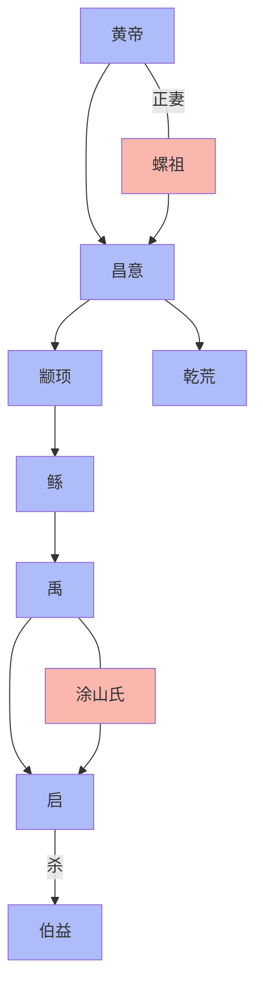
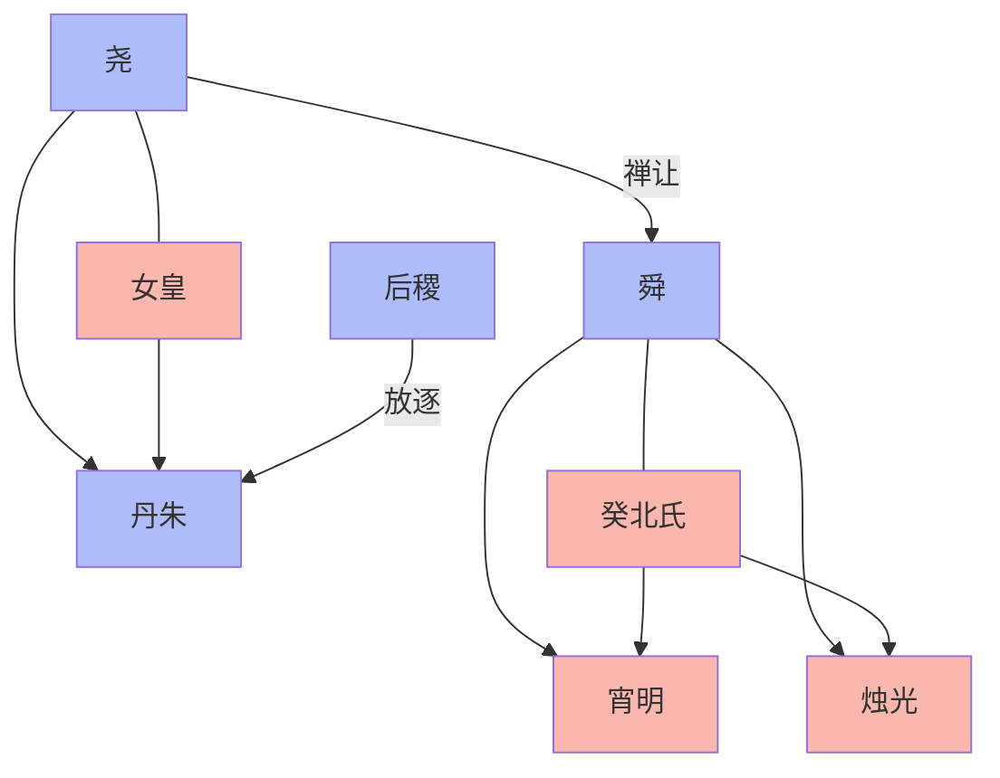
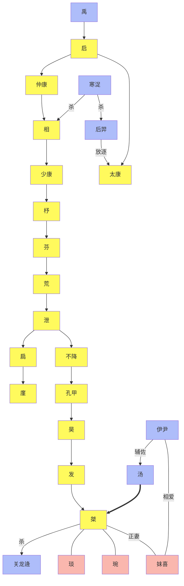
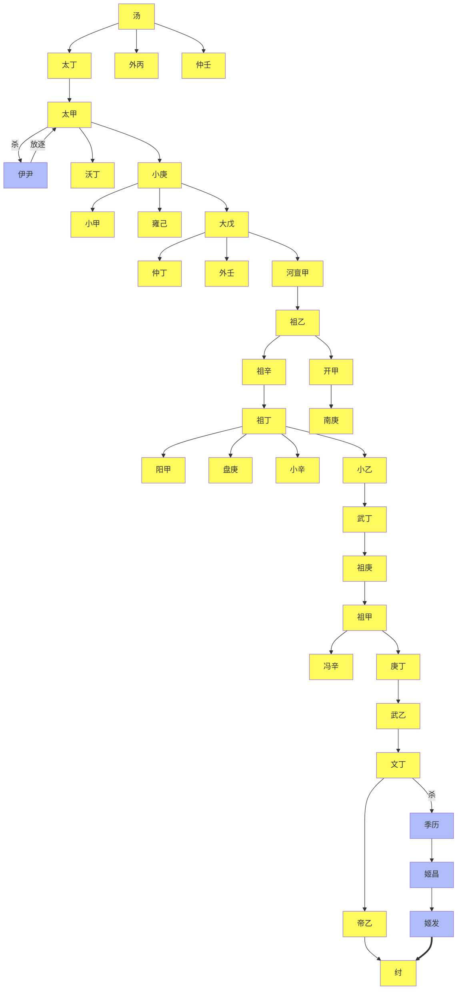
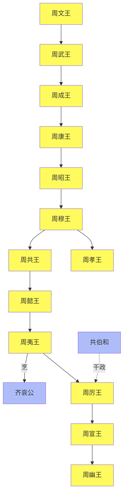

# 竹书纪年

## 黄帝
- 乾荒 = 韩流

```mermaid
graph TB

style 黄帝 fill:#AEBDFA
style 螺祖 fill:#FAB7AE
style 昌意 fill:#AEBDFA
style 颛顼 fill:#AEBDFA
style 乾荒 fill:#AEBDFA
style 鲧 fill:#AEBDFA
style 禹 fill:#AEBDFA
style 涂山氏 fill:#FAB7AE
style 启 fill:#AEBDFA
style 伯益 fill:#AEBDFA

黄帝--正妻---螺祖
黄帝-->昌意
螺祖-->昌意
昌意-->颛顼
昌意-->乾荒
颛顼-->鲧
鲧-->禹
禹---涂山氏
禹-->启
涂山氏-->启
启--杀-->伯益

%%click 黄帝 "https://baike.baidu.com/item/%E9%BB%84%E5%B8%9D/118887?fr=aladdin" "黄帝"
```

<!--more-->

## 尧舜
- 女皇 = 散宜氏

```mermaid
graph TB

style 尧 fill:#AEBDFA
style 女皇 fill:#FAB7AE
style 丹朱 fill:#AEBDFA
style 后稷 fill:#AEBDFA
style 舜 fill:#AEBDFA
style 癸北氏 fill:#FAB7AE
style 宵明 fill:#FAB7AE
style 烛光 fill:#FAB7AE

尧---女皇
尧-->丹朱
女皇-->丹朱
后稷--放逐-->丹朱
尧--禅让-->舜
舜---癸北氏
舜-->宵明
癸北氏-->宵明
舜-->烛光
癸北氏-->烛光
```

## 夏
- 后羿 = 有穷氏
- 芬 = 槐
- 荒 = 芒
- 廑 = 胤甲
- 昊 = 皋

```mermaid
graph TB

style 禹 fill:#AEBDFA
style 启 fill:#FFFA5D
style 太康 fill:#FFFA5D
style 仲康 fill:#FFFA5D
style 后羿 fill:#AEBDFA
style 相 fill:#FFFA5D
style 寒浞 fill:#AEBDFA
style 少康 fill:#FFFA5D
style 杼 fill:#FFFA5D
style 芬 fill:#FFFA5D
style 荒 fill:#FFFA5D
style 泄 fill:#FFFA5D
style 不降 fill:#FFFA5D
style 扃 fill:#FFFA5D
style 廑 fill:#FFFA5D
style 孔甲 fill:#FFFA5D
style 昊 fill:#FFFA5D
style 发 fill:#FFFA5D
style 桀 fill:#FFFA5D
style 妺喜 fill:#FAB7AE
style 琬 fill:#FAB7AE
style 琰 fill:#FAB7AE
style 关龙逄 fill:#AEBDFA
style 汤 fill:#AEBDFA
style 伊尹 fill:#AEBDFA

禹-->启
启-->太康
启-->仲康
后羿--放逐-->太康
寒浞--杀-->后羿
寒浞--杀-->相
仲康-->相
相-->少康
少康-->杼
杼-->芬
芬-->荒
荒-->泄
泄-->不降
泄-->扃
不降-->孔甲
扃-->廑
孔甲-->昊
昊-->发
发-->桀
桀--正妻---妺喜
桀---琬
桀---琰
桀--杀-->关龙逄
伊尹--相爱---妺喜
伊尹--辅佐-->汤
汤==>桀
```

## 商
- 小庚 = 太庚
- 开甲 = 沃甲
- 阳甲 = 和甲

```mermaid
graph TB

style 汤 fill:#FFFA5D
style 太丁 fill:#FFFA5D
style 外丙 fill:#FFFA5D
style 仲壬 fill:#FFFA5D
style 伊尹 fill:#AEBDFA
style 太甲 fill:#FFFA5D
style 沃丁 fill:#FFFA5D
style 小庚 fill:#FFFA5D
style 小甲 fill:#FFFA5D
style 雍己 fill:#FFFA5D
style 大戊 fill:#FFFA5D
style 仲丁 fill:#FFFA5D
style 外壬 fill:#FFFA5D
style 河亶甲 fill:#FFFA5D
style 祖乙 fill:#FFFA5D
style 祖辛 fill:#FFFA5D
style 开甲 fill:#FFFA5D
style 祖丁 fill:#FFFA5D
style 南庚 fill:#FFFA5D
style 阳甲 fill:#FFFA5D
style 盘庚 fill:#FFFA5D
style 小辛 fill:#FFFA5D
style 小乙 fill:#FFFA5D
style 武丁 fill:#FFFA5D
style 祖庚 fill:#FFFA5D
style 祖甲 fill:#FFFA5D
style 冯辛 fill:#FFFA5D
style 庚丁 fill:#FFFA5D
style 武乙 fill:#FFFA5D
style 文丁 fill:#FFFA5D
style 季历 fill:#AEBDFA
style 姬昌 fill:#AEBDFA
style 姬发 fill:#AEBDFA
style 帝乙 fill:#FFFA5D
style 纣 fill:#FFFA5D

汤-->太丁
汤-->外丙
汤-->仲壬
太丁-->太甲
伊尹--放逐-->太甲
太甲--杀-->伊尹
太甲-->沃丁
太甲-->小庚
小庚-->小甲
小庚-->雍己
小庚-->大戊
大戊-->仲丁
大戊-->外壬
大戊-->河亶甲
河亶甲-->祖乙
祖乙-->祖辛
祖乙-->开甲
祖辛-->祖丁
开甲-->南庚
祖丁-->阳甲
祖丁-->盘庚
祖丁-->小辛
祖丁-->小乙
小乙-->武丁
武丁-->祖庚
祖庚-->祖甲
祖甲-->冯辛
祖甲-->庚丁
庚丁-->武乙
武乙-->文丁
文丁--杀-->季历
文丁-->帝乙
帝乙-->纣
季历-->姬昌
姬昌-->姬发
姬发==>纣
```

## 周

```mermaid
graph TB

style 周文王 fill:#FFFA5D
style 周武王 fill:#FFFA5D
style 周成王 fill:#FFFA5D
style 周康王 fill:#FFFA5D
style 周昭王 fill:#FFFA5D
style 周穆王 fill:#FFFA5D
style 周共王 fill:#FFFA5D
style 周孝王 fill:#FFFA5D
style 周懿王 fill:#FFFA5D
style 周夷王 fill:#FFFA5D
style 齐哀公 fill:#AEBDFA
style 周厉王 fill:#FFFA5D
style 共伯和 fill:#AEBDFA
style 周宣王 fill:#FFFA5D
style 周幽王 fill:#FFFA5D

周文王-->周武王
周武王-->周成王
周成王-->周康王
周康王-->周昭王
周昭王-->周穆王
周穆王-->周共王
周穆王-->周孝王
周共王-->周懿王
周懿王-->周夷王
周夷王--烹-->齐哀公
周夷王-->周厉王
共伯和-.干政.->周厉王
周厉王-->周宣王
周宣王-->周幽王
```
