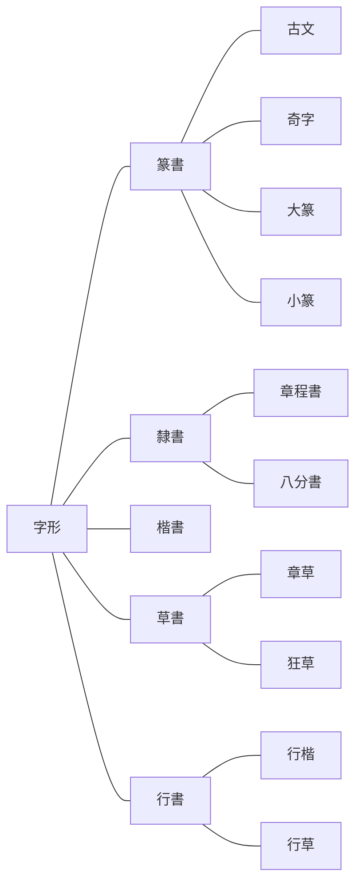
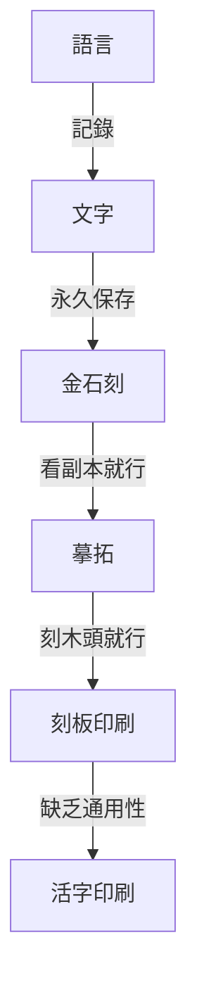
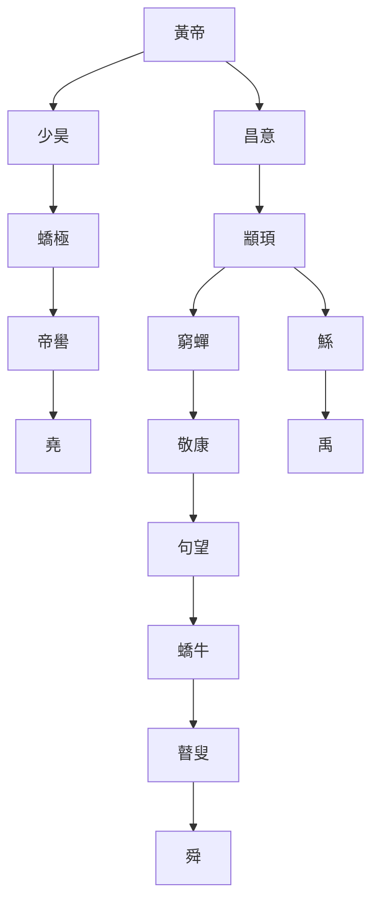
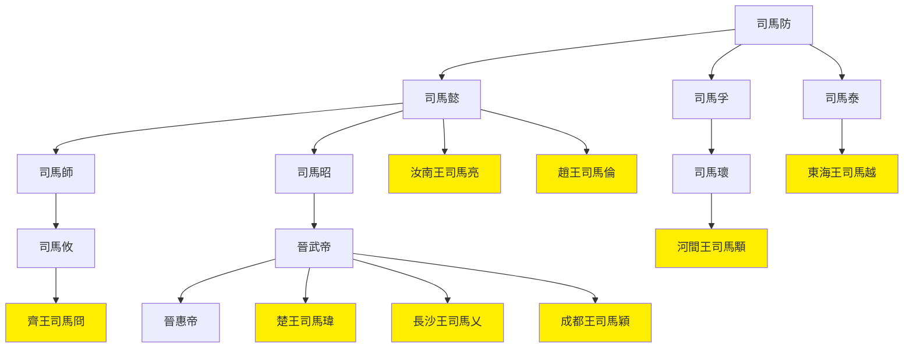

# 呂著中國通史

> 2022/3/19 -> 2022/4/27

## 緒論
- 歷史作用：搜尋史料->加以分析->驗證今事->推測未來
- 從智人起，人類主要為文化進化，而非生物進化
- 文化是人類控制環境的工具，因此環境相似的人群文化也相似
- 人類因為感覺遲鈍，造成歷史一治一亂交替出現

## 第一章 婚姻
- 男女關係發展：毫無禁忌->僅限同輩->禁止親族(氏族)->唯一配偶多情人->必須同居->一夫一妻
- 先史男女地位

類型|男|女
--|--|--
遊獵|負責掠奪|作為掠奪交換品
畜牧|負責掠奪|管理牧群
農耕|附屬品，勞力|掌握經濟主權

- 貞操源於奴隸需忠實的要求
- 伴娘來源於媵，伴郎來源於御
- 人類本性多婚，法律道德壓迫之下，演變出通姦與賣淫
- 部分原始宗教保留先世風俗，與後世不符，被目為邪教，如私有財產未形成時的群體淫亂
- 家庭制度的積弊造成男女不平等，社群制度是女性解放的根基

## 第二章 族制
- 兄終弟及源於母系氏族的舅權制，兄弟同氏族而父子不同族
- 封建制由父系的宗法衍生而來
- 人類互助由合作轉為分工，分工使部分人優先富裕，服務婚轉為買賣婚，建立父權家庭
- 氏族時代的知識技術輩輩相傳，因此尊祖崇古的觀念自然產生，與倫理道德無關
- 國家體制不鼓勵氏族做大，經濟原因也要求家庭分化
- 家庭制度下，古代勞力重於資本，人多可致富，今日則返貧
- 愛家的倫理觀念也是制度所需的洗腦
- 春秋前姓氏區別

姓氏|別稱|改變|稱謂|說明
--|--|--|--|--
姓|正姓|不可|女稱姓|母系氏族的稱號
氏|庶姓|可|男稱氏|同姓中分支的稱號

## 第三章 政體
- 亞里士多德氏族社會角色

角色|參政權|源出|有決定政權
--|--|--|--
君主|有|貴族中的最高首領|君主
貴族|有|平民中的掌權者|貴族
平民|有|戰勝氏族的普通人|民主
奴隸|無|戰敗氏族成為俘虜|
農奴|無|戰敗氏族僅收貢賦|

- 古代的國指諸侯的地盤；家指士大夫的地盤；社稷或邦近似今日國家的概念，國衍生出邦意主要因為避諱劉邦
- 中國君主主要由族長演化而來，繼承法為母系的兄終弟及或父系的父死子繼；周召共和為貴族制；有民主制，如大詢於眾庶之法
- 郡原為縣的下級區劃，因為用於屯兵，逐漸成為縣的上級。秦始皇的36郡均需屯兵
- 項羽分封十八路諸侯，有互相稱王之意，並非項羽獨斷
- 韓信等異姓王被誅，因思想上的慣性，無法想象劉邦可以皇帝之名滅諸侯，即周天子從無滅國的先例，故未設防而敗
- 民主制度消亡的原因
  - 地域過大，會議召集不便
  - 少數人已形成專權
  - 大眾不團結，無從糾正專權者
- 平民本無效忠君主之義務，只有貴族應效忠。後世此點被擴大化加以利用

## 第四章 階級
- 最初，國人為征服民族，野人為被征服民族，後來區別逐漸消失
- 最初的士從軍隊產生，所以戰士和士大夫均為士
- 古代階級破壞的原因
  - 貴族嬌縱自亡
  - 一國破敗全部轉為平民
  - 各階級間通婚無嚴格限制
- 奴：男奴隸；婢：女奴隸；臧：奴與平民之子；獲：婢與平民之子
- 封建時代的武力優勝主義，逐漸被資本時代的富力優勝主義取代
- 封建時代的中層分為兩派：近文成儒，近武成俠。實為孔墨兩家欲拉攏的社會群體。文臣極致如蓋寬饒，武士極致如李廣，魏晉後皆絕跡。而文臣偏狹，武士濫殺，絕跡亦不足惜
- 資本時代的土地私有，使農奴也變為奴隸
- 東漢末年產生了部曲階級，直至宋朝。部曲地位介於奴隸與平民之間。部曲女子稱客女。
- 門閥階級：源於封建貴族階級，漢朝被壓制，魏晉崛起，至五代沒落。沒落原因：
  - 世族已無實力
  - 與庶族通婚或賣家譜
  - 隋廢九品中正制，改為科舉
  - 唐末大亂，家譜散佚
- 異族階級：金以前，異族仰慕中國文化，主動融合；金開始剝削漢人，形成階級
- 階級的形成，根源只有武力和經濟兩種。種族並不是形成階級的原因，利益差別的作用遠大於體質差別。
- 以前的階級相去不遠，今日懸殊巨大，中產階級成為不穩定狀態，不能成為階級。消滅階級和階級鬥爭由今日產生，風險極大。

## 第五章 財產
- 各重要經濟時期

名稱|起始|轉折|消亡|說明
--|--|--|--|--
大同|上古以前|黃帝時期|東周前|大概上古以前存在。財產部族公有，無私產，故無工，商僅限與外族的簡單易物或討要。
小康|黃帝時期|東周|新朝|黃帝時期即始小康。出現私產，出現士，工商無大利，精神上開始自私。社會的舊組織崩潰，而人們仍覺不妥，仍追求徹底改革。
亂世|東周|王莽後|清末|東周已是亂世。王莽後人們認可了新常態，不再反抗。
近現代|西力東侵|清亡|至今|經濟已與世界相通，民生與民族問題合一。

> 井田制更像是孟子意淫的產物。以本書觀點，私產在部族時期並不存在，井田耕作分公田和私田則與之矛盾；井田類似十稅一，更像是國家已形成後的想法

- 人類聯合的方式：一為通力合作；二為劃清界限後共享，方式包括交易與掠奪
- 農業社會的文化和富力最高，但易被遊牧等民族征服。征服者在軍事上佔有，而在文化上因落後反被同化。
- 小康至亂世的經濟變遷
  - 人口增加，土地兼並
  - 公有的山澤變為私有
  - 工業進化使工匠出現致富機會
  - 商人更加活躍
  - 放貸者從國君擴至任何富人
  - 貨幣更加進步，儲蓄過剩的情況消失
- 亂世前形成三類人
  - 大地主：佔有農田或佔有山澤
  - 大工商家：包括工業家及大商人
  - 子錢家：放貸者
- 西漢人物仍在謀求徹底變革，造福被統治者，但總妄圖靠統治者發動，因此均失敗
- 拯救亂世兩家：儒家提倡平均地權，恢復井田制，如董仲舒；法家提倡節制資本，國營支柱產業、重大商業、金融業，如桑弘羊。王莽綜合了儒法兩家，欲徹底改革經濟制度。
- 王莽後的三次平和改革：晉的戶調式，北魏的均田令，唐的租庸調法。然實行程度很可疑，即使實行也至多一段時期內使貧民略得平均，無法持久。其後再無平均地權的政策。
- 物價控制
  - 戰國-李悝：平䨀法
  - 漢宣帝-耿壽昌：常平倉。民間谷物市場興盛後失效
  - 隋文帝-長孫平：義倉。主動隨喜募捐。類似的有後周惠民倉、宋廣惠倉
  - 北宋-王安石：青苗法。本意好，選錯了推行機關
  - 南宋-朱熹：社蒼。以社為範圍救濟借貸，治標不治本，且久亦失控
- 中國自古主張均貧富，而方法不對。主導的儒家只知平均地權，從未著手法家的節制資本。儒家過分希冀明君管好一切，而現實因大一統國土廣大，即使有明君也無能為力，故一直失敗。

## 第六章 官制
- 官制複雜：官多；老變；變得沒道理
- 人的見解總是落後於時代，因此制度一定下來即不適用
- 官制六時期
  - 周以前的列國時代
  - 秦及漢初，三公九卿，尚書職權漸重
  - 至唐朝，三省六部
  - 唐中葉至宋，官名與爵祿相關，與具體職務脫鉤
  - 元明清，三省漸虛，六部做實
  - 清末至今
- 內官分事務，宰相綜合統管；外官分地界，管理所有事務。
- 翰林在唐初純為藝能之士，唐中參與政務。明中六部官員均自翰林出。
- 胥吏即今之公務員，實際處理各類政務。地位太低不思進取，但求無過照例行事，因不可或缺而唯利是圖。
- 官品起於南北朝，宋確定正從九品。
- 官俸微薄，下級公務員尤甚，此為貪污腐敗之源。

## 第七章 選舉
- 三代以前，士以下選舉，以上世襲
- 漢初布衣將相，世襲告終
- 漢以後入官之途
  - 征召：天子仰慕直接聘請
  - 辟舉：相府等機關自主聘用
  - 薦舉：內推
  - 吏員：由吏升為官
  - 任子：官二代蔭子
  - 專業技術人員：外聘或自行培養
  - 捐納：買官
  - 學校
  - 科舉
- 九品中正制問題：量德不量才，非政治所需；中正無法公正評判，礙於喜好、恩仇、威脅等諸多因素。最終只可選出門閥士族
- 科舉開取士的另一途徑，而宋後成為唯一途徑
- 科舉之弊
  - 學非所用
  - 僅考察一時的應試能力
- 科舉改革：范仲淹改革；王安石熙寧貢舉法
- 王安石變法失敗後，為平衡兩派考生而經義詩賦同時考察。明清科舉全部考察，實際上無人能通
- 賣官起自漢武帝
- 外官僚屬自行招聘，多為本地人，功曹負責，隋廢由吏部負責。

## 第八章 賦稅
- 井田：平正之地；畦田(圭田)：崎嶇之地
- 賦稅隨政務發展而增加，本是合理之事，而多數增稅均不察情勢
- 漢田租正稅十五或三十稅一，但還有私租，如王莽十稅五。其外有算賦，即人口稅
- 鹽鐵之類間接稅不被接受，未能盛行
- 戶調法：起源於曹操，晉平吳後成定法。替代了算賦和各類不定期橫征，改現金稅為實物稅，官方按各戶情況授田，定期繳納
- 農民所缺，一錢二物三勞力。役法如正確使用，可有益於公，無害於民
- 在官庶人(吏)
  - 府：看守財物
  - 史：記事
  - 胥：高級腦力雜務
  - 徒：跑腿的，體力雜務
- 雜稅：田租、口賦、力役以外的賦稅

## 第九章 兵制
- 兵制八期
  - 征服之族全民皆兵，被征服之族部分民兵制
  - 戰爭增多，全部全民皆兵
  - 秦天下一統至五胡亂華，罪人及異族為兵，中央失權後出現州郡兵
  - 五胡亂華末至唐，漢人兵源加入，出現部分民兵制的府兵
  - 唐末五代，府兵廢壞，出現藩鎮之兵
  - 宋，募兵制
  - 元明，元朝特殊兵制，明朝東施效顰
  - 清，整體腐敗，中葉曾建強大陸軍，但跟不上時代
- 春秋時，各國用兵最多數萬，至戰國則斬首動輒數萬。比為由部分民兵制轉為全民皆兵的體現
- 民兵制在光武帝時被破壞，開始外強中弱，邊兵強內地弱。漢末軍閥擅權，積久必驕奢淫逸，故使五胡亂華。兵權一直不在漢人手，故長期難以恢復
- 五胡亂華前，北方文明南方彪悍，其後反之
- 漢朝多數用本國兵，唐朝多用番兵。唐武功成就雖大於唐，軍事實力實不如
- 唐廢壞府兵制(平時為農，田產無稅，閒時為兵，兵馬自備）重用異族雖減輕人民負擔，卻導致安史之亂，甚至間接影響宋的武力養成
- 兵制上策應守在四夷，類似都護府監管鎮撫而防患未然，在本國之外。中策為本國之內經營邊境。唐朝的藩鎮為下策至無策，實為對四夷已失控。
- 宋改為募兵制
  - 優點：接收教化社會無賴；使農民專心種地
  - 缺點：兵力漸腐敗；番戍之制不合理；一味追求兵多
- 北方為侵略民族原因：土地貧瘠；地形平坦利於集合
- 元朝為世襲兵籍制，僅限蒙古人；明朝一定程度模仿之，使兵二代成為特權階級，而迅速腐化
- 戰爭是社會的變態，變態原因消失則戰爭結束。因此武力無法持久，否則會隨變態原因消失而必然腐化。兵需常備是不符合客觀規律的，應為需要時產生。
- 近代的趨勢：多以西南為根據地(受中原影響較少)；恢復全民皆兵

## 第十章 刑法
- 法律的來源：社會風俗；國家對人民的要求
- 刑法簡表

常用刑名|其餘別名|組合|來源|類型|說明
--|--|--|--|--|--
劓||五刑|苗民始創|肉刑|五行屬木。割鼻
刵|馘|||肉刑|割耳
椓、宮|腐|五刑|苗民始創|肉刑|五行屬土。男割生殖器，婦則閉於宮中
墨、黥|庶勍、黥面|五刑|外族習俗，苗民始創||五行屬火。在臉上刺字染墨
臏|剕、刖|五刑|苗民始創|肉刑|五行屬金。砍雙腳。一說剕僅斬左趾
大辟、死|割頭|五刑、隋五刑|苗民始創|死刑|五行屬水。死刑總稱
鞭、笞||隋五刑|||鞭子毆打
朴、杖||隋五刑|||木棍毆打
流||隋五刑|||流放
髡|||外族習俗||剃頭
腰斬|斬|||死刑|從腰斬斷。原名斬，後被斬首借用需特指
磔|矺、辜|||死刑|裂其肢體而殺之
膊||||死刑|去衣磔之
車裂|轘|||死刑|用車磔
縊、絞||||死刑|用繩勒死。絞原為勒人的繩
焚||||死刑|燒死
烹||||死刑|煮死
脯|||食人族習俗|死刑|做成肉脯
醢|||食人族習俗|死刑|剁成肉醬
三族||||死刑|連同父母、兄弟、妻子共同誅殺
徒||隋五刑|||
凌遲|||元傳入|死刑|
充軍|||||

> 五刑：書經·呂刑、虞書·大小夏侯版本、周官·司刑、逸周書逸文

> 虧體、死刑均源於戰陣處理異族

> 隋五刑：笞杖徒流死

- 階級產生之前無利己主義，故無須教化和刑罰。法律不問人的動機，成為反社會之物
- 法典歷史
  - 李悝《法經》：最早法典，共六篇
  - 劉邦約法三章：只取秦法三章，定天下後蕭何與叔孫通相繼增至27篇，漢武帝時增至300餘篇
  - 《晉律》：陳群制新律18篇未頒行，賈充定晉律20篇而頒行。南北朝略參鮮卑法，至《唐律》仍大體沿襲。金熙宗《皇統制》合女真及舊法，仍沿古律。元用金律。《大明律》以唐律為本，《清律》又以明律為本。
  - 清末開始採用西法
- 漢始，儒家學說被摻入法典之中，融入較多公序良俗
- 晉律後幾乎無變化原因：只規定經久之事；只列出大綱

## 第十一章 實業
- 農工商為實業

### 農業
- 中國文明由漁獵起，神農時期進入農耕
- 農業進化：粗耕->精耕
  - 爰田法：先秦，按土地肥沃程度調整分配畝數
  - 代田法：漢武帝時期趙過發明，分一畝三圳三壟，圳低壟高，種於圳而漸以壟為肥，終平，次年反之。後氾勝之發明區田法，與代田法原理類似
- 農業進化阻力
  - 缺乏農學研究者或脫離實際
  - 土地變為私有制而農田受侵佔，如水利
  - 剝削使農民不願賣力
- 農學書籍：先秦漢代農書基本均亡佚，散見雜家著述。漢成帝時《氾勝之書》，南北朝賈思勰《齊民要術》，元官修《農桑輯要》，元王楨《農書》，明徐光啟《農政全書》，清官修《授時通考》
- 廣義種植外各類農業
  - 蠶桑：起於上古，齊紈魯縞漢世聞名。而地區發展不平均
  - 林業：起初為公有，後一直在破壞，從未保護且無意識
  - 漁獵畜牧：均不被重視。田獵受武事影響還定期舉行。漁業被視為鄙事。畜牧主要供給祭祀，唯養馬事關軍事交通而受重視，主要在邊地。
  - 礦業：管子載勘察礦苗(榮)之法。銅重於鐵，造兵器、寶鼎等，後漢前兵器多用銅。礦業發展南優於北，采珠玉亦屬礦業

### 工業
- 工業自古不喜奇技淫巧
  - 生活恬淡所致
  - 社會範圍狹窄，故崇古
  - 工官為國家服務，但求無過
  - 森嚴的等級規範
- 工官制度隨封建制破壞而消亡，工業基本未曾進化

### 商業
- 私產形成前的商人為部族服務，才智過人；私產形成後漸成居間優勝階級，低買高賣
- 古代定期設市，唐中葉後可隨時隨地交易
- 輕視商人原因
  - 封建制遺留的重掠奪輕生產思想
  - 商人多為賤人出身，商業無法生利。兩漢輕視其人，之後敵視其業

## 第十二章 貨幣
- 中國貨幣制度不甚完善
  - 中國經濟學說不注重交換
  - 疆域廣大難以控制
- 金屬貨幣的缺點
  - 無法禁止私鑄
  - 產量不足用
- 銅錢最初應起源於齊，主要在貴族間流通
- 自周至漢，銅錢使用並不普遍，零星交易可直接用粟易物
- 秦半兩至漢文帝開私鑄，直至漢武帝上林三官五銖，始安定
- 王莽暫時破壞後恢復，董卓破壞五銖錢，唐初開元通寶錢復定，但不久私鑄又起
- 宋產生交子，來源於飛錢(兌換券)
- 紙幣的貶值導致銀錢復起，明宣宗起銀兩為正式流通貨幣。明清皆受銀銅並行之害

## 第十三章 衣食
### 飲食
- 食物來源：鳥獸肉；草木；魚類
- 神農本草經為最早探究草木性味之書
- 六畜：馬牛羊雞犬豕。馬牛主交通耕作，羊貴重，常食雞犬豕。古代畜養，男犬女豕，狗漸少而主食豬
- 茶來自於荼字，唐朝盛行，至宋時未全民普及，煎茶而非泡
- 外來輸入食物：蔗糖唐太宗時自摩揭陀引入，之前為米麥製的飴。菜類如苜蓿，果品如西瓜
- 中國烹調世界第一，奢侈亦是

### 衣冠
- 衣服材料最早用皮草，後發明絲麻取代。木棉至元才普及全國
- 取暖衣裘，窮人衣褐(毛織品)。庶人可衣犬羊裘，絲綿最貴。
- 衣服緣起先下後上，先前後後，然非以裸露為恥，而是用於裝飾
- 短褲為褌，長褲為褲，貧者無褲而仍有褌。褲襠縫合為窮褲，一般不縫，以裳蔽之。韍僅蔽前，裳前後皆蔽
- 上衣短者為襦，長者為衫，額外加棉為袍
- 冠以冕最尊，次之為弁，後為冠，庶人用巾(類野人之帽)，覆髻為幘。冕弁用簪而冠不用
- 脫帽握手源於歐洲中古，免胄知敵我，握手知無兵
- 襪(韤)最初革製，襪外為屨。偪為綁腿，在襪內
- 深衣為上衣下裳縫合在一起。理論庶人禮服，士大夫平居服，實際廣泛使用
- 服飾的社會屬性使之總體大同小異，且逐漸趨同
- 中國服飾大部分自行進化，僅靴來自胡服，起自趙武靈王，唐中葉盛行
- 染色技術未盛行前，不忌諱白色衣服

## 第十四章 住行
### 建築
- 上古住居為巢居和穴居。溫熱地築巢抽梯，幹寒地營窟穴居
- 穴居種類
  - 天然洞窟
  - 鑿出窟窿而居，為穴居
  - 自堆土窯而居，為復。漸進化為版築
- 古人最初湖居，藉水以自衛。後藉山，最後人工築墻，是為郭。長城屬於郭，為抵禦小波寇盜最經濟的方式
- 修築長城時期
  - 戰國秦：齊南防淮夷，秦趙燕北防匈奴，秦始皇連結為一
  - 隋：北防突厥
  - 金：防其餘遊牧民族
  - 明：北防蒙古，現主要遺跡
- 古代房屋：士大夫之居，前堂後室左右房；平民之居，少一堂，以室為堂，以房為室
- 中國建築以土木為材，造樓技術差，因此向平面廣大發展，總體不算發達。建築落後原因
  - 政治比較清明，反對大興土木
  - 迷信不深，祭壇臨時設地，無固定場所
  - 經濟相對平等
- 苑只有草木，囿兼有禽獸。園原為果園，發展為園林

### 器用喪葬
- 古人家具主要為床與几，西域胡床傳入後有桌椅
- 古人生火取暖，土炕應自女真傳入
- 墨家主薄葬，儒家反對，然仍比流俗薄。火葬隨佛教傳入，僅風靡一時

### 交通通信
- 交通運輸肉體，通信運輸思想
- 西北陸路交通發達，東南水路交通發達
- 大車牛拉用以運輸，小車馬拉為兵車或人乘，人力車為輦
- 國中路為馳道，田間路為阡陌。道路失修後(宋以後為甚)，騎馬漸盛行。水路交通逐漸比陸路交通發達
- 道路之壞使經濟重心轉為沿海，而陸路交通多用人力。山行用轎，南宋始用於平地
- 魏晉商賈興盛而發展出逆旅，取代了之前官營住所
- 通信使用郵驛，然僅限投遞公文。民間寄書須遣專使或託人
- 交通起於陸地，進及河海大洋，再返回陸地，是必然的路線

## 第十五章 教育
- 古代貴族小學教育
  - 三德：至德、敏德、孝德，師氏授
  - 三行：孝行、友行、順行，師氏授
  - 六藝：禮、樂、射、御、書、數，保氏授
  - 六儀：祭祀、賓客、朝廷、喪紀、軍旅、車馬，保氏授
- 大學教育：春秋禮樂，冬夏詩書，與宗教關係密切
- 學校名稱

年代|小學|大學
--|--|--
夏|校|學
商|序|學
周|庠|學

- 平民教育偏重於道德，實際技能來源於實習，古稱宦
- 東周教育移於私家，出現諸子百家
- 後漢因重儒學使學校空前絕後興盛；魏晉始成花瓶；隋唐成為選舉的一途，不提倡學術教化，且明分階級
- 文翁為提倡學術的少見案例；王安石提議科舉取士，國家養士；朱元璋極其重視學校
- 中國無宗教意義的孔廟，實際均為學校
- 凡事國營弊端(僅小國寡民可行，國大社會複雜不可行)
  - 國家不可勝任繁重職務，因此辦事有名無實
  - 無法盡知社會的需要，因此辦事頑固守舊，阻礙進步
- 唐五代民間研究學問機構興起，為書院。自主辦學，能真正研究學問。
  - 四大書院

名稱|位置|興建年代|興建者|備註
--|--|--|--|--
白鹿|廬山白鹿洞|南唐升元||
石鼓||唐元和|衡州守李寬|《玉海》非四大
應天||宋真宗|曹誠|
嶽麓||宋開寶|潭州守朱洞|
嵩陽|登封縣大室山|五代||《通考》非四大

## 第十六章 語文
- 以語言表示意思，以文字表示語言。最初象形文字並非如此，後漢字演化出形聲
- 六書：漢所總結的文字構造之法

名稱|類型|典型字|數量|說明
--|--|--|--|--
象形|造字法-文|日月山水火子|少|畫成一種東西的形狀，需進行抽象，否則僅為圖畫文字
指事|造字法-字|上下|少|指示其物的所在。事意物
會意|造字法-字|信武|少|合成兩個字。會意合
形聲|造字法-字|鞅洋氧恙|多|表意與表聲兩部分結合
轉註|非造字法-文字增加|考-老、夥-多|少|多個字同一意思，源出也類似
假借|非造字法-文字減少|難(本指鳥)久(本指針灸法)|少|借用同音字，不再新造

- 書體變遷

名稱|別名|從屬|說明
--|--|--|--
篆書|||古代文字流傳至秦漢，刻在簡牘上，用圓筆
隸書|||秦官獄多事，令徒隸佐書變異而得，用方筆
楷書|真書、正書||正式書寫所用
草書|||用於起草，自然產生無發明權。張芝始創狂草，脫離實用
行書|||草書脫離實用後，代為起草的書體
古文||篆書|大篆之前，自古流傳的文字，《史籀》15篇以外
奇字||篆書|古文的一部分，說不出字形構造之由
大篆|籀文|篆書|周以前通行的字，見《史籀》15篇
小篆|秦篆|篆書|秦以後通行的字，李斯、趙高、胡毋敬制定
章程書||隸書|舊派隸書，無挑法，漸發展為真書(楷書)
八分書||隸書|新派隸書，有挑法
章草||草書|字之間分開的草書
狂草||草書|字互相連結的草書，張芝首創
行楷|真行|行書|比楷書潦草一些
行草||行書|比草書莊重一些

- 春秋戰國為造字高峰期，因此七國文字異形。確立一字一音、單字發展為多字，為文字重要進化，成為語言的代表
- 漢字先造文字，再與語音結合，不適合用拼音。拼音適合文字學習自其餘先進民族者使用
- 生活是最大的教育。除少數學者外，讀書對於其人格的關係，是很少的
- 採用中國文字的方法
  - 全盤使用。如朝鮮，而與語言不通，仍需另造諺文以應用
  - 用偏旁造字。如契丹大字，採隸書半字增損創造，而不能通行，後參照回紇創契丹小字以實際應用
  - 借漢字而自造音符。如日文，較為方便，故用至今
- 各族文字
  - 回文：拼音文字，不知出於猶太、天主教還是大食
  - 藏文：拼音文字，出於印度
  - 蒙文：拼音文字，初用回文，後八思巴據藏文造字
  - 滿文：拼音文字，據蒙文
  - 倮儸(彝族)：象形文字
- 印刷流變

## 第十七章 學術
### 學術思想
- 學術思想三大時期
  - 上古至漢魏
  - 佛學輸入至清亡
    - 佛學時期
    - 理學時期
  - 西學輸入後
- 先秦諸子學術來源
  - 古代宗教哲學，較輕
  - 各社會官守，更重
- 諸子思想來源
  - 農家源於遠古農業部族的思想
    - 君臣並耕，政府無權
    - 物論量不論質
  - 道家源於反對遊牧侵略的思想
    - 老子行文古，女重於男
    - 主張以柔克剛
    - 主張無為
  - 墨家取法夏王朝思想
    - 墨學出於清廟之守(祭祀禮儀)，可見較古學說
    - 貴儉因夏值水災之後
    - 天志明鬼因夏迷信較深
  - 儒家陰陽家思想綜合上古至西周所形成
    - 儒家三統之說三代循環，陰陽家五德終始說，均為根據時局選擇治法
  - 法家根據當前政治形勢所產生的思想
    - 裁抑貴族，推翻封建
    - 富國強兵，統一天下
  - 名家專講高深玄遠理論，縱橫兵家僅用於單專業

> 個人觀點：從農家到法家的順序恰好對應從右派到左派

- 儒家思想
  - 六經：詩書禮樂，為大學課程；易為原理，春秋為方法。易分言理派(近於先秦哲學)和言數派(術數之學，古文易均為此)
  - 益處：個人修養。理智上中庸，感情陶冶有禮樂，知天命，推己及人等
  - 害處：只傳小康不傳大同，追求小康導致專制
  - 儒家整體功過相抵，然亦形勢所成
- 儒學傳承
  - 漢武帝時八家
    - 詩：魯申培公、齊轅固生、燕韓太傅
    - 書：濟南伏生
    - 禮：魯高堂生
    - 易：菑川田生
    - 春秋：齊魯胡毋生、趙董仲舒
  - 東漢十四博士
    - 詩：齊、魯、韓
    - 書：歐陽、大小夏侯
    - 禮：大小戴
    - 易：施、孟、梁丘、京
    - 春秋：嚴、顏
  - 出現古文派，又出現以王肅為代表的偽古文派，偽造《孔子家語》
- 儒家已不適應時代發展，因此藉口古文研究引入其他理論，拋棄師承另成一派。實際今文經與古文經並無思想的不同
- 鄭玄等刻意追求博學，而理論其實不通，消遣功用大於救世。此風起於西漢中，盛於東漢，隋唐猶存。如章句、義疏
- 魏晉玄學反對拘泥事跡的儒家，混合儒道而重視原理，屬於近似且兼採道家的儒家。功勞為去除了拘泥形式之弊，但其本身並無實際可執行的方案
- 佛教以宗教輸入，而亦含學術。有較多實行標準，故能興起
  - 佛滅百年後小乘興，又五六百年大乘出
  - 有情十等：四聖-佛、菩薩、緣覺、聲聞，六凡-天、人、阿修羅、畜生、餓鬼、地獄。六凡成六道輪迴，畜生、餓鬼、地獄為三途
  - 小乘佛即釋迦摩尼，大乘佛有三身：報身(本人)、法身(自然力，感知萬物)、化身(變化為各種形態)
  - 六識：色聲香味觸法，第七識末那(有我)，第八識阿賴耶(由第七識生，須滅盡)
  - 認識世界的方法錯誤，故世界根源問題無法回答，成佛後自知
- 佛教宗派

宗派|別名|組合|說明
--|--|--|--
天台宗|性宗|教下三家|就識本身闡發
惟識宗|相宗|教下三家|由相闡發萬法惟識之義
華嚴宗||教下三家|描述菩薩的樣子以供模仿
禪宗|||不立文字，直指心源，專靠修証。因教下三家繁瑣而禪宗獨勝，因修習禪定而為有閒階級獨有。流行於上流社會
淨土宗|||阿彌陀佛接引往生淨土，有不墮落的低保。修習簡易：觀、想、持名(念佛)。流行於下流社會

- 佛教以消滅社會為解決社會問題之法，宋明理學反之而生，以唯物反唯心
- 理學
  - 自創宇宙觀人生觀
    - 周敦頤：太極生兩儀，化五行，成萬物，保持中正以配太極。著太極圖說、通書
    - 張載：萬物原質為氣，疏密成隱顯，迎距生好惡。人有義理之性不受制於物質，氣質之性受制於物質，應變氣質以和義理。著正蒙、西銘
    - 邵雍：術數之學，主要研究自然現象的規律，不被視為正宗。著觀物內外篇、皇極經世書
  - 實行方法
    - 程顥：識得此理，以誠敬存之
    - 程頤：涵養須用敬，進學在致知。致知在格物，即窮其理
  - 格物問題
    - 陸九淵：先發其本心之明
    - 朱熹：讚同程頤
    - 王守仁：良知，洗除障翳
  - 吸取佛學內容
    - 嚴於律己
    - 理論的徹底
    - 過於注重內心修養，疏於學問與行事
  - 反對者
    - 永嘉、永康派：反對疏於實學
    - 清代顏元、李塨：只講實學不修內心
    - 戴震：捨理而論情
    - 理學反對者均難自圓其說，因此一家獨大
  - 清考證學
    - 清代學術只是方法運動，不是主義運動
    - 考證學實為理學一支，傳承講究讀書的程朱派
    - 功績：研究漸深，日趨客觀
- 近代
  - 西學起於自然科學，推及社會科學
  - 各民族傳統均有糟粕，且壞得相像，均需新學術以改變
  - 風俗的薄惡因社會組織的不良，非改良道德政治可變

### 文學
- 文源於語言
  - 先有韻文，後有散文
  - 散文興起於東周，盛於西漢。散文能說明意思，是文學的一大進步
  - 西漢末開始追求美化，至齊梁而浮糜不能達意
  - 唐朝韓柳改革，以古文語法用今人言語
  - 宋散文發達，駢文謂之宋四六
- 詩源於歌謠
  - 吟誦的詩與合樂的詩分離，實為詩體的進化
  - 音樂的變化造成詩體的變化
- 作品的社會性體現
  - 積極：直接宣揚正能量，如屈原杜甫
  - 消極：流露負能量，如王維孟浩然，其積極作用：
    - 揭露社會陰暗面
    - 使惡勢力能有所減少

### 歷史
- 最早左史記事，右史記言(尚書)，小史記世系
- 魏晉南北朝專設史官，依賴國家出錢，實質仍為私人編修
- 唐以後集眾編纂正史
- 宋代史學突飛猛進
  - 一人獨成一史：歐陽修《新五代史》、宋祁為主的《新唐書》
  - 編年史：司馬光《資治通鑑》、朱熹《通鑑綱目》
  - 典章經制：馬端臨《文獻通考》
  - 網羅古今：鄭樵《通志》
  - 當代史料：李燾《續資治通鑑長編》、王偁《東都紀略》等
  - 周以前古史：劉恕《通鑑外紀》、蘇轍《古史考》、羅泌《路史》
  - 外國史：葉隆禮《契丹國志》、孟珙《蒙韃備錄》
  - 考古學：起於宋，歐陽修《集古錄》、趙明誠《金石錄》
  - 史事考證：倪思《班馬異同評》等
- 元明史學復衰。清朝文字獄不言史事，因考據盛行而有糾錯之功
- 中國史學偏重政治史，尤其重於理亂興衰(正史紀傳、編年體)、典章經制(正史志、通典通考類)
- 研究史法著作：唐代劉知幾《史通》、清代章學誠《文史通義》

## 第十八章 宗教
- 學問研究旨在解決部分問題，宗教旨在解決全部問題，因此不分時間地域均會產生。因信仰不可改變，經一定時間證偽後，遂成為迷信
- 《周官》神靈分類
  - 天神：天子祭祀
  - 地祇：諸侯祭祀
  - 人鬼：主要是祖宗
  - 物魅
- 歷來民間最重要典禮為社祭，人民只崇拜與自己關係近的神。中國天子不管細務，因此成為多神教，與一神教中一神管萬事並無實際區別
- 泛神論與無神論實際也無本質區別
- 術數：天文-數、曆譜-數、五行-數、蓍龜-術、雜占-術、形法-數
  - 術：壓勝咒詛占卜等神秘學
  - 數：根據所見所感推論原因
- 漢武帝時方士
  - 一派煉丹求仙追求長生，傳承自東周方士，後逐漸失信於上層社會，轉向民間，終成黃巾起義。煉丹耗資故推向貴族，推平民改為符水
  - 一派祭祀山川神靈以求福，傳承自上古宗教，漢元帝後多被廢除
- 道教
  - 道教源於術數及神仙家
  - 北魏寇謙之使道教上升為國教
  - 道教始祖可能是張脩，張魯冒之，以祖父張道陵為始祖
- 佛教盛行原因
  - 輪迴說受歡迎
  - 只修個人不涉政治，得以扶植
  - 中國缺乏大宗教，故先入為主
- 伊斯蘭教
  - 別稱回教、清真
  - 元代盛行輸入，從未流行
  - 回族因宗教結為一個民族，是獨一無二的
- 明教
  - 原波斯國教，別稱摩尼教、火教、胡天、祆(音先)教
  - 南北朝傳入，流傳至南宋
  - 吃菜事魔
- 基督教
  - 唐太宗時波斯人阿羅本(Olopen)傳入。別稱景教
  - 元朝時隨蒙古再輸入復絕，明中葉後又輸入
  - 清朝一度被朝廷禁止
- 猶太教
  - 別稱一賜樂業教(以色列)、挑筋教
  - 約五代漢時輸入，宋時建寺
- 宗教除了精神安慰，也會協助解決實際生活問題，因此廣為流傳
- 宗教常做為政變的工具，如張角、孫恩、太平天國
- 中國整體不甚迷信宗教，因儒學盛行之故

## 第十九章 中國民族的由來
- 一個民族難以知其來源，如人不知嬰兒時之事。中國又無其餘民族記載可參考，故很難考證。最有根據的中國起源於西部高原昆崙山，實際禁不起推敲。因此只能有賴於考古學
  - 文化通常起源於大河下游，中國文明起源於黃河下游可能性較大
- 史前似乎分兩系
  - 东系以黑陶為代表，為中國固有文化
  - 西系以彩陶為代表，為西方傳入
  - 東西兩系匯聚至河南
- 古亞洲東方民族三系：北族辮髮、南族斷髮、中原冠帶

## 第二十章 中國史的年代
- 確切紀年為周共和元年，-841年
- 曆法推算年代
  - 劉歆：堯在-2305年。周867，商629，夏432，舜50，堯70
  - 顧雍之：堯在-2357年
- 堯以前為先史時代
- 獲麟：-481年

## 第二十一章 古代的開化
- 盤古：開天闢地。一說及長沙武陵蠻祖先盤瓠(狗)，不足信
- 三皇五帝：說法不一，綜合版本：三皇為燧人、伏羲、神農，五帝為黃帝、顓頊、帝嚳、堯、舜
  - 五德終始說原為相克順序，劉向改為相生順序，且為湊堯與漢同為火德，五帝中湊了一個少昊
  - 三皇五帝是後人造的古史系統
- 古帝王表
  - 古帝王代表一個社會進化階段，未必有其人，但應有對應的先進部族
  - 堯舜禹為王位相繼而非君位相繼，即選舉部族共主，既非禪讓也非篡奪。後來禹部族一家獨大，故改為家天下

慣用名|別名|姓|位置|事跡
--|--|--|--|--
有巢氏||||教民構木為巢
燧人氏||||教民鑽木取火
伏羲|包犧氏、太昊氏|風|山東東南部|創八卦、結繩做漁網
神農|大庭氏、炎帝|姜|山東東南部|發明耒耜，與黃帝阪泉之戰
蚩尤||姜||涿鹿之戰被黃帝殺。與炎帝為一人，涿鹿即阪泉(位於彭城南)
黃帝|軒轅|姬|窮桑(魯北)|涿鹿之戰殺蚩尤，與炎帝阪泉之戰
顓頊|高陽|姬|窮桑(魯北)|父為黃帝嫘祖子昌意，徙都帝丘不足信
帝嚳||姬||
少昊|玄囂、青陽|姬|曲阜|黃帝嫘祖子
堯||姬||
舜||姬||
禹||姬||
共工||姜||
三苗||姜||

- 三皇五帝世系圖(史記版)

- 治水與西遷
  - 共工、三苗、鯀、禹應都參與治水，且因知識類似，堵與疏應並用
  - 水患應未解決，禹部落開始西遷
  - 東方姜姓因水患發展落後，遷徙後的西方姬姓反而領先
  - 姬姓部族對姜姓部族的勝利應為自吹，如共工觸不周山

## 第二十二章 夏殷西周的事跡
- 夏：太康失國少康中興
- 商30代，夏17代，因商用兄終弟及之制
- 商八遷，活動范圍仍在河南的黃河兩岸
- 周武王滅紂未滅商，封其子武庚，使管蔡監。周公攝政成王，三監之亂，連帶東方諸國徐、魯、熊、嬴皆服商不服周，周公平之。
- 周公後有雷風之變、周公奔楚
- 成康之治，昭王南征伐楚敗而不復，穆王中興，五傳厲王被國人逐
- 厲王被逐，周召共和，後宣王號稱中興而敗於西方姜氏之戎，幽王被犬戎申國所滅，平王東遷洛陽而西周亡

## 第二十三章 春秋戰國的競爭和秦國的統一
- 西周前歷史多為共主一國的歷史，東周始有各國歷史
- 春秋多為大國爭二三等小國之戰，戰國則大國相爭
- 呂不韋欲吞天下，秦廢之而沿襲政策。秦統一天下非盡兵力原因，政治、經濟、文化亦自有統一之勢
- 秦成功因素
  - 地處偏僻，風氣淳樸
  - 地廣人稀，用三晉民為耕
  - 重用法家

## 第二十四章 古代對於異族的同化
- 中國為農耕民族，居平原；春秋以前所遇外族主要為山戎，居山地，農耕且相對落後；戰國後遇畜牧的騎寇，居草原
- 各異族情況

名稱|別名|位置|情況
--|--|--|--
犬戎|獯粥、獫狁、昆夷、串夷、緄夷|陝西中甘肅東|黃帝北逐獯粥，西周滅於犬戎，後應被秦人征服
白狄||陝西至中山|由狄分化
赤狄||山西、河北|由狄分化，被晉吞併
氐|巴氐|嘉陵江流域|在周之西，因漢族開拓向西南發展
羌||黃河大通河流域|在周之西，因漢族開拓向西南發展
蜀|賨|戰國在漢中成都|被秦吞併
貉||後世蔓延朝鮮半島|東北方民族
肅慎||原在內地而徙居東北|滿族祖先，
鮮卑||原在南方而徙居東北|東胡之後
烏丸|||東胡之後
黎族|俚、長沙武陵蠻|長江流域|南蠻正宗，現苗族
越|粵|沿海一帶、南洋|現馬來人，斷髮文身、食人(次睢之社)
倮儸|濮|本在河南湖北間，後遷雲貴|西南大族，莊蹻為滇王。現彝族

- 狄種類

氏族|從屬|位置
--|--|--
東山皋落|赤狄|山西昔陽
廧咎如|赤狄|山西樂平
潞氏|赤狄|山西潞城
甲氏|赤狄|河北雞澤
留吁|赤狄|山西屯留
鐸辰|赤狄|山西長治
鮮虞|白狄|戰國時中山
肥|白狄|河北藁城
鼓|白狄|河北晉縣

- 燕趙開闢外族疆域

名稱|開闢者|現位置
--|--|--
雲中|趙武靈王|山西大同
雁門|趙武靈王|山西右玉
代郡|趙武靈王|山西代縣
上谷|燕國|河北懷來
漁陽|燕國|北京密雲
右北平|燕國|河北盧龍
遼西|燕國|河北撫寧
遼東|燕國|遼寧遼陽

- 漢族以文化同化周邊民族並開拓疆土，周邊民族被迫遷徙，而不免受文化影響

## 第二十五章 古代社會的綜述
- 徹底改變社會組織的探索
  - 道家：無實際方案
  - 墨家：節制消費，但不講平均分配
  - 儒家：恢復井田，有明王處理列國紛爭
  - 法家：大事業官營，相對能看清社會前進的趨勢，但方法不當
- 諸子均以民出發，但均無使人民參政的方法，只寄希望於改變上層，且無制裁上層的手段
- 三代是古人共同創造的理想世界

## 第二十六章 秦朝治天下的政策
- 秦漢的時勢
  - 對內治理長治久安
  - 對外擴張疆域，不可征服者確立防線
- 秦始皇作為
  - 對內
    - 廢封建，行三十六郡
    - 解除武裝，收天下兵
    - 統一思想，焚書
  - 對外
    - 蒙恬北逐匈奴，取河套
    - 確立防線，連秦趙燕長城
    - 南取百越、閩中
- 秦始皇順時勢而為，敗在過於急進

## 第二十七章 秦漢間封建政體的反動
- 正史中秦漢間史實很多為當時的傳說
- 項羽十八路諸侯相王，實際是公平的，劉邦所謂背約是找事
- 秦始皇有公心和魄力廢除封建，劉邦則大封同姓以自輔
- 秦二世六國復立至漢初建國，7年，六國之勢復起；劉邦滅異姓王，8年，封建勢力轉向同姓王；賈誼衆建諸侯而少其力至七國之亂平，40年，封建制徹底結束

## 第二十八章 漢武帝的內政外交
- 漢武帝沒本事有志向，重拾秦始皇舊業
- 漢武帝作為
  - 對內
    - 儒家：未用儒家平均地權，而只做表面文章，改正朔易服色，亦未興庠序
    - 法家：欲用法家節制資本，而只達籌款的目的，因不得民心而嚴刑壓迫人民
    - 經濟：一部分用於對外擴張，剩餘浪費在封禪、巡幸、方士、宮室
  - 對外
    - 匈奴：逐匈奴使損折頗多，收復河套甘肅。因用兵不得法，任人唯親，傷亡慘重耗費巨大，實以國力勝匈奴
    - 西域：遠征大宛，和親烏孫，時人多反對，後來的好處亦非本意已知
      - 通西域好處：打通東西方文化交流之路；多一層防備遊牧民族的地理屏障
    - 朝鮮：收復朝鮮，加強文化傳播
    - 西南夷：擴張雲貴川諸地，確立西南邊境
    - 羌：開闢河湟之地，設護羌校尉，收青海東部

## 第二十九章 前漢的衰亡
- 巫蠱之禍至誅滅霍光間，疑點頗多
  - 托孤霍光、上官桀、金日磾、桑弘羊可疑
  - 劉賀無道被廢可疑
  - 漢宣帝身世可疑
- 霍光廢立出於私心，但為政相較武帝為清明
- 宰相之權，移於尚書，此禍由霍光起。進者出弘恭、石顯，遠者開宦官專權的先例

## 第三十章 新室的興亡
- 王莽前，政治家抱有撥亂反正的思想；王莽後，政治家的思想是與天下安
  - 王莽前撥亂反正者：眭弘、蓋寬饒、王吉、貢禹、翼奉、夏賀良
- 王莽改革
  - 土地國有，廢除奴隸，平均地權
  - 六筦法，大事業國營
  - 平衡物價，納稅養失業者及借貸
- 王莽改革綜合儒法，思慮周詳，而失敗原因
  - 民眾覺悟尚不足
  - 對官僚的督責不力，實際內容未推行，均被扭曲而為害
  - 王莽泥古不化、脫離實際，忽視眼前政務，亂改貨幣、瞎改名、胡改官制、對外不當
- 兩漢之亂時間四倍於楚漢相爭，破壞程度或許更甚。光武只能休養生息，後世也不再有人進行根本改革

## 第三十一章 後漢的盛衰
- 後漢國力遠不如前漢
  - 移都雒陽，對西北兩面控制不利
  - 兩漢大亂，海內凋敝
  - 羌亂
- 光武嚴以察吏、寬以馭民，所以政治清明。明章承襲。因運氣好，至和帝時，班超平定西域，竇憲擊破北匈奴
- 後漢亂源
  - 君主年幼，母后臨朝，外戚專權。始於孝章竇皇后
  - 皇帝任用宦官。始於和帝與鄭眾誅竇憲
  - 宦官得勢，而成黨錮之禍
  - 羌亂使後漢大傷元氣
  - 下流社會受宗教煽動

## 第三十二章 後漢的分裂和三國
- 三國分裂的心理原因
  - 封建各忠其君的心理餘習
  - 南方風氣的強悍
- 後漢亂源需嚴法督責，曹操及諸葛亮收其效

## 第三十三章 晉初的形勢
- 晉初潛伏的亂源
  - 玄學興起，忽視現實政務，生活奢侈
  - 門閥士族的階級固化，政治腐敗，忠君之念淡薄
  - 廢史立牧之弊延續，雖除刺史兵權而仍地方割據
  - 兵權倒持異族手中，引發五胡亂華
- 道家思想轉變
  - 漢朝黃老：清淨不擾，使人民各安其生
  - 魏晉老莊：委心任運，趨利避害之術，逃避現實，專求物慾
- 五胡

名稱|源出地|說明
--|--|--
匈奴|散佈山西省|
鮮卑|蒙古東蘇克蘇魯北|東胡後裔，後漢時居北匈奴之地，烏桓被滅後成為五胡之首
羯|山西遼縣|史籍言匈奴別種，疑為氐羌混種。火葬
氐|甘肅成縣|源出武都白馬氐，後同羌居涇渭流域。火葬
羌|涇渭流域|後漢叛亂者。火葬

## 第三十四章 五胡之亂(上)
## 第三十五章 五胡之亂(下)

- 八王之亂圖

- 八王之亂原因：封建思想殘餘。曹魏兄弟爭立，晉反之而大封同姓並給兵
- 晉南北形勢
  - 北方：匈奴劉淵建前趙，滅西晉。羯族石勒滅前趙，控制北方。後被冉閔屠殺，匈奴、羯族一蹶不振。鮮卑慕容氏殺冉閔，控制河北建前燕，氐、羌趁機自立。羌姚氏降晉又降前秦；氐苻氏建前秦，滅前燕前涼，但淝水之戰大敗。鮮卑慕容河北建後燕，羌族姚萇關中建後秦。後秦滅前秦，塞內五胡因戰爭同化已成強弩之末，而鮮卑拓拔氏崛起建北魏。匈奴鉄弗部赫連勃勃被北魏敗而投後秦，叛之建胡夏而後秦衰。北魏敗後燕，分裂為北燕、南燕。北魏拓拔珪吸毒而暫停，各勢力分裂兼併，劉裕占長安而還，被胡夏奪。北魏復強，佔據北方。
  - 南方：衣冠南渡，王敦、庾氏、桓溫相繼掌權。謝安淝水之戰敗前秦。桓玄廢帝自立，劉裕討平之。劉裕平孫恩盧循之亂，北伐滅南燕、後秦，後方有事而棄關中，未能統一南北，篡晉建南朝宋。

## 第三十六章 南北朝的始末
- 治亂循環：開國需文武兼備之主，及諸多輔佐者。如輔佐者擇賢而立，可利國利民，然而實際開國之君必殺功臣而立子。繼位者必生長於富貴，至多中人，不免昏庸或殘暴。前人功業因此付諸東流，國民再次蒙難。
- 南朝
  - 宋文帝北伐
    - 宋文帝時期為南朝較長的治世元嘉盛世
    - 因輕敵而三次北伐敗於北魏
    - 北強南弱之勢至此形成
  - 齊朝
    - 蕭道成篡宋自立
    - 齊高武兩帝政治較清明
  - 梁武帝蕭衍
    - 早年政治清明
    - 晚年好佛法，綱紀廢弛
    - 侯景之亂起，武帝死而子被弒，陳霸先除侯景。
  - 陳朝
    - 梁骨肉相殘，引異族為助，陳霸先建陳朝而存江南
    - 陳後主被隋文帝楊堅滅
- 北魏及北朝
  - 太武帝拓拔燾以平城為根本，不圖南侵
  - 魏孝文帝遷都洛陽，全面漢化，然而淪落至驕奢淫逸
  - 爾朱氏的入侵使北魏轉亂，高歡滅爾朱氏，與宇文氏對立，分裂為東西魏
  - 東魏高歡被其子篡立北齊，西魏宇文泰被其子篡立北周。高歡將侯景南下作亂
  - 北周武帝滅北齊，後北周權歸外戚楊堅，建立隋朝
- 遊牧民族被漢化後的驕奢淫逸，是環境改變後的必然現象，非被文化所貽誤。遊牧民族以掠奪為生產，則必以佔有後享樂為消費，符合經濟學的規律。
- 兩晉南北朝政治黑暗，文化卻得較大發展
  - 南方經濟大發展，成為富力中心
  - 南方由野蠻轉文明，談玄學佛，成為文化中心
  - 文化傳播至東北、遼東、交趾等邊境
  - 五胡大部分主動歸化漢族

## 第三十七章 南北朝隋唐間塞外的形勢
- 秦漢南北朝為一段落，五胡亂華而隋唐興起為另一段落
- 漠南北
  - 初匈奴後鮮卑。拓拔鮮卑據平城
  - 鐵勒入據，被鮮卑趕至漠北。即敕勒，漢時丁零
  - 北魏占漠南，柔然逃漠北歸鐵勒，北魏復破之，部分鐵勒遷至漠南稱高車
  - 南北朝末柔然復強，北朝忌憚。突厥更強，破柔然而代之
- 西域
  - 西域無法侵略中國，中國亂世時亦無暇經營
  - 兩晉南北朝僅苻堅使呂光征伐過一次西域，但商業不絕
  - 三十六國互相吞併，隋唐時僅剩高昌、焉耆、龜茲、于窴等幾個大國
- 東北
  - 遼東遼西朝鮮四郡以南：貉族
    - 西漢時曾至長春附近，建立夫餘國
    - 東漢時朝貢
    - 晉初被鮮卑慕容破，轉向朝鮮半島
    - 部落高句麗獨立建國，慕容入中原後佔遼東侵遼西。支族在南建百濟國
    - 半島南部三韓，秦時有漢人雜居，稱秦韓，後自立建國新羅
    - 高句麗最強，新羅百濟聯合，後百濟附高句麗，新羅附中國
  - 遼東遼西朝鮮四郡以北：未開化的滿族，漢時挹婁，南北隋唐勿吉、靺鞨
- 海路
  - 與印度因佛法交流不少
  - 朝鮮自海路通中國。日本東漢始通中國。百濟使見侯景之亂，號慟哭泣
  - 東漢始與羅馬通商，首例記載為安敦
  - 三國末至唐武后間約450年，中國握有航海權
  - 扶桑可能是庫頁島，更可能是墨西哥。法顯可能發現了美洲
  - 東南亞貨物輸入中國較多

## 第三十八章 隋朝和唐朝的盛世
- 隋文帝離間，突厥分為東西，東突厥臣隋
- 貞觀之治
  - 天下豐樂，制度井然
  - 對外破突厥、薛延陀(鐵勒一部)，服回紇、吐谷渾，平西域，通西藏，敗印度
- 唐高宗時期滅百濟、高句麗，定西突厥，對外聲威達頂峰
  - 使新羅、日本全面漢化
  - 波及滿族，建立渤海國
- 與大食的文化交流
  - 輸入回教、摩尼教、基督教
  - 輸出印刷、羅盤、火藥

## 第三十九章 唐朝的中衰
- 唐高宗因柔懦而使唐中衰
  - 政權落入武后之手，掌權55年
  - 吐蕃破吐谷渾、西域，成為外患
- 武則天：維持權勢不顧大局的政治家
  - 用祿位收買人心，用酷吏威吓異己
  - 驕奢淫逸
  - 使突厥復強，契丹反叛，滿族建渤海國，朝鮮失控
- 唐中宗昏庸，韋后、安樂公主、上官婉兒干政。唐睿宗時太平公主干政。
- 唐玄宗
  - 開元之治：大力廓清武后積弊，滅突厥，戰吐蕃收河西九曲之地
  - 中歲亦墮入武后的驕奢淫逸，引發天寶之亂
  - 安史之亂成為唐朝的盛衰轉折點
- 安史之亂
  - 根源
    - 唐朝武力遠不如漢朝，多用蕃兵
    - 唐控異族於塞外，雖不至於像漢遷胡內地致五胡亂華，卻會在政治衰弱時難防其侵入。安史之亂、唐末沙陀、五代契丹皆此情景
  - 安祿山得長安後不再進取，有勇無謀，被郭子儀借回紇力平
  - 史思明降而復叛，復陷東京。李光弼與相持，再借回紇之力乃平
  - 處於唐中期，後雖表面統一而內核已衰不可復振
  - 後果
    - 引發了藩鎮的跋扈，鐵勒、各節度使
    - 外患的復興，回紇、吐蕃、南詔

## 第四十章 唐朝的衰亡和沙陀的侵入
- 雲南西康六詔(詔為王的音譯)

名稱|別名|位置|事跡
--|--|--|--
蒙嶲詔||西康西昌縣|
越析詔|磨些詔|雲南麗江縣|
浪穹詔||雲南洱源縣|
邆睒詔||雲南等川縣|
施浪詔||雲南洱源縣東|
蒙舍詔|南詔|雲南蒙化縣|位於最南，吞併別五詔

- 唐德宗屢遭叛變，開始重用宦官。後屢鬥宦官未遂，唐文宗謀殺宦官敗露成為傀儡。唐武宗、宣宗時政治清明，但對宦官無能為力。
- 唐懿宗時徐泗之亂，引沙陀軍討平
- 唐末，與南詔言和，回紇為黠戛斯破，吐蕃內亂，三外患因幸運而解除。但因綱紀不振，僅沙陀即可橫行
- 沙陀
  - 西突厥別部，屬白種人。又名處月、朱邪，在新疆迪化縣，有大沙漠名沙陀
  - 酋長朱邪赤心，賜名李國昌，鎮守大同
  - 王仙芝黃巢作亂，各藩鎮坐視，朝廷再請沙陀平亂，李國昌子李克用敗黃巢收復長安
  - 黃巢將朱溫與沙陀抗衡
  - 沙陀整個部族侵入中國，因此其後被同化
- 唐朝痼疾在宦官不在藩鎮，因宦官而不得不用藩鎮，使唐朝與宦官同歸於盡

## 第四十一章 五代十國的興亡和契丹的侵入
- 契丹
  - 大概是宇文鮮卑之後，久居塞外
  - 初遭北齊襲擊，隋時元氣恢復。唐初李盡忠反叛，安史之亂與安祿山鬥爭。唐末回紇崩潰後，興於漠北
  - 分為八部，每部一個大人，一人司旗鼓，連結較弱。亦有一虛名共主，大賀氏或遙輦氏。
  - 劉守光暴虐，流民出塞投契丹，耶律阿保機學習知識，滅八部大人，廢遙輦氏自立，契丹興起
  - 與石敬瑭交易得燕雲十六州，遼太宗侵入中國不利而返
  - 被金聯宋攻破亡國
  - 耶律大石建立西遼，被成吉思汗滅
- 內亂流民同化情況
  - 1 流民多，外國文明低且人少，會被完全同化
  - 2 流民少且文明高，會在外國掌權
  - 3 文明相當，流民會被役使並傳授知識，可能造成外國的強盛
  - 契丹前中國流民多屬1、2情況，契丹始多為3
- 後梁
  - 朱溫篡弒私德不佳，而政治有功，然早死
  - 梁戰唐不力，被滅
- 後唐
  - 沙陀改國號為唐，佔據中原
  - 李存勗滅梁後志得意滿，政治大亂
  - 石敬瑭聯合契丹，廢帝李從珂自焚
- 後晉
  - 石敬瑭為李嗣源女婿，沙陀人
  - 石敬瑭許燕雲十六州，引契丹滅後唐，割地稱臣
  - 石重貴對契丹不復稱臣，被劫持，遼軍劫掠百姓，激起民憤而逃歸
- 後漢
  - 劉知遠為石敬瑭手下，沙陀人
  - 契丹退後稱帝。無甚作為被郭威篡
- 後周
  - 政權返回漢人手中
  - 北漢乘郭威喪來伐，柴榮破之
  - 柴榮政治清明。整頓軍隊，一掃藩鎮之弊，敗後蜀伐南唐
  - 柴榮伐遼成功在望，中途病死，趙匡胤篡位
- 趙匡胤知燕雲十六州不易取，先平定國內建宋

## 第四十二章 唐宋時代中國文化的轉變
- 北族對中國的威脅
  - 前4世紀至6世紀末，一千年，北方騎寇至五胡全被同化。以被征服形式移入而同化
  - 4世紀後半至10世紀前半，六百年，鐵勒侵入至沙陀失權。以被征服形式移入而同化
  - 10世紀初至1911，約千年，東北契丹興盛至近代東北問題。以征服形式移入而同化
- 五胡與沙陀之亂並未激起民族主義，只引發內政治理的反思
- 中國文化三時期
  - 正：先秦兩漢，諸子之學，均為撥亂反正矯正社會。王莽變法失敗後消沉
  - 反：魏晉南北隋唐，玄學佛學，討論人性改進個人。最終結論只能消滅世界
  - 合：宋至西學傳入，理學，認可社會而改良個人。理論治人有益而治世無用
- 宋儒弊病
  - 偏於內心而疏忽處事
  - 要求過嚴而轄制有才之士
  - 論調過高不切實際
  - 過重意氣而陷於黨爭
- 宋儒認識到要改造社會，但無能於政治，其所主張與目的相反；關鍵時期不重視外敵壓迫而消耗於黨爭，使外侮終成

## 第四十三章 北宋的積弱
- 宋真宗與契丹歲幣，開國未幾已不振
- 宋仁宗時又與西夏定歲幣，契丹復加價
- 西夏
  - 黨項人，應為羌族，拓拔鮮卑流入而為酋長，唐太宗時歸化
  - 平黃巢有功，拓拔思敬賜姓李，據五州
  - 李元昊時成為宋患
- 宋神宗時王安石變法，道理沒錯，但目的未達到，且引發大量此生災害，難辭其咎。至哲宗徽宗時，在新法舊法間來回搖擺
- 宋徽宗時政治日下，恰巧遼夏亦衰。而女真崛起則亡
- 女真
  - 先秦肅慎，漢挹婁，南北隋唐靺鞨，宋女真，清滿族，皆為女真未變
  - 松花江南熟女真，松花江北生女真
  - 文明程度很低，渤海時代才一度開化
  - 金始祖函普，為高句麗入居生女真的完顏部
  - 連宋攻遼滅之。本欲分燕雲十六州，童貫屢敗而賴金救，終得空城而加歲幣
  - 靖康之恥，立張邦昌為偽楚，南宋建立
  - 被宋聯合蒙古滅

## 第四十四章 南宋恢復的無成
- 南宋無文武兼備的統帥，可退金兵；金亦因無法消化而退兵
- 宋高宗無進取心，任秦檜為宰相，執意言和供歲幣，岳飛等進兵被召回
- 韓侂胄作妖，金已是強弩之末，而宋仍急於講和增賠款
- 蒙古
  - 室韋部落，與韃靼混合。初在黑龍江上游之南
  - 成吉思汗時始強大，與宋聯合滅金(滅後宋仍不發奮自強，蹈聯金滅遼覆轍)
  - 蒙古滅宋
  - 明時達延汗中興蒙古
- 宋朝覆亡
  - 因文化不及轉變，不適應競爭環境
  - 激發了民族主義

## 第四十五章 蒙古大帝國的盛衰
- 蒙古成功原因
  - 勇於戰鬥
    - 最深入西征抵威尼斯
    - 然二征日本大敗，三征柬埔寨緬甸不利
  - 善於統治，如不干涉各族信仰
  - 主要原因為幸運
    - 彼時中國、大食都正處於衰頹期
    - 西征時諸部族附從
- 蒙古真正打通了東西方的陸路交通，使文化交流融合大興
- 蒙古自忽必烈臻於極盛，亦開始衰頹
- 僅忽必烈及元仁宗時政治清明

## 第四十六章 漢族的光復事業
- 遼金元對中國態度
  - 遼：立國以部族為本，和漢人不發生深切關係
  - 金：海陵遷都後全部寄託於中國，了解漢人較深且壓迫較多
  - 元：始終視中國為一部分，不了解中國
- 忽必烈治法專以防制漢人為務，因漢人不關心政治(抗壓能力強)未得即時覆滅
- 末代元順帝破，朱元璋建國

## 第四十七章 明朝的盛衰
- 朱元璋
  - 平定群雄，武力出眾
  - 通政治，學校科舉賦役法用600年
  - 衛所制可不煩民力而強兵
  - 私心太重，廢宰相，朝中無人，權入宦官
  - 重任官二代，軍政腐敗，導致靖難之變
  - 用刑殘酷，立錦衣衛，後起東廠西廠內廠
- 明初好大喜功，有意沿襲元朝
  - 經略北方
  - 征服安南，設交趾佈政使司(維持22年)
  - 鄭和七次下西洋
- 明政治敗壞始於朱棣
  - 用刑殘酷
  - 宦官專權
- 土木堡之變，徐珵主遷都，于謙主抵抗，其時以抵抗為宜。但兩種策略各有其用，非抵抗必優於遷都
- 明中葉後三昏君
  - 武宗：荒淫，寵宦官劉瑾等
  - 世宗：昏聵，受嚴嵩蒙蔽等
  - 神宗：怠荒，張居正為相十年大有起色，死後神宗親政而昏亂

## 第四十八章 明清的興亡
- 西南邊境
  - 貴州：明成祖時列為佈政司
  - 雲南：唐起大理獨立為國，被元滅，建土司制度，改土歸流逐漸歸屬中國
- 永曆帝入緬甸被弒，明亡。寇盜李定國、白文選死節，重臣洪承疇、吳三桂降清
- 吳三桂三藩之亂反清失敗，鄭成功退守臺灣被施琅覆滅

## 第四十九章 清代的盛衰
- 清朝摧折漢人遠甚遼金元，因渤海、金已經兩度開化
  - 戒喻臣下勿染華風，旗人圈地單獨居住，如封鎖東三省
  - 連結蒙古制漢，假裝信喇嘛教
  - 摧折民族性，立貳臣名目，大興文字獄，編四庫全書而焚書篡改
- 康雍乾
  - 康雍勤政，乾隆吃老本，政治清明
  - 漢人不關心政治(抗壓能力強)，內無兵戈之事
  - 西藏、蒙古因喇嘛教而趨平和，塞外衛拉特(瓦剌)被滅，武功烜赫一時，滅大小和卓木時極盛。明初有緬甸，清未復
- 中國發展特點
  - 中國不適宜向外侵略，除秦漢襲戰國餘風，其餘均為守勢
  - 因國力充裕，只需政治清明、外無強敵，即可威行萬里
- 清衰機始於乾隆，暴露於嘉慶，崩潰於道光、咸豐

## 第五十章 中西初期的交涉
- 中國同化外族入侵者，改造外來宗教，自古未變，直至西方文化傳入
- 洋務以通商傳教為主，但心理上一直畏惡洋人
- 至1860年，與各國訂立北京條約

## 第五十一章 漢族的光復運動
- 部分漢族光復運動被冠以文字獄而鎮壓
- 反清組織：北方哥老會，南方天地會，三合會黨，白蓮教，太平天國、捻軍、回亂
- 太平天國失敗原因：非軍事不力，而為文化落後
  - 政治失敗，均貧富方法簡陋不可行
  - 文化落後，本為討胡而宣揚上帝，不得民心，反使曾國藩、李鴻章等站在對立面
- 太平天國使漢人開始受到重任，內政外交均委託漢人，平定後號稱中興，但滿清已名存實亡

## 第五十二章 清朝的衰亂
- 從慈禧到中興漢臣，應對新局面的思想覺悟均不足
- 列強瓜分使中國徹底覺醒

## 第五十三章 清朝的覆亡
- 西力東侵的應對
  - 戊戌變法：起自中產階級，以傳統文化為根基，以康有為為代表
  - 辛亥革命：起自下層社會，以西方文化為根基
- 義和團被縱容毀洋貨殺洋人，八國聯軍入京城，慈禧變排外為媚外
- 庚子後對清政府失望，分立憲、革命兩大潮流
- 自五口通商民族對時局覺醒，到改革建立中華民國，不過70年，速度已是很快了

## 第五十四章 革命途中的中國
- 民國間革命最大的問題在對外，軍閥混戰只是小擾亂
