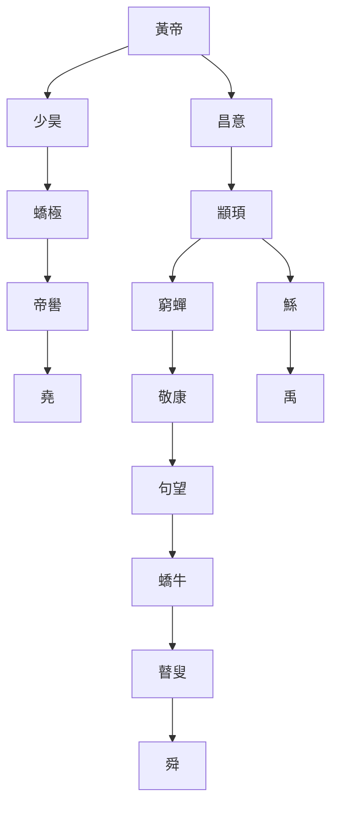
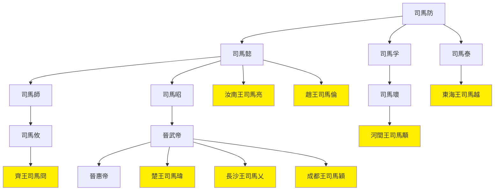

# 呂著中國通史·下（政治史）

## 第十九章 中國民族的由來
- 一個民族難以知其來源，如人不知嬰兒時之事。中國又無其餘民族記載可參考，故很難考證。最有根據的中國起源於西部高原昆崙山，實際禁不起推敲。因此只能有賴於考古學
  - 文化通常起源於大河下游，中國文明起源於黃河下游可能性較大
- 史前似乎分兩系
  - 东系以黑陶為代表，為中國固有文化
  - 西系以彩陶為代表，為西方傳入
  - 東西兩系匯聚至河南
- 古亞洲東方民族三系：北族辮髮、南族斷髮、中原冠帶

## 第二十章 中國史的年代
- 確切紀年為周共和元年，-841年
- 曆法推算年代
  - 劉歆：堯在-2305年。周867，商629，夏432，舜50，堯70
  - 顧雍之：堯在-2357年
- 堯以前為先史時代
- 獲麟：-481年

## 第二十一章 古代的開化
- 盤古：開天闢地。一說及長沙武陵蠻祖先盤瓠(狗)，不足信
- 三皇五帝：說法不一，綜合版本：三皇為燧人、伏羲、神農，五帝為黃帝、顓頊、帝嚳、堯、舜
  - 五德終始說原為相克順序，劉向改為相生順序，且為湊堯與漢同為火德，五帝中湊了一個少昊
  - 三皇五帝是後人造的古史系統
- 古帝王表
  - 古帝王代表一個社會進化階段，未必有其人，但應有對應的先進部族
  - 堯舜禹為王位相繼而非君位相繼，即選舉部族共主，既非禪讓也非篡奪。後來禹部族一家獨大，故改為家天下

慣用名|別名|姓|位置|事跡
--|--|--|--|--
有巢氏||||教民構木為巢
燧人氏||||教民鑽木取火
伏羲|包犧氏、太昊氏|風|山東東南部|創八卦、結繩做漁網
神農|大庭氏、炎帝|姜|山東東南部|發明耒耜，與黃帝阪泉之戰
蚩尤||姜||涿鹿之戰被黃帝殺。與炎帝為一人，涿鹿即阪泉(位於彭城南)
黃帝|軒轅|姬|窮桑(魯北)|涿鹿之戰殺蚩尤，與炎帝阪泉之戰
顓頊|高陽|姬|窮桑(魯北)|父為黃帝嫘祖子昌意，徙都帝丘不足信
帝嚳||姬||
少昊|玄囂、青陽|姬|曲阜|黃帝嫘祖子
堯||姬||
舜||姬||
禹||姬||
共工||姜||
三苗||姜||

- 三皇五帝世系圖(史記版)

- 治水與西遷
  - 共工、三苗、鯀、禹應都參與治水，且因知識類似，堵與疏應並用
  - 水患應未解決，禹部落開始西遷
  - 東方姜姓因水患發展落後，遷徙後的西方姬姓反而領先
  - 姬姓部族對姜姓部族的勝利應為自吹，如共工觸不周山

## 第二十二章 夏殷西周的事跡
- 夏：太康失國少康中興
- 商30代，夏17代，因商用兄終弟及之制
- 商八遷，活動范圍仍在河南的黃河兩岸
- 周武王滅紂未滅商，封其子武庚，使管蔡監。周公攝政成王，三監之亂，連帶東方諸國徐、魯、熊、嬴皆服商不服周，周公平之。
- 周公後有雷風之變、周公奔楚
- 成康之治，昭王南征伐楚敗而不復，穆王中興，五傳厲王被國人逐
- 厲王被逐，周召共和，後宣王號稱中興而敗於西方姜氏之戎，幽王被犬戎申國所滅，平王東遷洛陽而西周亡

## 第二十三章 春秋戰國的競爭和秦國的統一
- 西周前歷史多為共主一國的歷史，東周始有各國歷史
- 春秋多為大國爭二三等小國之戰，戰國則大國相爭
- 呂不韋欲吞天下，秦廢之而沿襲政策。秦統一天下非盡兵力原因，政治、經濟、文化亦自有統一之勢
- 秦成功因素
  - 地處偏僻，風氣淳樸
  - 地廣人稀，用三晉民為耕
  - 重用法家

## 第二十四章 古代對於異族的同化
- 中國為農耕民族，居平原；春秋以前所遇外族主要為山戎，居山地，農耕且相對落後；戰國後遇畜牧的騎寇，居草原
- 各異族情況

名稱|別名|位置|情況
--|--|--|--
犬戎|獯粥、獫狁、昆夷、串夷、緄夷|陝西中甘肅東|黃帝北逐獯粥，西周滅於犬戎，後應被秦人征服
白狄||陝西至中山|由狄分化
赤狄||山西、河北|由狄分化，被晉吞併
氐|巴氐|嘉陵江流域|在周之西，因漢族開拓向西南發展
羌||黃河大通河流域|在周之西，因漢族開拓向西南發展
蜀|賨|戰國在漢中成都|被秦吞併
貉||後世蔓延朝鮮半島|東北方民族
肅慎||原在內地而徙居東北|滿族祖先，
鮮卑||原在南方而徙居東北|東胡之後
烏丸|||東胡之後
黎族|俚、長沙武陵蠻|長江流域|南蠻正宗，現苗族
越|粵|沿海一帶、南洋|現馬來人，斷髮文身、食人(次睢之社)
倮儸|濮|本在河南湖北間，後遷雲貴|西南大族，莊蹻為滇王。現彝族

- 狄種類

氏族|從屬|位置
--|--|--
東山皋落|赤狄|山西昔陽
廧咎如|赤狄|山西樂平
潞氏|赤狄|山西潞城
甲氏|赤狄|河北雞澤
留吁|赤狄|山西屯留
鐸辰|赤狄|山西長治
鮮虞|白狄|戰國時中山
肥|白狄|河北藁城
鼓|白狄|河北晉縣

- 燕趙開闢外族疆域

名稱|開闢者|現位置
--|--|--
雲中|趙武靈王|山西大同
雁門|趙武靈王|山西右玉
代郡|趙武靈王|山西代縣
上谷|燕國|河北懷來
漁陽|燕國|北京密雲
右北平|燕國|河北盧龍
遼西|燕國|河北撫寧
遼東|燕國|遼寧遼陽

- 漢族以文化同化周邊民族並開拓疆土，周邊民族被迫遷徙，而不免受文化影響

## 第二十五章 古代社會的綜述
- 徹底改變社會組織的探索
  - 道家：無實際方案
  - 墨家：節制消費，但不講平均分配
  - 儒家：恢復井田，有明王處理列國紛爭
  - 法家：大事業官營，相對能看清社會前進的趨勢，但方法不當
- 諸子均以民出發，但均無使人民參政的方法，只寄希望於改變上層，且無制裁上層的手段
- 三代是古人共同創造的理想世界

## 第二十六章 秦朝治天下的政策
- 秦漢的時勢
  - 對內治理長治久安
  - 對外擴張疆域，不可征服者確立防線
- 秦始皇作為
  - 對內
    - 廢封建，行三十六郡
    - 解除武裝，收天下兵
    - 統一思想，焚書
  - 對外
    - 蒙恬北逐匈奴，取河套
    - 確立防線，連秦趙燕長城
    - 南取百越、閩中
- 秦始皇順時勢而為，敗在過於急進

## 第二十七章 秦漢間封建政體的反動
- 正史中秦漢間史實很多為當時的傳說
- 項羽十八路諸侯相王，實際是公平的，劉邦所謂背約是找事
- 秦始皇有公心和魄力廢除封建，劉邦則大封同姓以自輔
- 秦二世六國復立至漢初建國，7年，六國之勢復起；劉邦滅異姓王，8年，封建勢力轉向同姓王；賈誼衆建諸侯而少其力至七國之亂平，40年，封建制徹底結束

## 第二十八章 漢武帝的內政外交
- 漢武帝沒本事有志向，重拾秦始皇舊業
- 漢武帝作為
  - 對內
    - 儒家：未用儒家平均地權，而只做表面文章，改正朔易服色，亦未興庠序
    - 法家：欲用法家節制資本，而只達籌款的目的，因不得民心而嚴刑壓迫人民
    - 經濟：一部分用於對外擴張，剩餘浪費在封禪、巡幸、方士、宮室
  - 對外
    - 匈奴：逐匈奴使損折頗多，收復河套甘肅。因用兵不得法，任人唯親，傷亡慘重耗費巨大，實以國力勝匈奴
    - 西域：遠征大宛，和親烏孫，時人多反對，後來的好處亦非本意已知
      - 通西域好處：打通東西方文化交流之路；多一層防備遊牧民族的地理屏障
    - 朝鮮：收復朝鮮，加強文化傳播
    - 西南夷：擴張雲貴川諸地，確立西南邊境
    - 羌：開闢河湟之地，設護羌校尉，收青海東部

## 第二十九章 前漢的衰亡
- 巫蠱之禍至誅滅霍光間，疑點頗多
  - 托孤霍光、上官桀、金日磾、桑弘羊可疑
  - 劉賀無道被廢可疑
  - 漢宣帝身世可疑
- 霍光廢立出於私心，但為政相較武帝為清明
- 宰相之權，移於尚書，此禍由霍光起。進者出弘恭、石顯，遠者開宦官專權的先例

## 第三十章 新室的興亡
- 王莽前，政治家抱有撥亂反正的思想；王莽後，政治家的思想是與天下安
  - 王莽前撥亂反正者：眭弘、蓋寬饒、王吉、貢禹、翼奉、夏賀良
- 王莽改革
  - 土地國有，廢除奴隸，平均地權
  - 六筦法，大事業國營
  - 平衡物價，納稅養失業者及借貸
- 王莽改革綜合儒法，思慮周詳，而失敗原因
  - 民眾覺悟尚不足
  - 對官僚的督責不力，實際內容未推行，均被扭曲而為害
  - 王莽泥古不化、脫離實際，忽視眼前政務，亂改貨幣、瞎改名、胡改官制、對外不當
- 兩漢之亂時間四倍於楚漢相爭，破壞程度或許更甚。光武只能休養生息，後世也不再有人進行根本改革

## 第三十一章 後漢的盛衰
- 後漢國力遠不如前漢
  - 移都雒陽，對西北兩面控制不利
  - 兩漢大亂，海內凋敝
  - 羌亂
- 光武嚴以察吏、寬以馭民，所以政治清明。明章承襲。因運氣好，至和帝時，班超平定西域，竇憲擊破北匈奴
- 後漢亂源
  - 君主年幼，母后臨朝，外戚專權。始於孝章竇皇后
  - 皇帝任用宦官。始於和帝與鄭眾誅竇憲
  - 宦官得勢，而成黨錮之禍
  - 羌亂使後漢大傷元氣
  - 下流社會受宗教煽動

## 第三十二章 後漢的分裂和三國
- 三國分裂的心理原因
  - 封建各忠其君的心理餘習
  - 南方風氣的強悍
- 後漢亂源需嚴法督責，曹操及諸葛亮收其效

## 第三十三章 晉初的形勢
- 晉初潛伏的亂源
  - 玄學興起，忽視現實政務，生活奢侈
  - 門閥士族的階級固化，政治腐敗，忠君之念淡薄
  - 廢史立牧之弊延續，雖除刺史兵權而仍地方割據
  - 兵權倒持異族手中，引發五胡亂華
- 道家思想轉變
  - 漢朝黃老：清淨不擾，使人民各安其生
  - 魏晉老莊：委心任運，趨利避害之術，逃避現實，專求物慾
- 五胡

名稱|源出地|說明
--|--|--
匈奴|散佈山西省|
鮮卑|蒙古東蘇克蘇魯北|東胡後裔，後漢時居北匈奴之地，烏桓被滅後成為五胡之首
羯|山西遼縣|史籍言匈奴別種，疑為氐羌混種。火葬
氐|甘肅成縣|源出武都白馬氐，後同羌居涇渭流域。火葬
羌|涇渭流域|後漢叛亂者。火葬

## 第三十四章 五胡之亂(上)
## 第三十五章 五胡之亂(下)

- 八王之亂圖

- 八王之亂原因：封建思想殘餘。曹魏兄弟爭立，晉反之而大封同姓並給兵
- 晉南北形勢
  - 北方：匈奴劉淵建前趙，滅西晉。羯族石勒滅前趙，控制北方。後被冉閔屠殺，匈奴、羯族一蹶不振。鮮卑慕容氏殺冉閔，控制河北建前燕，氐、羌趁機自立。羌姚氏降晉又降前秦；氐苻氏建前秦，滅前燕前涼，但淝水之戰大敗。鮮卑慕容河北建後燕，羌族姚萇關中建後秦。後秦滅前秦，塞內五胡因戰爭同化已成強弩之末，而鮮卑拓拔氏崛起建北魏。匈奴鉄弗部赫連勃勃被北魏敗而投後秦，叛之建胡夏而後秦衰。北魏敗後燕，分裂為北燕、南燕。北魏拓拔珪吸毒而暫停，各勢力分裂兼併，劉裕占長安而還，被胡夏奪。北魏復強，佔據北方。
  - 南方：衣冠南渡，王敦、庾氏、桓溫相繼掌權。謝安淝水之戰敗前秦。桓玄廢帝自立，劉裕討平之。劉裕平孫恩盧循之亂，北伐滅南燕、後秦，後方有事而棄關中，未能統一南北，篡晉建南朝宋。

## 第三十六章 南北朝的始末
- 治亂循環：開國需文武兼備之主，及諸多輔佐者。如輔佐者擇賢而立，可利國利民，然而實際開國之君必殺功臣而立子。繼位者必生長於富貴，至多中人，不免昏庸或殘暴。前人功業因此付諸東流，國民再次蒙難。
- 南朝
  - 宋文帝北伐
    - 宋文帝時期為南朝較長的治世元嘉盛世
    - 因輕敵而三次北伐敗於北魏
    - 北強南弱之勢至此形成
  - 齊朝
    - 蕭道成篡宋自立
    - 齊高武兩帝政治較清明
  - 梁武帝蕭衍
    - 早年政治清明
    - 晚年好佛法，綱紀廢弛
    - 侯景之亂起，武帝死而子被弒，陳霸先除侯景。
  - 陳朝
    - 梁骨肉相殘，引異族為助，陳霸先建陳朝而存江南
    - 陳後主被隋文帝楊堅滅
- 北魏及北朝
  - 太武帝拓拔燾以平城為根本，不圖南侵
  - 魏孝文帝遷都洛陽，全面漢化，然而淪落至驕奢淫逸
  - 爾朱氏的入侵使北魏轉亂，高歡滅爾朱氏，與宇文氏對立，分裂為東西魏
  - 東魏高歡被其子篡立北齊，西魏宇文泰被其子篡立北周。高歡將侯景南下作亂
  - 北周武帝滅北齊，後北周權歸外戚楊堅，建立隋朝
- 遊牧民族被漢化後的驕奢淫逸，是環境改變後的必然現象，非被文化所貽誤。遊牧民族以掠奪為生產，則必以佔有後享樂為消費，符合經濟學的規律。
- 兩晉南北朝政治黑暗，文化卻得較大發展
  - 南方經濟大發展，成為富力中心
  - 南方由野蠻轉文明，談玄學佛，成為文化中心
  - 文化傳播至東北、遼東、交趾等邊境
  - 五胡大部分主動歸化漢族

## 第三十七章 南北朝隋唐間塞外的形勢
- 秦漢南北朝為一段落，五胡亂華而隋唐興起為另一段落
- 漠南北
  - 初匈奴後鮮卑。拓拔鮮卑據平城
  - 鐵勒入據，被鮮卑趕至漠北。即敕勒，漢時丁零
  - 北魏占漠南，柔然逃漠北歸鐵勒，北魏復破之，部分鐵勒遷至漠南稱高車
  - 南北朝末柔然復強，北朝忌憚。突厥更強，破柔然而代之
- 西域
  - 西域無法侵略中國，中國亂世時亦無暇經營
  - 兩晉南北朝僅苻堅使呂光征伐過一次西域，但商業不絕
  - 三十六國互相吞併，隋唐時僅剩高昌、焉耆、龜茲、于窴等幾個大國
- 東北
  - 遼東遼西朝鮮四郡以南：貉族
    - 西漢時曾至長春附近，建立夫餘國
    - 東漢時朝貢
    - 晉初被鮮卑慕容破，轉向朝鮮半島
    - 部落高句麗獨立建國，慕容入中原後佔遼東侵遼西。支族在南建百濟國
    - 半島南部三韓，秦時有漢人雜居，稱秦韓，後自立建國新羅
    - 高句麗最強，新羅百濟聯合，後百濟附高句麗，新羅附中國
  - 遼東遼西朝鮮四郡以北：未開化的滿族，漢時挹婁，南北隋唐勿吉、靺鞨
- 海路
  - 與印度因佛法交流不少
  - 朝鮮自海路通中國。日本東漢始通中國。百濟使見侯景之亂，號慟哭泣
  - 東漢始與羅馬通商，首例記載為安敦
  - 三國末至唐武后間約450年，中國握有航海權
  - 扶桑可能是庫頁島，更可能是墨西哥。法顯可能發現了美洲
  - 東南亞貨物輸入中國較多

## 第三十八章 隋朝和唐朝的盛世
- 隋文帝離間，突厥分為東西，東突厥臣隋
- 貞觀之治
  - 天下豐樂，制度井然
  - 對外破突厥、薛延陀(鐵勒一部)，服回紇、吐谷渾，平西域，通西藏，敗印度
- 唐高宗時期滅百濟、高句麗，定西突厥，對外聲威達頂峰
  - 使新羅、日本全面漢化
  - 波及滿族，建立渤海國
- 與大食的文化交流
  - 輸入回教、摩尼教、基督教
  - 輸出印刷、羅盤、火藥

## 第三十九章 唐朝的中衰
- 唐高宗因柔懦而使唐中衰
  - 政權落入武后之手，掌權55年
  - 吐蕃破吐谷渾、西域，成為外患
- 武則天：維持權勢不顧大局的政治家
  - 用祿位收買人心，用酷吏威吓異己
  - 驕奢淫逸
  - 使突厥復強，契丹反叛，滿族建渤海國，朝鮮失控
- 唐中宗昏庸，韋后、安樂公主、上官婉兒干政。唐睿宗時太平公主干政。
- 唐玄宗
  - 開元之治：大力廓清武后積弊，滅突厥，戰吐蕃收河西九曲之地
  - 中歲亦墮入武后的驕奢淫逸，引發天寶之亂
  - 安史之亂成為唐朝的盛衰轉折點
- 安史之亂
  - 根源
    - 唐朝武力遠不如漢朝，多用蕃兵
    - 唐控異族於塞外，雖不至於像漢遷胡內地致五胡亂華，卻會在政治衰弱時難防其侵入。安史之亂、唐末沙陀、五代契丹皆此情景
  - 安祿山得長安後不再進取，有勇無謀，被郭子儀借回紇力平
  - 史思明降而復叛，復陷東京。李光弼與相持，再借回紇之力乃平
  - 處於唐中期，後雖表面統一而內核已衰不可復振
  - 後果
    - 引發了藩鎮的跋扈，鐵勒、各節度使
    - 外患的復興，回紇、吐蕃、南詔

## 第四十章 唐朝的衰亡和沙陀的侵入
- 雲南西康六詔(詔為王的音譯)

名稱|別名|位置|事跡
--|--|--|--
蒙嶲詔||西康西昌縣|
越析詔|磨些詔|雲南麗江縣|
浪穹詔||雲南洱源縣|
邆睒詔||雲南等川縣|
施浪詔||雲南洱源縣東|
蒙舍詔|南詔|雲南蒙化縣|位於最南，吞併別五詔

- 唐德宗屢遭叛變，開始重用宦官。後屢鬥宦官未遂，唐文宗謀殺宦官敗露成為傀儡。唐武宗、宣宗時政治清明，但對宦官無能為力。
- 唐懿宗時徐泗之亂，引沙陀軍討平
- 唐末，與南詔言和，回紇為黠戛斯破，吐蕃內亂，三外患因幸運而解除。但因綱紀不振，僅沙陀即可橫行
- 沙陀
  - 西突厥別部，屬白種人。又名處月、朱邪，在新疆迪化縣，有大沙漠名沙陀
  - 酋長朱邪赤心，賜名李國昌，鎮守大同
  - 王仙芝黃巢作亂，各藩鎮坐視，朝廷再請沙陀平亂，李國昌子李克用敗黃巢收復長安
  - 黃巢將朱溫與沙陀抗衡
  - 沙陀整個部族侵入中國，因此其後被同化
- 唐朝痼疾在宦官不在藩鎮，因宦官而不得不用藩鎮，使唐朝與宦官同歸於盡

## 第四十一章 五代十國的興亡和契丹的侵入
- 契丹
  - 大概是宇文鮮卑之後，久居塞外
  - 初遭北齊襲擊，隋時元氣恢復。唐初李盡忠反叛，安史之亂與安祿山鬥爭。唐末回紇崩潰後，興於漠北
  - 分為八部，每部一個大人，一人司旗鼓，連結較弱。亦有一虛名共主，大賀氏或遙輦氏。
  - 劉守光暴虐，流民出塞投契丹，耶律阿保機學習知識，滅八部大人，廢遙輦氏自立，契丹興起
  - 與石敬瑭交易得燕雲十六州，遼太宗侵入中國不利而返
  - 被金聯宋攻破亡國
  - 耶律大石建立西遼，被成吉思汗滅
- 內亂流民同化情況
  - 1 流民多，外國文明低且人少，會被完全同化
  - 2 流民少且文明高，會在外國掌權
  - 3 文明相當，流民會被役使並傳授知識，可能造成外國的強盛
  - 契丹前中國流民多屬1、2情況，契丹始多為3
- 後梁
  - 朱溫篡弒私德不佳，而政治有功，然早死
  - 梁戰唐不力，被滅
- 後唐
  - 沙陀改國號為唐，佔據中原
  - 李存勗滅梁後志得意滿，政治大亂
  - 石敬瑭聯合契丹，廢帝李從珂自焚
- 後晉
  - 石敬瑭為李嗣源女婿，沙陀人
  - 石敬瑭許燕雲十六州，引契丹滅後唐，割地稱臣
  - 石重貴對契丹不復稱臣，被劫持，遼軍劫掠百姓，激起民憤而逃歸
- 後漢
  - 劉知遠為石敬瑭手下，沙陀人
  - 契丹退後稱帝。無甚作為被郭威篡
- 後周
  - 政權返回漢人手中
  - 北漢乘郭威喪來伐，柴榮破之
  - 柴榮政治清明。整頓軍隊，一掃藩鎮之弊，敗後蜀伐南唐
  - 柴榮伐遼成功在望，中途病死，趙匡胤篡位
- 趙匡胤知燕雲十六州不易取，先平定國內建宋

## 第四十二章 唐宋時代中國文化的轉變
- 北族對中國的威脅
  - 前4世紀至6世紀末，一千年，北方騎寇至五胡全被同化。以被征服形式移入而同化
  - 4世紀後半至10世紀前半，六百年，鐵勒侵入至沙陀失權。以被征服形式移入而同化
  - 10世紀初至1911，約千年，東北契丹興盛至近代東北問題。以征服形式移入而同化
- 五胡與沙陀之亂並未激起民族主義，只引發內政治理的反思
- 中國文化三時期
  - 正：先秦兩漢，諸子之學，均為撥亂反正矯正社會。王莽變法失敗後消沉
  - 反：魏晉南北隋唐，玄學佛學，討論人性改進個人。最終結論只能消滅世界
  - 合：宋至西學傳入，理學，認可社會而改良個人。理論治人有益而治世無用
- 宋儒弊病
  - 偏於內心而疏忽處事
  - 要求過嚴而轄制有才之士
  - 論調過高不切實際
  - 過重意氣而陷於黨爭
- 宋儒認識到要改造社會，但無能於政治，其所主張與目的相反；關鍵時期不重視外敵壓迫而消耗於黨爭，使外侮終成

## 第四十三章 北宋的積弱
- 宋真宗與契丹歲幣，開國未幾已不振
- 宋仁宗時又與西夏定歲幣，契丹復加價
- 西夏
  - 黨項人，應為羌族，拓拔鮮卑流入而為酋長，唐太宗時歸化
  - 平黃巢有功，拓拔思敬賜姓李，據五州
  - 李元昊時成為宋患
- 宋神宗時王安石變法，道理沒錯，但目的未達到，且引發大量此生災害，難辭其咎。至哲宗徽宗時，在新法舊法間來回搖擺
- 宋徽宗時政治日下，恰巧遼夏亦衰。而女真崛起則亡
- 女真
  - 先秦肅慎，漢挹婁，南北隋唐靺鞨，宋女真，清滿族，皆為女真未變
  - 松花江南熟女真，松花江北生女真
  - 文明程度很低，渤海時代才一度開化
  - 金始祖函普，為高句麗入居生女真的完顏部
  - 連宋攻遼滅之。本欲分燕雲十六州，童貫屢敗而賴金救，終得空城而加歲幣
  - 靖康之恥，立張邦昌為偽楚，南宋建立
  - 被宋聯合蒙古滅

## 第四十四章 南宋恢復的無成
- 南宋無文武兼備的統帥，可退金兵；金亦因無法消化而退兵
- 宋高宗無進取心，任秦檜為宰相，執意言和供歲幣，岳飛等進兵被召回
- 韓侂胄作妖，金已是強弩之末，而宋仍急於講和增賠款
- 蒙古
  - 室韋部落，與韃靼混合。初在黑龍江上游之南
  - 成吉思汗時始強大，與宋聯合滅金(滅後宋仍不發奮自強，蹈聯金滅遼覆轍)
  - 蒙古滅宋
  - 明時達延汗中興蒙古
- 宋朝覆亡
  - 因文化不及轉變，不適應競爭環境
  - 激發了民族主義

## 第四十五章 蒙古大帝國的盛衰
- 蒙古成功原因
  - 勇於戰鬥
    - 最深入西征抵威尼斯
    - 然二征日本大敗，三征柬埔寨緬甸不利
  - 善於統治，如不干涉各族信仰
  - 主要原因為幸運
    - 彼時中國、大食都正處於衰頹期
    - 西征時諸部族附從
- 蒙古真正打通了東西方的陸路交通，使文化交流融合大興
- 蒙古自忽必烈臻於極盛，亦開始衰頹
- 僅忽必烈及元仁宗時政治清明

## 第四十六章 漢族的光復事業
- 遼金元對中國態度
  - 遼：立國以部族為本，和漢人不發生深切關係
  - 金：海陵遷都後全部寄託於中國，了解漢人較深且壓迫較多
  - 元：始終視中國為一部分，不了解中國
- 忽必烈治法專以防制漢人為務，因漢人不關心政治(抗壓能力強)未得即時覆滅
- 末代元順帝破，朱元璋建國

## 第四十七章 明朝的盛衰
- 朱元璋
  - 平定群雄，武力出眾
  - 通政治，學校科舉賦役法用600年
  - 衛所制可不煩民力而強兵
  - 私心太重，廢宰相，朝中無人，權入宦官
  - 重任官二代，軍政腐敗，導致靖難之變
  - 用刑殘酷，立錦衣衛，後起東廠西廠內廠
- 明初好大喜功，有意沿襲元朝
  - 經略北方
  - 征服安南，設交趾佈政使司(維持22年)
  - 鄭和七次下西洋
- 明政治敗壞始於朱棣
  - 用刑殘酷
  - 宦官專權
- 土木堡之變，徐珵主遷都，于謙主抵抗，其時以抵抗為宜。但兩種策略各有其用，非抵抗必優於遷都
- 明中葉後三昏君
  - 武宗：荒淫，寵宦官劉瑾等
  - 世宗：昏聵，受嚴嵩蒙蔽等
  - 神宗：怠荒，張居正為相十年大有起色，死後神宗親政而昏亂

## 第四十八章 明清的興亡
- 西南邊境
  - 貴州：明成祖時列為佈政司
  - 雲南：唐起大理獨立為國，被元滅，建土司制度，改土歸流逐漸歸屬中國
- 永曆帝入緬甸被弒，明亡。寇盜李定國、白文選死節，重臣洪承疇、吳三桂降清
- 吳三桂三藩之亂反清失敗，鄭成功退守臺灣被施琅覆滅

## 第四十九章 清代的盛衰
- 清朝摧折漢人遠甚遼金元，因渤海、金已經兩度開化
  - 戒喻臣下勿染華風，旗人圈地單獨居住，如封鎖東三省
  - 連結蒙古制漢，假裝信喇嘛教
  - 摧折民族性，立貳臣名目，大興文字獄，編四庫全書而焚書篡改
- 康雍乾
  - 康雍勤政，乾隆吃老本，政治清明
  - 漢人不關心政治(抗壓能力強)，內無兵戈之事
  - 西藏、蒙古因喇嘛教而趨平和，塞外衛拉特(瓦剌)被滅，武功烜赫一時，滅大小和卓木時極盛。明初有緬甸，清未復
- 中國發展特點
  - 中國不適宜向外侵略，除秦漢襲戰國餘風，其餘均為守勢
  - 因國力充裕，只需政治清明、外無強敵，即可威行萬里
- 清衰機始於乾隆，暴露於嘉慶，崩潰於道光、咸豐

## 第五十章 中西初期的交涉
- 中國同化外族入侵者，改造外來宗教，自古未變，直至西方文化傳入
- 洋務以通商傳教為主，但心理上一直畏惡洋人
- 至1860年，與各國訂立北京條約

## 第五十一章 漢族的光復運動
- 部分漢族光復運動被冠以文字獄而鎮壓
- 反清組織：北方哥老會，南方天地會，三合會黨，白蓮教，太平天國、捻軍、回亂
- 太平天國失敗原因：非軍事不力，而為文化落後
  - 政治失敗，均貧富方法簡陋不可行
  - 文化落後，本為討胡而宣揚上帝，不得民心，反使曾國藩、李鴻章等站在對立面
- 太平天國使漢人開始受到重任，內政外交均委託漢人，平定後號稱中興，但滿清已名存實亡

## 第五十二章 清朝的衰亂
- 從慈禧到中興漢臣，應對新局面的思想覺悟均不足
- 列強瓜分使中國徹底覺醒

## 第五十三章 清朝的覆亡
- 西力東侵的應對
  - 戊戌變法：起自中產階級，以傳統文化為根基，以康有為為代表
  - 辛亥革命：起自下層社會，以西方文化為根基
- 義和團被縱容毀洋貨殺洋人，八國聯軍入京城，慈禧變排外為媚外
- 庚子後對清政府失望，分立憲、革命兩大潮流
- 自五口通商民族對時局覺醒，到改革建立中華民國，不過70年，速度已是很快了

## 第五十四章 革命途中的中國
- 民國間革命最大的問題在對外，軍閥混戰只是小擾亂
