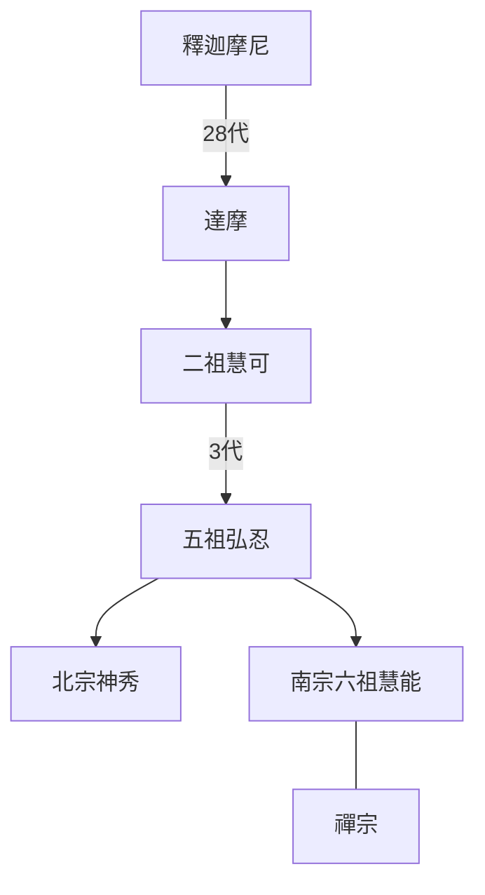
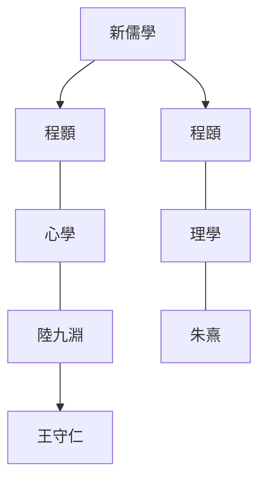

# 中國哲學簡史·下（經學時代）

## 第十七章 將漢帝國理論化的哲學家：董仲舒
### 陰陽家和儒家的混合
- 為了天與人的聯繫，董仲舒把陰陽家和儒家結合起來，混合了陰陽學說與五行學說

### 宇宙發生論的學說
- 宇宙十種成分：天地陰陽木火土金水人
- 天亦有喜怒哀樂，人是天的副本

### 人性學說
- 天有陰陽，人有性情
- 孟子言性已善，董仲舒言性未善

### 社會倫理學說
- 三綱：從五倫中選君臣父子夫妻為三綱，為社會倫理
- 五常：定仁義禮智信為五常，為個人德性

### 政治哲學
- 王者四政：慶、賞、刑、罰，幫助發展人性
- 人間政治過失會引發天怒；人的異常也會機械性地連帶引發天的異常

### 歷史哲學
- 否定五德終始說，創造三統學說：黑統、白統、赤統
  - 夏商周，黑白赤；法西斯、資本主義、社會主義，黑白赤
- 改制並不改變基本原則

### 對《春秋》的解釋
- 孔子繼周正黑統
- 春秋分三世：孔子所見世、所聞世、所傳聞世

### 社會進化的三個階段
- 禮記分亂世、小康、大同三階段

## 第十八章 儒家的獨尊和道家的復興
### 統一思想
- 焚書是法家思想的實際應用
- 漢武帝繼秦始皇，以獨尊儒術統一思想，以儒學為做官的門徑，不禁百家

### 孔子在漢代思想中的地位
- 神話孔子後，相對經書出現了緯書，古文學派駁斥之

### 古文學派和今文學派之爭

差異點|古文學派|今文學派
--|--|--
緣起|擁有焚書前密藏古文經書|經書由漢朝字體寫成
成員|劉歆、揚雄、王充|董仲舒
溯源|先秦儒家現實派-荀子|先秦儒家理想派-孟子
傾向|受道家影響|受陰陽家影響

### 揚雄和王充
- 代表古文學派抨擊今文學派，持自然主義宇宙觀和科學的懷疑精神

### 道家與佛學
- 王充為新道家的復興開闢了道路
- 道教
  - 儒家今文學派的陰陽家成分與道家結合，通過模仿佛教而產生了道教，實際已無先秦道家痕跡。
  - 道教意圖從民族主義出發，取代佛教的影響
- 佛學
  - 以道家為盟友
  - 和尚與新道家清談，出現了禪的精神

### 政治社會背景
- 對秦朝的仇恨使法家受牽連，儒道得益
- 儒家主用於社會組織、精神文明、學術界；法家主用於實際政治的理論和技術；道家主用於休養生息、反對派及逃避現實的思想體係

## 第十九章 新道家：主理派
- 玄學為新道家

### 名家興趣的復興
- 辯名析理

### 重新解釋孔子
- 多數玄學認為孔子是最大聖人，甚至超過老莊，但以道家精神來解釋

### 向秀和郭象
- 向秀、郭象為玄學唯理派代表，著《莊子註》

### “道”是“無”
- 向郭認為道是真正的無

### 萬物的“獨化”
- 萬物自生，而各具他物。社會現象也如此

> 個人觀點：有點類似原子結構

### 制度和道德
- 應自生，適應新的社會

### “有為”和“無為”
- 順應自然、自由發揮才能即無為

### 知識和模仿
- 反對模仿以獲取知識，無用、沒結果、有害。應任我以至於無為

### “齊物”
### 絕對的自由和絕對的幸福
- 向郭註闡明了莊子的暗示

## 第二十章 新道家：主情派
### “風流”和浪漫精神
- 向郭的棄彼任我，為風流的本質
- 世說新語記載清談，體現了風流精神
- 風流源於道家，有浪漫主義精神
- 漢：莊嚴、雄偉；晉：放達、文雅

### 《列子》的《楊朱》篇
- 《列子》應為晉朝著作
- 表現了任從衝動而生的思想

### 任從衝動而生活
- 風流應有縱情外的超越感
- 風流要善於感情投射，以致物我無別

### 情的因素
- 聖人有情而無累
- 主情派多數為宇宙人生而感，非為個人得失

### 性的因素
- 新道家對性有審美無肉感

## 第二十一章 中國佛學的建立
### 佛教的傳入及其在中國的發展
- 1世紀：傳統說法漢明帝時期傳入中國
- 2世紀：謠言佛為老子弟子
- 3-4世紀：佛經以道家思想來格義(類比解釋)
- 5世紀：放棄格義，大量翻譯佛經
- 玄奘引入的相宗為在中國的佛學，短暫時期影響少數人；中道宗與道家結合成為禪宗，為中國的佛學

### 佛學的一般概念
- 佛學一般概念
  - 業是因，報是果，今生來生的生死輪迴，為痛苦根源。
  - 所有業是心的表象，渴求它是無明，陷入生死輪回萬劫不復。
  - 學佛可將無明轉化為菩提，積累善業達到涅槃
- 涅槃定義
  - 法性宗：個人與宇宙的心同一
  - 法相宗：負的方法

> 法性宗：性宗，含三論、華嚴、天台
>
> 法相宗：相宗、空宗、中道宗，含惟識、俱舍

### 二諦義
- 法相宗提出俗諦與真諦，低層次的真為高層次的俗
- 吉藏三層次二諦
  - 俗諦萬物有，真諦萬物無
  - 俗諦萬物無，真諦非有非無
  - 俗諦非有非無，真諦非有非無且非非有非無
- 涅槃類似坐忘

### 僧肇的哲學
### 道生的哲學
- 鳩摩羅什弟子：僧肇、道生，已產生了禪宗的理論背景

## 第二十二章 禪宗：靜默的哲學
### 禪宗傳述的宗系

- 世系不可信，分裂禪宗是事實
  - 神秀：性宗，類道生的佛性
  - 慧能：相宗，類僧肇的無

### 第一義不可說
- 與道家結合達高峰
- 禪宗第一義即法相宗二諦第三層次
- 因不可說產生了語錄

### 修行的方法
- 充分自信，以無心作事，即自然作事

### 頓悟
- 禪師以棒喝助力頓悟

### 無得之得
- 聖人悟道後，仍做平常事
- 凡事皆修禪，則修他法亦修禪，為何修禪？禪師對此無解

## 第二十三章 新儒家：宇宙發生論者
- 唐代儒學地位重新確立
- 儒家需要形而上學和超道德價值的發揮

### 韓愈和李翱
- 繼禪宗盛行，道統說復興，繼承孟子，成立道學，也稱宋明理學、新儒學
- 理學思想來源
  - 儒家本身
  - 佛家及禪宗，包括禪宗中的道家
  - 道教，吸納陰陽家的宇宙觀
- 理學思想發端於韓愈，直至宋朝完成整合

### 周敦頤的宇宙發生論
- 改畫道教圖像，成太極圖說

### 精神修養的方法
- 周敦頤提出無欲，以文字上區別道家的無為和禪宗的無心
- 去除私慾，達到動直，接近禪宗率性而活的思想

### 邵雍的宇宙發生論
- 發展十二主卦理論，兩儀為動靜，四象為陰陽剛柔

### 事物的演化規律
- 邵雍創六十四卦圓圖方位圖，以成與毀解釋陽與陰

### 張載的宇宙發生論
- 強調氣的觀念，太極就是氣，氣的聚散使萬物形成和消亡

## 第二十四章 新儒家：兩個學派的開端

- 朱熹和陸九淵論戰核心：自然規律是否由人心創造

### 程顥的“仁”的觀念
- 仁主要特征為與萬物合一，萬物皆有生命的傾向

### 程朱的“理”的觀念的起源
- 程朱理學認為，宇宙是氣於理的產物

### 程頤的“理”的觀念
- 理是形而上的道，是抽象的；器是形而下的事物，是具體的
- 精神修養以敬字為關鍵

### 處理感情的方法
- 不將情感與自我聯繫起來，如明鏡，不遷怒

### 尋求快樂
- 從名教中尋求快樂，名教實是自然的發展，與風流結合，即古典與浪漫的結合

## 第二十五章 新儒家：理學
### 朱熹在中國歷史上的地位
- 朱熹使程朱理學達巔峰，統治直至西學時期
- 將思想與學識結合起來，從而使思想佔據了統治地位

### 理
- 一切事物都有自己特殊的性，即理，理是永恆存在的

> 個人觀點：理即對象的屬性，有對象必有屬性，屬性在對象創建之前也可存在

### 太極
- 太極是萬物之理的總括，萬物中各有太極

> 個人觀點：太極是最根本的基類

### 氣
- 氣與理共存，孰先孰後是個問題

### 心、性
- 性即是理，抽象；心為理加氣的體現，具象。此為程朱與陸王主要思想分歧之一

### 政治哲學
- 國家亦有其理，須按理治國

### 精神修養的方法
- 格物致知：擴大知識面，以求窮理；
- 用敬：專心致志心無旁騖，再現個人本性從而頓悟
- 類似柏拉圖的宿慧

## 第二十六章 新儒家：心學
### 陸九淵的“心”的概念
- 心即理
- 不存在抽象具體兩個世界，只有心一個世界

### 王守仁的“宇宙”的概念
- 王守仁將心學最終系統化完成
- 無心則理同時消失

### “明德”
- 大學為大人之學

### 良知
- 三綱領歸納：心的本性為在明明德
- 善的本性為良知，人應致良知

### “正事”(格物)
- 八條目歸納：致良知

### 用敬
- 陸王思想有禪學的延續

### 對佛家的批評
- 朱熹批評佛學所說的空，其中應有理的存在
- 王守仁批評佛家自稱不著相其實已著相，儒家反不著相

## 第二十七章 西方哲學的傳入
- 朱熹自己不遵守格物的做法，加重了官方化的權威主義與保守主義

### 對於新儒家的反動
- 陸王學派陷入全部相信直覺去做事的陷阱
- 清朝被指責朱子道，陸子禪。反對宋學(新儒學)，提倡漢學
- 漢學思想成就不大，但打開了眼界，不再局限於四書

### 孔教運動
- 為抵抗西方傳教士影響，康有為力圖把儒家建立為宗教。基督教影響有限，孔教也夭折了

### 西方思想的傳入
- 20世紀初，西方思想最大權威是嚴復，流傳原因
  - 中國戰敗從而想對西方有所了解
  - 嚴復使用了類比法(格義)，便於理解
  - 嚴復翻譯得很像中國古典經書
- 王國維對哲學有更深見解，可惜棄哲學從文史

### 西方哲學的傳入
- 1919年杜威與羅素首次來中國講學
- 迄今為止，還是西方哲學在中國，未有融入中國的情況
- 西方哲學最大的貢獻是提供了邏輯分析方法，即正的方法，與道佛的負的方法相對

## 第二十八章 中國哲學在現代世界
### 哲學家和哲學史家
### 戰時的哲學著作
### 哲學的性質
- 哲學應成為不知之知，不為提高知識，而是提高精神境界

### 人生的境界
- 生命活動四等境界
  - 自然境界
  - 功利境界
  - 道德境界
  - 天地境界
- 中國哲學既入世又出世，這方面可能會有所貢獻

### 形上學的方法論
- 正的方法：討論形而上學的對象。西方哲學占統治地位，在中國被過分忽略
- 負的方法：排除法。中國哲學占統治地位，康德曾有所運用
- 應以正的方法開始，以負的方法告終
