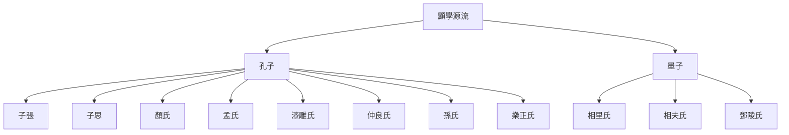

# 韓非子雜記

> 2025/8/31 -> 2026/1/6

## 初見秦第一
- 論述人臣應忠，秦臣不忠使統一天下多次功敗垂成

## 存韓第二
- 韓非建議先攻趙以存韓，李斯反對并向韓王上書

## 難言第三
- 說服君主很難，試圖說服傻逼可能招禍
- 成語：洋洋灑灑

## 愛臣第四
- 必須防備臣下，否則必犯上。集權集資是最優解
- 愛臣太親，必危其身；人臣太貴，必易主位；主妾無等，必危嫡子；兄弟不服，必危社稷：可謂另一個版本的君君臣臣父父子子

## 主道第五
- 君主統治的要點，主要為御下之術，隱藏想法、會也不干、出事甩鍋、中央集權、嚴防小團夥、賞罰分明
- 明君無爲於上，羣臣竦懼乎下：韓非變異的無為，其實是畏之階段的改進版
- 有功則君有其賢，有過則臣任其罪：傳家真本事
- 不自操事而知拙與巧，不自計慮而知福與咎：需要知道但又不做，從實操來講其實根本做不到，只能理想化地空談
- 故明君無偷賞，無赦罰。賞偷，則功臣墯其業；赦罰，則姦臣易爲非。是故誠有功，則雖䟽賤必賞；誠有過，則雖近愛必誅：真正的法治思想，卻幾乎無應用，即使偶發也更多被解讀為儒家情懷，典型好的學不會，壞的一學就會

## 有度第六
- 以法治國。屬下要一心一意當工具人，君主要嚴格憑法律辦事
- 刑過不避大臣，賞善不遺匹夫：比刑不上大夫好太多

## 二柄第七
- 刑德(賞罰)為二柄。君主掌握刑德，才能不使大權旁落。只有在職責範圍內立功且符合所言才賞，超越職責、言行不符皆罰。君主不可暴露自身好惡，否則會被迎合導致賞罰失效。

## 揚榷第八
- 改造道家思想的綱領內容。君主無為讓臣下發揮，對下明賞罰以防止其顯貴和結黨
- 黃帝有言曰：「上下一日百戰。」下匿其私，用試其上；上操度量，以割其下。故度量之立，主之寶也；黨與之具，臣之寶也。臣之所不弑其君者，黨與不具也：先有君臣之分，才有一日百戰
- 一家二貴，事乃無功

## 八姦第九
- 警惕八姦奪取君權
- 八姦：臣下犯上方法
  - 同牀：利用妻妾
  - 在旁：利用近習
  - 父兄：利用宗室及寵臣
  - 養殃：用享樂腐蝕
  - 民萌：收買民心
  - 流行：利用公知或製造輿論
  - 威強：蓄養死士以立威
  - 四方：勾結外敵
- 成語：唯唯諾諾

## 十過第十
- 十個敗亡小故事
- 十過
  - 行小忠：子反嗜酒，榖陽以忠心勸酒，使貽誤戰機
  - 顧小利：假途伐虢
  - 行僻：楚靈王申之會無禮諸侯而亡身。飄
  - 好音：晉平公聽師曠鼓琴。不務正業
  - 貪愎：智伯貪三家之地而被反殺
  - 耽於女樂：秦穆公以女樂亡戎王而得由余
  - 離内遠遊：齊景公貪游海上，顔涿聚死諫使返國
  - 過而不聽於忠臣：齊桓公不聽管仲而用竪刁
  - 内不量力：韓君不聽公仲朋，信楚虛言而失地於秦
  - 國小無禮：曹君觀重耳浴而被滅國
- 臣聞聖人之治，藏於民，不藏於府庫
- 成語：靡靡之音

## 孤憤第十一
- 權臣會蒙蔽主上及進言的道路，智法之士進言及生存困難
- 主利在有能而任官，臣利在無能而得事；主利在有勞而爵禄，臣利在無功而富貴：主臣利益的核心矛盾

## 說難第十二
- 遊說的技巧，關鍵點是從被遊說者的心理出發。先極盡察言觀色拍馬屁，再挑君主心情好的時候，說出論點
- 成語：逆鱗

## 和氏第十三
- 法術之士比卞和還慘，比如吳起和商鞅
- 和氏璧故事最早記録
- 大臣貪重，細民安亂：此法家違背自然，不可長久為用的實證

## 奸劫弑臣第十四
- 只有法術才能防範奸臣。用賞罰形成勢，引導全國人的行為，而不能用仁義。被弒殺的君主世界最慘
- 聖人之治國也，固有使人不得不愛我之道，而不恃人之以愛爲我也：以法治國而不以個人判斷
- 故其治國也，正明法，陳嚴刑，將以救羣生之亂，去天下之禍，使强不陵弱，衆不暴寡，耆老得遂，幼孤得長，邊境不侵，君臣相親，父子相保，而無死亡係虜之患，此亦功之至厚者也：法家的愿景太貪了
- 不畏重誅，不利重賞，不可以罰禁也，不可以賞使也，此之謂無益之臣也：隱士對管理層而言為無益之臣

## 亡徵第十五
- 亡國徵兆47例
- 夫兩堯不能相王，兩桀不能相亡：苟延殘喘的解釋

## 三守第十六
- 不能向近習泄露忠臣的進言；必須獨掌賞罰；必須親理朝政

## 備內第十七
- 防備后妃太子篡權，也要防備姦臣。所有人皆從利益出發，皆不可信。避免人民徭役過重，而使大臣得掌賞罰之權
- 醫善吮人之傷，含人之血，非骨肉之親也，利所加也。故輿人成輿，則欲人之富貴；匠人成棺，則欲人之夭死也。非輿人仁而匠人賊也，人不貴，則輿不售；人不死，則棺不買。情非憎人也，利在人之死也：天下熙熙，皆為利來

## 南面第十八
- 君主需要明法，防止臣下以辦事或言論騙取資源，只辦利大於弊的事，辦事以結果為導向
- 主道者，使人臣必有言之責，又有不言之責：說與不說皆綁定責任
- 不知治者，必曰：「無變古，毋易常。」變與不變，聖人不聽，正治而已：法家明確為結果導向，怎麽做無所謂，但既然開始討論，大部分情況確實是需要變了

## 飾邪第十九
- 整治邪惡，不要迷信，不要相信他人，以法治國是唯一正路
- 故君臣異心，君以計畜臣，臣以計事君，君臣之交，計也：君臣相處之道的大實話

## 解老第二十
- 老子部分條目解讀，此節為硬解讀
- 道與理的關係，為類與對象的關係
- 道譬諸若水，溺者多飲之即死，渴者適飲之即生；譬之若劒戟，愚人以行忿則禍生，聖人以誅暴則福成。故得之以死，得之以生，得之以敗，得之以成：道不仁，全看用法

## 喻老第二十一
- 通過事例解讀老子部分章句

## 說林上第二十二
- 小故事集錦，遊說的素材
- 紂爲長夜之飲，懽以失日，問其左右，盡不知也。乃使人問箕子。箕子謂其徒曰：「爲天下主而一國皆失日，天下其危矣。一國皆不知而我獨知之，吾其危矣。」辭以醉而不知：啓陳平答呂后之智
- 成語：老馬識途、遠水不救近火

## 說林下第二十三
- 小故事集錦下篇
- 有與悍者鄰，欲賣宅而避之。人曰：「是其貫將滿矣，子姑待之。」答曰：「吾恐其以我滿貫也。」遂去之。故曰：「物之幾者，非所靡也。」：風險管理經典題目
- 典故：海大魚

## 觀行第二十四
- 觀察他人的行為要遵循客觀規律

## 安危第二十五
- 國家安定與危亡之道
- 安危在是非，不在於強弱；存亡在虚實，不在於衆寡

## 守道第二十六
- 法治是保守國家之道，不能寄希望於忠臣良民

## 用人第二十七
- 用人原則：循天順人明賞罰，專人專職避免內鬥。以法治代替心治
- 明君使事不相干，故莫訟；使士不兼官，故技長；使人不同功，故莫爭
- 明主立可爲之賞，設可避之罰

## 功名第二十八
- 立功成名的四要素，其中勢位最重要，需要人來獲得
- 明君之所以立功成名者四：一曰天時，二曰人心，三曰技能，四曰勢位：比天時地利人和精準

## 大體第二十九
- 大局觀
- 豪傑不著名於圖書，不録功於盤盂，記年之牒空虚：漢文帝之時史書無事，可證
- 成語：吹毛求疵

## 內儲說上七術第三十
- 論據故事集，君主治理臣下的七種手段及六種問題端倪
- 最早的連珠體，先說結論(經)，再依次列舉事例證明(說)
- 七術
  - 眾端參觀(參觀)：對臣下的提議要多方面觀察驗證，避免偏聽
  - 必罰明威(必罰)：有罪必罰以立威，避免當老好人
  - 信賞盡能(賞譽)：有功必賞鼓勵積極做事，以奬勵為驅動
  - 一聽責下(一聽)：對臣下一一聽取與督責，避免被混淆視聽
  - 疑詔詭使(詭使)：發佈不明確的命令來試探，迫使臣下謹慎盡責。這兩節故事文不對題
  - 挾知而問(挾知)：用已知的事詢問臣下，從而瞭解到其他事實。這兩節故事文不對題
  - 倒言反事(倒言)：故意說反話做反事，觀察臣下是否有陰謀
- 成語：三人成虎、一颦一笑、滥竽充数

## 內儲說下六微第三十一
- 六微
  - 權借在下(權借)：君主權勢借給下屬
  - 利異外借(利異)：姦臣串通外部謀求私利
  - 託於似類(似類)：姦臣以似是而非之事謀求私利
  - 利害有反(有反)：要從受害者的相反面尋找利益獲得者。國家受害時要嚴查臣下得利者，臣下受害時要觀察其利益相反者
  - 參疑内争(參疑)：臣下勢均力敵而內鬬
  - 敵國廢置(廢置)：本國的人事任免被敵國干預
  - 廟攻：把第五第六用在敵人身上，就變成了計謀

## 外儲說左上第三十二
- 仍然為連珠體
  - 避免聽信迂闊無用之言
  - 聽言必須以功用為目的。否則容易外行領導內行
  - 人性自利，以利益為出發點才能成事
  - 遠離不以國家利益出發者
  - 君主不可事必躬親，而應各司其職
  - 明主積於信。各種狼來了的故事
- 畫莢：以豆莢為底片畫畫，先秦幻燈片
- 鄭縣人有屈公者，聞敵，恐，因死；恐已，因生：末日生存聖體
- 成語及典故：買櫝還珠、良藥苦口、忠言逆耳、畫犬馬難、堅瓠、郢書燕說、鄭人置履

## 外儲說左下第三十三
- 繼續連珠體
  - 執法公平公正則無後患
  - 忠誠不可信，必須靠權術
  - 堅決維護君主獨尊的地位
  - 確保執法落到實處，否則無效
  - 臣下的財富地位由貢獻決定，避免過奢過儉，同時需杜絶拉幫結派
  - 探討嚴格執法與人性倫理的矛盾
- 故明主者，不恃其不我叛也，恃吾不可叛也；不恃其不我欺也，恃吾不可欺也：明主不信人性，只依賴法治
- 紂曰：「夫仁義者，上所以勸下也。今昌好仁義，誅之不可。」三說不用，故亡：紂不忍誅文王，仁義以亡國的說法
- 桓公問置吏於管仲：劉邦論漢初三傑句式原出處
- 成語：外舉不避讎，內舉不避子

## 外儲說右上第三十四
- 治臣原則
  - 勢：賞罰御下，駕馭不了就殺掉
  - 術：隱藏自身，堅持獨裁
  - 法：維護法治，謹防猛狗(外戚重臣)社鼠(近習)破壞法治
- 獨視者謂明，獨聽者謂聰。能獨断者，故可以爲天下主：申不害語
- 成語：玉卮無當

## 外儲說右下第三十五
- 繼續連珠體
    - 賞罰共則禁令不行：必須獨裁
    - 君不仁而正賞罰，臣不忠而盡死力：徹底法治拋棄仁政
    - 臣掌握實權將危主
    - 治吏不治民
    - 因事之理，則不勞而成
- 塞禱：還願
- 夫生而亂，不如死而治：寧可人民餓死，不可使其無功收救災物資
- 成語：中饱私囊

## 難一第三十六
-  對前人言論事蹟的擡槓專輯，共四篇
- 開創先陳述後辯論的論難文體，可能啓發了太史公曰
- 師曠以琴撞晉平公，高漸離用筑擊秦始皇，可見琴自古為兇器
- 成語：矛盾

## 難二第三十七
- 繼續擡槓

## 難三第三十八
- 繼續擡槓
- 此章順帶批管子
- 仲尼之對，亡國之言也：韓非似乎是出於想要自成一派，不停地以罵自己祖師為噱頭
- 中期推琴而對曰：鍾子期可能是皇家樂師，還能干政
- 故法莫如顯，而術不欲見：制度需要宣傳到深入人心，權謀術需要隱藏在君主的內心

## 難四第三十九
- 本節擡槓兩次
- 羣臣皆有陽虎之心：人人都要害朕
- 非賢而賢用之，與愛而用之同：不辨賢愚與任用進習效果相同

## 難勢第四十
- 基於慎到觀點，詳解勢的作用。落毛鳳凰不如雞，但雞插了鳳凰毛也不行。韓非觀點是用套路羽毛(法治)，讓大部分鳥類都不難看，中等身材都適用
- 此篇實際可視作全書勢治的核心綱領
- 今廢勢背法而待堯、舜，堯、舜至乃治，是千世亂而一治也。抱法處勢而待桀、紂，桀、紂至乃亂，是千世治而一亂也：成熟法治降低亂世概率

## 問辯第四十一
- 未統一思想的亂世纔會產生辯論

## 問田第四十二
- 題目無意義，實際在說：幹部要從基層開始逐級提拔；韓非甘願為法治理想獻身
- 利民萌、便衆庶：這實際是韓非的終極目標。與之相對的是道家，終極目標是保存自身。儒家是騎牆派，能兼濟天下就兼濟天下，不行就獨善其身

## 定法第四十三
- 申不害使君王用術而國家無法，商鞅使國家用法而君王無術，皆不可行，而且他們本身的法與術也有漏洞
- 此篇實際可視作全書法治術治的核心綱領
- 術者，因任而授官，循名而責實，操殺生之柄，課羣臣之能者也。此人主之所執也。法者，憲令著於官府，刑罰必於民心，賞存乎慎法，而罰加乎姦令者也。此臣之所師也。君無術則弊於上，臣無法則亂於下，此不可一無，皆帝王之具也

## 說疑第四十四
- 辨別臣子好壞的方法，禁奸臣優先級高於明賞罰

臣子類型|代表人物|特點
--|--|--
不令之民|許由、伯夷、叔齊|賞罰無效，聖主也用不了
諫爭之臣|比干、伍子胥|意見統一親如師徒，產生分歧撒潑報復，聖主也難以駕馭
朋黨之臣|田常、白公勝、子之|雖有能力但拉幫結派，聖主能控制，昏主控制不住
霸王之佐|伊尹、周公、管仲、范蠡|夙興夜寐能力超羣不爭不搶，昏主使用也能強國
諂諛之臣|儀行父、豎刁、易牙|以滿足私慾為中心，完全無視國家存亡，聖主使用也會亡國

- 舜偪堯，禹偪舜，湯放桀，武王伐紂。此四王者，人臣弑其君者也，而天下譽之：奸臣做大成聖王
- 成語：内舉不避親，外舉不避讎

## 詭使第四十五
- 很多事情弄反了：額外尊崇法律體系之外的所謂賢人，會降低法律有效性從而帶來混亂
- 所以治者，法也；所以亂者，私也。法立，則莫得爲私矣

## 六反第四十六
- 批判被誤贊和誤貶的人各六種，基本相互對應。實際主要提倡重賞重罰治國，避免仁政陷阱
- 姦僞無益之民
    - 貴生之士：逃跑投降者
    - 文學之士：創立學說蠱惑羣衆的儒家
    - 有能之士：靠遊說發財的縱橫家
    - 辯智之士：講歪理邪說的騙子
    - 磏勇之士：不服管教的黑幫俠客
    - 任譽之士：窩藏協助反賊亂臣者
- 耕戰有益之民
    - 失計之民：為國捐軀的烈士
    - 樸陋之民：遵紀守法的良民
    - 寡能之民：老老實實幹活的
    - 愚戇之民：為人善良厚道的
    - 怯懾之民：尊重領導服從安排的
    - 讇讒之民：幫助國家舉報反賊清理奸臣的
- 禮之所在，利必加焉；賤之所在，害必加焉：一句話戳破儒家崇禮泡沫
- 夫陳輕貨於幽隱，雖曾、史可疑也；懸百金於市，雖大盜不取也：此處堅定繼承荀子的性惡論
- 故母厚愛處，子多敗，推愛也；父薄愛教笞，子多善，用嚴也：棍棒出孝子原型
- 故法之爲道，前苦而長利；仁之爲道，偷樂而後窮
- 不躓於山，而躓於垤：不會被山絆倒，而會被小土包絆倒
- 老聃有言曰：「知足不辱，知止不殆。」夫以殆辱之故而不求於足之外者，老聃也。今以爲足民而可以治，是以民爲皆如老聃也：道家用以修身，法家用以治國

## 八說第四十七
- 以辯駁八種利個人損國家的說法起，論述用人、法治等事
- 焚書坑儒的原型：孔、墨不耕耨，則國何得焉？……夫貴文學以疑法，尊行修以貳功，索國之富強，不可得也
- 古人亟於德，中世逐於智，當今争於力：世風日下
- 仁暴者，皆亡國者也：仁者破壞賞罰體系，暴者無視法律不可約束
- 不能具美食而勸餓人飯：站着說話不腰疼的勸飯之說
- 成語：大爭之世

## 八經第四十八
- 八項基本原則
    - 因情：充分運用好賞惡罰等人之常情
    - 主道：君主綜合臣下智慧的作法，先民主後集中
    - 起亂：明確君臣利益不同，明辨公私之分，才能避免禍亂
    - 立道：多方面考查瞭解真相道方法
    - 參言：賞罰需要不露聲色
    - 聽法：檢驗言論的方法，讓每人對自己的話負責到底
    - 類柄：遵從法度，一切從國家利益出發
    - 主威：君主的威勢，一切從國家利益出發
- 此節忽然非常晦澀
- 下君盡己之能，中君盡人之力，上君盡人之智
- 知臣主之異利者王，以爲同者劫，與共事者殺
- 成語：賞同罰異

## 五蠹第四十九
- 五蠹：儒家、縱橫家、刺客遊俠、逃兵避戰者、工商業者
- 問題
    - 儒家：仁義對治國毫無用處，並且會在法治外開特例破壞法制，打開了私賞的口子
    - 縱橫家：言論沒有實際價值，更像脫口秀表演。說客個人成功了飛黃騰達，失敗了捲錢逃跑。國家執行合縱連橫只會空損國力
    - 刺客遊俠：隨意誅殺破壞法治，打開了私罰的口子
    - 逃兵避戰者：不戰，直接削減國家戰鬥力，不利於軍事發展
    - 工商業者：不耕，直接削減國家農業，不利於經濟發展
- 是以聖人不期脩古，不法常可，論世之事，因爲之備：道可道非常道，與時俱進
- 是以古之易財，非仁也，財多也；今之爭奪，非鄙也，財寡也：窮生奸計富長良心
- 上古競於道德，中世逐於智謀，當今爭於氣力：逢人必說的世風日下
- 賞莫如厚而信，使民利之；罰莫如重而必，使民畏之；法莫如一而固，使民知之：基本涵蓋了全書精髓
- 儒以文亂法，俠以武犯禁，而人主兼禮之，此所以亂也。夫離法者罪，而諸先生以文學取；犯禁者誅，而羣俠以私劒養。故法之所非，君之所取；吏之所誅，上之所養也。法、趣、上、下，四相反也，而無所定，雖有十黄帝不能治也：明星段落
- 古者蒼頡之作書也，自環者謂之私，背私謂之公，公私之相背也，乃蒼頡固以知之矣：厶表示圍着自己轉，公的八表示反義，因此公私本意就是完全相反的
- 國平養儒俠，難至用介士，所利非所用，所用非所利：各種資源錯配現象
- 故糟糠不飽者不務粱肉，短褐不完者不待文繡。夫治世之事，急者不得，則緩者非所務也：輕重緩急是政治的首要問題
- 布衣相與交，無富厚以相利，無威勢以相懼也，故求不欺之士：老實人只有在貧民階級纔有用處，更高階級只看利益，無所謂是否欺騙
- 故明主之國，無書簡之文，以法爲教；無先王之語，以吏爲師；無私劒之捍，以斬首爲勇。是境内之民，其言談者必軌於法，動作者歸之於功，爲勇者尽之於軍。是故無事則國富，有事則兵强，此之謂王資。既畜王資而承敵國之舋，超五帝、侔三王者，必此法也：法家理想國，與道家小國寡民一樣基本不可能實現
- 矰繳：音增灼，箭上繫繩射鳥，沒射中箭還能收回來毫無損失，比喻縱橫家無論成敗都可以非富即貴
- 長袖善舞，多錢善賈……治强易爲謀，弱乱難爲計：越有錢越好掙錢，越強容錯率越高，越弱容錯率越低
- 成語：守株待兔、脛毛、微妙之言、長袖善舞、汗馬功勞

## 顯學第五十
- 對儒家墨家的系統性批判。儒墨二者本身就有很多矛盾之處，二者思想又多與治國原則相違背

- 無參驗而必之者，愚也；弗能必而據之者，誣也。故明據先王，必定堯、舜者，非愚則誣也：不是蠢就是壞
- 故明主之吏，宰相必起於州部，猛將必發於卒伍：是騾子是馬拉出來遛遛
- 夫聖人之治國，不恃人之爲吾善也，而用其不得爲非也。恃人之爲吾善也，境内不什數；用人不得爲非，一國可使齊。爲治者用衆而舍寡，故不務德而務法：沒有惡人比培養善人重要
- 民智之不可用，猶嬰兒之心也：人民沒有大局觀，出於政策討好人民的政策一定無益
- 故舉士而求賢智，爲政而期適民，皆亂之端，未可與爲治也

## 忠孝第五十一
- 批判儒家的忠孝不徹底，應該絕對地忠孝
- 治也者，治常者也……天下太上之士，不可以賞勸也；天下太下之士，不可以刑禁也：極端人物不在法治之內
- 獨行謂之王：有獨立思考能力才算得上領導

## 人主第五十二
- 人主之所以身危國亡者，大臣太貴，左右太威也

## 飭令第五十三
- 君主應使命令合乎法治
- 行刑，重其輕者，輕者不至，重者不來，此謂以刑去刑：理論看起來可行，但容易造成犯法者的破罐破摔，使小事化大

## 心度第五十四
- 以法度服民心。用法纔是愛民，法律應因材施教與時俱進，想強國需要能夠發動羣衆
- 法與時轉則治，治與世宜則有功：此處與上文“法莫如一而固”矛盾，也暴露了法家最大的問題，即如何立法的問題
- 成語：好逸惡勞

## 制分第五十五
- 控制刑賞的分寸。另推崇連坐制度