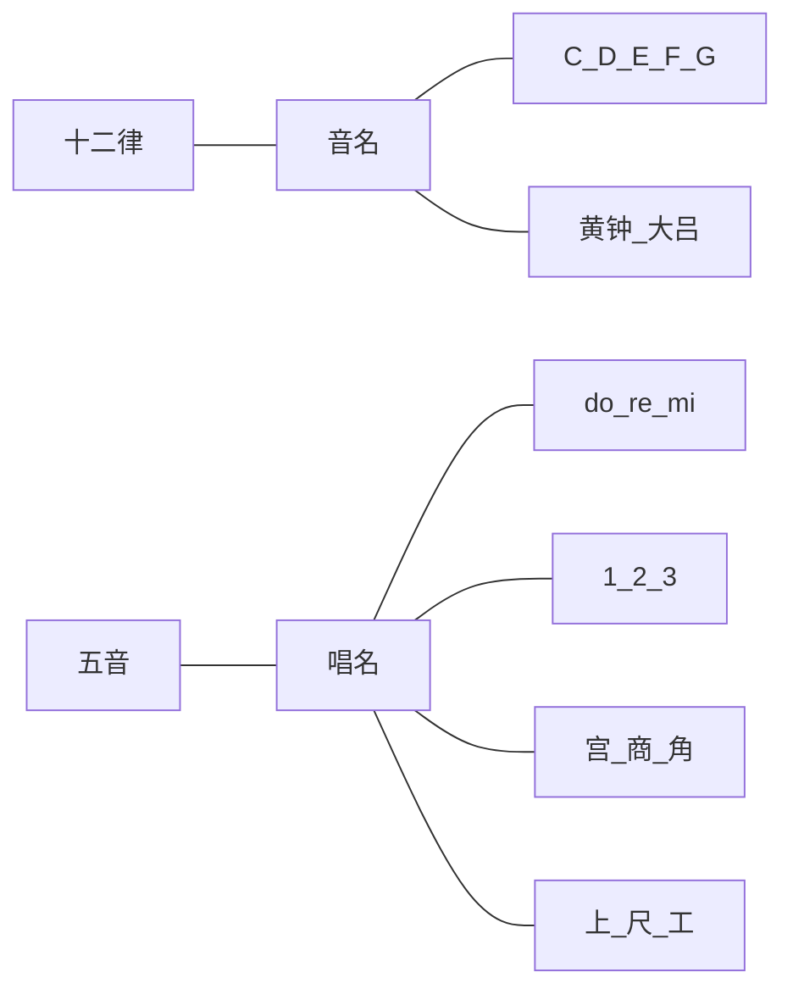

# 从零开始了解中国传统乐理知识（一）——五音十二律

> 乐理并不难，原理简单，需要背点东西。中国传统爱起名，所以还需要多背点。
>
> 这系列文章旨在让自称乐盲者能了解到一些中国传统的乐理知识，消除些神秘感。为方便入门，很多地方与西方乐理互参，个人认为也并无坏处。
>
> 中国古乐及古律博大精深，此处也仅作了解初探，如有谬误及疏漏还请方家指正。

## 音的来源

- 物体振动时，除了来回抖，还产生了副产品：声音。如果每秒抖一圈，频率就是1赫兹。
- 可惜人耳只能听见一定频率范围内的声音，甚至只对一部分敏感。因此，电话占线的声音被定为440赫兹，相当于钢琴上的`A`音。

## 十二平均律与八度
- **乐理入门最大的障碍主要是一些术语**，而西方乐理是个捷径，因为西乐起名简单，而中国古人爱装逼，起名飘逸。
- 找个钢琴或者模拟钢琴，仔细观察键盘，会发现黑白键以12个一组在循环，这就是所谓的**十二平均律**。实话说，十二平均律是明朝朱载堉最先发现的，他是朱元璋的孙子。
- 为了沟通方便，西方人管这一组循环的第一个白键叫`C`，第二个白键叫`D`，依此类推即`C D E F G A B`，而黑键则分别叫做`#C #D #F #G #A`（#为升号，表示提升半音），这样加起来一共12个音。
- 这12个音再往前往后走，都是如此循环，每个循环被叫做一个**八度**。
- 而平均律平均的意思，是指这12个音互相之间都间隔**半音**，钢琴上相邻的两个键（黑键白键均包括）也是半音关系，如`C`和`#C`、`#C`和`D`、`E`和`F`等等。
    - 琴键是否相邻，不要看手弹的这边，要看琴键的根部。可以盖住琴键的下半部分观察黑白色块的分布，每个色块是一个半音。
    - 每个半音之间的音高差距是完全一样的（至少让人类这么觉得）。

## 音名与十二律

- `C D E F G A B`，这些符号被称为**音名**，就是给某一音高取的名字。所以440赫兹可以叫`A`，某一些狗叫声也可能是`G`。
- 中国古代却取了一堆更亮瞎狗眼的名字：**黄钟、大吕、太簇、夹钟、姑洗（xiǎn）、仲吕、蕤（ruí）宾、林钟、夷则、南吕、无射（yì）、应（yìng ）钟**，也就是所谓的`十二律`。
- 由于文化不同，以多少赫兹对应`A`并不相同，本文为方便理解（并不正确），以黄钟直接对应钢琴上的`C`，则440赫兹我们也可以叫它`南吕`。

钢琴键|C|#C|D|#D|E|F|#F|G|#G|A|#A|B
--|--|--|--|--|--|--|--|--|--|--|--|--
琴键颜色|白|黑|白|黑|白|白|黑|白|黑|白|黑|白
十二律|黄钟|大吕|太簇|夹钟|姑洗|仲吕|蕤宾|林钟|夷则|南吕|无射|应钟
律吕|六律|六吕|六律|六吕|六律|六吕|六律|六吕|六律|六吕|六律|六吕

- 所以，**十二律即音名，用来表示音高**。其中，单数音名为**六律**（黄太姑蕤夷无），偶数音名为**六吕**（大夹仲林南应），合称**律吕**。

## 唱名与五音

- 对于更多数人而言，音名接触较少，而**唱名**接触的就多了。
- 唱名就是**do、re、mi、fa、so、la、xi**，简谱写作**1、2、3、4、5、6、7**，这些都是西方人起的名字。（简谱是法国人发明的）
- 在中国古代也有两套唱名影响力较大，分别是：
    - **五音**：**宫、商、角（jué）、清角、徴（zhǐ）、羽、变宫**
    - **工尺（chě）谱**：**上、尺、工、凡、六、五、乙**
    
唱名|do|re|mi|fa|so|la|xi
--|--|--|--|--|--|--|--
简谱|1|2|3|4|5|6|7
五音|宫|商|角|清角|徴|羽|变宫
工尺谱|上|尺|工|凡|六|五|乙

- 作为历史悠久的五音，很多人有不少误解。五音实际是`宫 商 角 徴 羽`，对应`1 2 3 5 6`，因此，说中国古乐没有`4`和`7`这样喜闻乐见的讹传也就不胫而走。事实上，`1 2 3 5 6`是中国古乐提炼出来的常用五声音阶，而七声音阶有多种，包含`4`和`7`。如：
    - 燕乐音阶：`1 2 3 4 5 6 b7`，其中的`4`叫`清角`。（b为降号，表示降低半音，b7和#6实际上是一个音）
    - 雅乐音阶：`1 2 3 #4 5 6 7`，其中的`7`叫`变宫`。
- 工尺谱是另一套记谱法，原理没有区别，暂不详述。

## 理清五音十二律

- 可能由于早年音乐都是政治老师教的，很多人对音名和唱名的理解都混做一锅粥。需要强调：
  - 唱名唱出来的`do`，未必就是音名的`C`！
  - 只有在`C调`下，音名为`C`的音高才唱作`do`！
- **所谓什么什么调，就是说拿哪个音名的音高当`do`用**。
  - 以音名`C`为`do`，就是`C调`
  - 以音名`G`为`do`，就是`G调`
- 而无论使用什么调，`do re mi`这些音之间的相对关系保持不变，即：
  - `do`与`re`、`re`与`mi`、`fa`与`so`、`so`与`la`、`la`与`xi`，始终都相差两个半音，即直观来看**相隔一个钢琴键**（黑键白键都包括）
  - `mi`与`fa`、`xi`与下一个八度的`do`，始终都相差一个半音，即直观来看**在钢琴键上是相邻的**。
- 所以，`C调`下的`do`，在`G调`下应唱作`fa`，而它们的音高是一样的，因此音名均为`C`。
- 为什么搞这么复杂？可以这样简单理解音名与唱名的作用：
  - 音名：**区分实际的音高**。每个音名对应一个固定的赫兹数。
  - 唱名：**固定音与音之间的关系**。各唱名之间的赫兹差值（差几个半音）不随调式改变而改变。
- 如果能理解以上西方乐理的内容，再把音名和唱名换成中国传统的十二律与五音，问题就容易了。
    - 西乐：`C调`下的`do`，在`G调`下应唱作`fa`
    - 中乐：`黄钟调`下的`宫`音，在`林钟调`下为`清角`音

## 总结
- 综上所述，所谓中国传统的五音十二律
  - 五音即唱名：`宫 商 角 徴 羽`，对应西乐唱名`do re mi so la`
  - 十二律即音名：`黄钟 大吕`等，其作用可类比西乐音名`C`、`#C`等

- **你是我的小呀小苹果**，这句歌词使用以下方法均可表示：
  - 西乐音名：`E C D A E D C D A`
  - 西乐简谱（C调）：`3 1 2 6 3 2 1 2 6`
  - 中乐音名：`姑洗 黄钟 太簇 南吕 姑洗 太簇 黄钟 太簇 南吕`
  - 中乐五音：`角 宫 商 羽 角 商 宫 商 羽`
