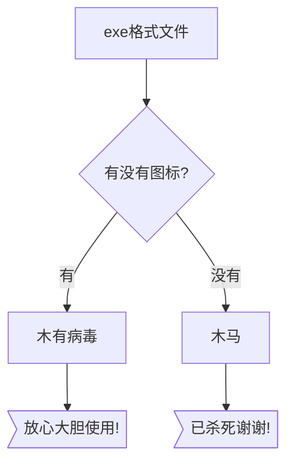

# 问题
- 日常写的Python小工具，使用pyinstaller打包成exe，被360当成木马。


# 解决方法
- 为小工具制作图标，可使用如下代码：
```python
# 先安装图片处理库：pip install Pillow
import os
import sys
from PIL import Image
img = Image.open('test.png')    # 图标的原图
img.resize((512,512),Image.ANTIALIAS).save('icon.ico') 
```
- 重新打包生成exe文件，使用以下命令：
```batch
rem 可自选-F -w参数
pyinstaller -i icon.ico XXX.py
```

# 结果
- 使用360查杀新的exe文件，确认无误！


# 原理
- 360的病毒排查核心逻辑如下所示

- 另：如果开发环境中不幸存在360，请在pyinstaller打包时完全退出360，否则会引发Permission denied错误（包括管理员模式）。
