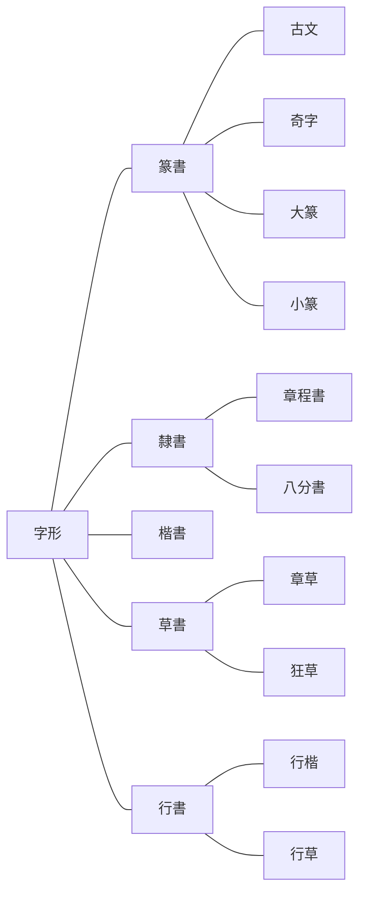
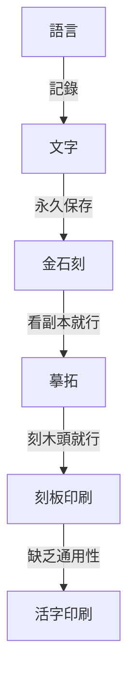

# 呂著中國通史·上（文化史）

> 2022/3/19 -> 2022/4/27

## 緒論
- 歷史作用：搜尋史料->加以分析->驗證今事->推測未來
- 從智人起，人類主要為文化進化，而非生物進化
- 文化是人類控制環境的工具，因此環境相似的人群文化也相似
- 人類因為感覺遲鈍，造成歷史一治一亂交替出現

## 第一章 婚姻
- 男女關係發展：毫無禁忌->僅限同輩->禁止親族(氏族)->唯一配偶多情人->必須同居->一夫一妻
- 先史男女地位

類型|男|女
--|--|--
遊獵|負責掠奪|作為掠奪交換品
畜牧|負責掠奪|管理牧群
農耕|附屬品，勞力|掌握經濟主權

- 貞操源於奴隸需忠實的要求
- 伴娘來源於媵，伴郎來源於御
- 人類本性多婚，法律道德壓迫之下，演變出通姦與賣淫
- 部分原始宗教保留先世風俗，與後世不符，被目為邪教，如私有財產未形成時的群體淫亂
- 家庭制度的積弊造成男女不平等，社群制度是女性解放的根基

## 第二章 族制
- 兄終弟及源於母系氏族的舅權制，兄弟同氏族而父子不同族
- 封建制由父系的宗法衍生而來
- 人類互助由合作轉為分工，分工使部分人優先富裕，服務婚轉為買賣婚，建立父權家庭
- 氏族時代的知識技術輩輩相傳，因此尊祖崇古的觀念自然產生，與倫理道德無關
- 國家體制不鼓勵氏族做大，經濟原因也要求家庭分化
- 家庭制度下，古代勞力重於資本，人多可致富，今日則返貧
- 愛家的倫理觀念也是制度所需的洗腦
- 春秋前姓氏區別

姓氏|別稱|改變|稱謂|說明
--|--|--|--|--
姓|正姓|不可|女稱姓|母系氏族的稱號
氏|庶姓|可|男稱氏|同姓中分支的稱號

## 第三章 政體
- 亞里士多德氏族社會角色

角色|參政權|源出|有決定政權
--|--|--|--
君主|有|貴族中的最高首領|君主
貴族|有|平民中的掌權者|貴族
平民|有|戰勝氏族的普通人|民主
奴隸|無|戰敗氏族成為俘虜|
農奴|無|戰敗氏族僅收貢賦|

- 古代的國指諸侯的地盤；家指士大夫的地盤；社稷或邦近似今日國家的概念，國衍生出邦意主要因為避諱劉邦
- 中國君主主要由族長演化而來，繼承法為母系的兄終弟及或父系的父死子繼；周召共和為貴族制；有民主制，如大詢於眾庶之法
- 郡原為縣的下級區劃，因為用於屯兵，逐漸成為縣的上級。秦始皇的36郡均需屯兵
- 項羽分封十八路諸侯，有互相稱王之意，並非項羽獨斷
- 韓信等異姓王被誅，因思想上的慣性，無法想象劉邦可以皇帝之名滅諸侯，即周天子從無滅國的先例，故未設防而敗
- 民主制度消亡的原因
  - 地域過大，會議召集不便
  - 少數人已形成專權
  - 大眾不團結，無從糾正專權者
- 平民本無效忠君主之義務，只有貴族應效忠。後世此點被擴大化加以利用

## 第四章 階級
- 最初，國人為征服民族，野人為被征服民族，後來區別逐漸消失
- 最初的士從軍隊產生，所以戰士和士大夫均為士
- 古代階級破壞的原因
  - 貴族嬌縱自亡
  - 一國破敗全部轉為平民
  - 各階級間通婚無嚴格限制
- 奴：男奴隸；婢：女奴隸；臧：奴與平民之子；獲：婢與平民之子
- 封建時代的武力優勝主義，逐漸被資本時代的富力優勝主義取代
- 封建時代的中層分為兩派：近文成儒，近武成俠。實為孔墨兩家欲拉攏的社會群體。文臣極致如蓋寬饒，武士極致如李廣，魏晉後皆絕跡。而文臣偏狹，武士濫殺，絕跡亦不足惜
- 資本時代的土地私有，使農奴也變為奴隸
- 東漢末年產生了部曲階級，直至宋朝。部曲地位介於奴隸與平民之間。部曲女子稱客女。
- 門閥階級：源於封建貴族階級，漢朝被壓制，魏晉崛起，至五代沒落。沒落原因：
  - 世族已無實力
  - 與庶族通婚或賣家譜
  - 隋廢九品中正制，改為科舉
  - 唐末大亂，家譜散佚
- 異族階級：金以前，異族仰慕中國文化，主動融合；金開始剝削漢人，形成階級
- 階級的形成，根源只有武力和經濟兩種。種族並不是形成階級的原因，利益差別的作用遠大於體質差別。
- 以前的階級相去不遠，今日懸殊巨大，中產階級成為不穩定狀態，不能成為階級。消滅階級和階級鬥爭由今日產生，風險極大。

## 第五章 財產
- 各重要經濟時期

名稱|起始|轉折|消亡|說明
--|--|--|--|--
大同|上古以前|黃帝時期|東周前|大概上古以前存在。財產部族公有，無私產，故無工，商僅限與外族的簡單易物或討要。
小康|黃帝時期|東周|新朝|黃帝時期即始小康。出現私產，出現士，工商無大利，精神上開始自私。社會的舊組織崩潰，而人們仍覺不妥，仍追求徹底改革。
亂世|東周|王莽後|清末|東周已是亂世。王莽後人們認可了新常態，不再反抗。
近現代|西力東侵|清亡|至今|經濟已與世界相通，民生與民族問題合一。

> 井田制更像是孟子意淫的產物。以本書觀點，私產在部族時期並不存在，井田耕作分公田和私田則與之矛盾；井田類似十稅一，更像是國家已形成後的想法

- 人類聯合的方式：一為通力合作；二為劃清界限後共享，方式包括交易與掠奪
- 農業社會的文化和富力最高，但易被遊牧等民族征服。征服者在軍事上佔有，而在文化上因落後反被同化。
- 小康至亂世的經濟變遷
  - 人口增加，土地兼並
  - 公有的山澤變為私有
  - 工業進化使工匠出現致富機會
  - 商人更加活躍
  - 放貸者從國君擴至任何富人
  - 貨幣更加進步，儲蓄過剩的情況消失
- 亂世前形成三類人
  - 大地主：佔有農田或佔有山澤
  - 大工商家：包括工業家及大商人
  - 子錢家：放貸者
- 西漢人物仍在謀求徹底變革，造福被統治者，但總妄圖靠統治者發動，因此均失敗
- 拯救亂世兩家：儒家提倡平均地權，恢復井田制，如董仲舒；法家提倡節制資本，國營支柱產業、重大商業、金融業，如桑弘羊。王莽綜合了儒法兩家，欲徹底改革經濟制度。
- 王莽後的三次平和改革：晉的戶調式，北魏的均田令，唐的租庸調法。然實行程度很可疑，即使實行也至多一段時期內使貧民略得平均，無法持久。其後再無平均地權的政策。
- 物價控制
  - 戰國-李悝：平䨀法
  - 漢宣帝-耿壽昌：常平倉。民間谷物市場興盛後失效
  - 隋文帝-長孫平：義倉。主動隨喜募捐。類似的有後周惠民倉、宋廣惠倉
  - 北宋-王安石：青苗法。本意好，選錯了推行機關
  - 南宋-朱熹：社蒼。以社為範圍救濟借貸，治標不治本，且久亦失控
- 中國自古主張均貧富，而方法不對。主導的儒家只知平均地權，從未著手法家的節制資本。儒家過分希冀明君管好一切，而現實因大一統國土廣大，即使有明君也無能為力，故一直失敗。

## 第六章 官制
- 官制複雜：官多；老變；變得沒道理
- 人的見解總是落後於時代，因此制度一定下來即不適用
- 官制六時期
  - 周以前的列國時代
  - 秦及漢初，三公九卿，尚書職權漸重
  - 至唐朝，三省六部
  - 唐中葉至宋，官名與爵祿相關，與具體職務脫鉤
  - 元明清，三省漸虛，六部做實
  - 清末至今
- 內官分事務，宰相綜合統管；外官分地界，管理所有事務。
- 翰林在唐初純為藝能之士，唐中參與政務。明中六部官員均自翰林出。
- 胥吏即今之公務員，實際處理各類政務。地位太低不思進取，但求無過照例行事，因不可或缺而唯利是圖。
- 官品起於南北朝，宋確定正從九品。
- 官俸微薄，下級公務員尤甚，此為貪污腐敗之源。

## 第七章 選舉
- 三代以前，士以下選舉，以上世襲
- 漢初布衣將相，世襲告終
- 漢以後入官之途
  - 征召：天子仰慕直接聘請
  - 辟舉：相府等機關自主聘用
  - 薦舉：內推
  - 吏員：由吏升為官
  - 任子：官二代蔭子
  - 專業技術人員：外聘或自行培養
  - 捐納：買官
  - 學校
  - 科舉
- 九品中正制問題：量德不量才，非政治所需；中正無法公正評判，礙於喜好、恩仇、威脅等諸多因素。最終只可選出門閥士族
- 科舉開取士的另一途徑，而宋後成為唯一途徑
- 科舉之弊
  - 學非所用
  - 僅考察一時的應試能力
- 科舉改革：范仲淹改革；王安石熙寧貢舉法
- 王安石變法失敗後，為平衡兩派考生而經義詩賦同時考察。明清科舉全部考察，實際上無人能通
- 賣官起自漢武帝
- 外官僚屬自行招聘，多為本地人，功曹負責，隋廢由吏部負責。

## 第八章 賦稅
- 井田：平正之地；畦田(圭田)：崎嶇之地
- 賦稅隨政務發展而增加，本是合理之事，而多數增稅均不察情勢
- 漢田租正稅十五或三十稅一，但還有私租，如王莽十稅五。其外有算賦，即人口稅
- 鹽鐵之類間接稅不被接受，未能盛行
- 戶調法：起源於曹操，晉平吳後成定法。替代了算賦和各類不定期橫征，改現金稅為實物稅，官方按各戶情況授田，定期繳納
- 農民所缺，一錢二物三勞力。役法如正確使用，可有益於公，無害於民
- 在官庶人(吏)
  - 府：看守財物
  - 史：記事
  - 胥：高級腦力雜務
  - 徒：跑腿的，體力雜務
- 雜稅：田租、口賦、力役以外的賦稅

## 第九章 兵制
- 兵制八期
  - 征服之族全民皆兵，被征服之族部分民兵制
  - 戰爭增多，全部全民皆兵
  - 秦天下一統至五胡亂華，罪人及異族為兵，中央失權後出現州郡兵
  - 五胡亂華末至唐，漢人兵源加入，出現部分民兵制的府兵
  - 唐末五代，府兵廢壞，出現藩鎮之兵
  - 宋，募兵制
  - 元明，元朝特殊兵制，明朝東施效顰
  - 清，整體腐敗，中葉曾建強大陸軍，但跟不上時代
- 春秋時，各國用兵最多數萬，至戰國則斬首動輒數萬。比為由部分民兵制轉為全民皆兵的體現
- 民兵制在光武帝時被破壞，開始外強中弱，邊兵強內地弱。漢末軍閥擅權，積久必驕奢淫逸，故使五胡亂華。兵權一直不在漢人手，故長期難以恢復
- 五胡亂華前，北方文明南方彪悍，其後反之
- 漢朝多數用本國兵，唐朝多用番兵。唐武功成就雖大於唐，軍事實力實不如
- 唐廢壞府兵制(平時為農，田產無稅，閒時為兵，兵馬自備）重用異族雖減輕人民負擔，卻導致安史之亂，甚至間接影響宋的武力養成
- 兵制上策應守在四夷，類似都護府監管鎮撫而防患未然，在本國之外。中策為本國之內經營邊境。唐朝的藩鎮為下策至無策，實為對四夷已失控。
- 宋改為募兵制
  - 優點：接收教化社會無賴；使農民專心種地
  - 缺點：兵力漸腐敗；番戍之制不合理；一味追求兵多
- 北方為侵略民族原因：土地貧瘠；地形平坦利於集合
- 元朝為世襲兵籍制，僅限蒙古人；明朝一定程度模仿之，使兵二代成為特權階級，而迅速腐化
- 戰爭是社會的變態，變態原因消失則戰爭結束。因此武力無法持久，否則會隨變態原因消失而必然腐化。兵需常備是不符合客觀規律的，應為需要時產生。
- 近代的趨勢：多以西南為根據地(受中原影響較少)；恢復全民皆兵

## 第十章 刑法
- 法律的來源：社會風俗；國家對人民的要求
- 刑法簡表

常用刑名|其餘別名|組合|來源|類型|說明
--|--|--|--|--|--
劓||五刑|苗民始創|肉刑|五行屬木。割鼻
刵|馘|||肉刑|割耳
椓、宮|腐|五刑|苗民始創|肉刑|五行屬土。男割生殖器，婦則閉於宮中
墨、黥|庶勍、黥面|五刑|外族習俗，苗民始創||五行屬火。在臉上刺字染墨
臏|剕、刖|五刑|苗民始創|肉刑|五行屬金。砍雙腳。一說剕僅斬左趾
大辟、死|割頭|五刑、隋五刑|苗民始創|死刑|五行屬水。死刑總稱
鞭、笞||隋五刑|||鞭子毆打
朴、杖||隋五刑|||木棍毆打
流||隋五刑|||流放
髡|||外族習俗||剃頭
腰斬|斬|||死刑|從腰斬斷。原名斬，後被斬首借用需特指
磔|矺、辜|||死刑|裂其肢體而殺之
膊||||死刑|去衣磔之
車裂|轘|||死刑|用車磔
縊、絞||||死刑|用繩勒死。絞原為勒人的繩
焚||||死刑|燒死
烹||||死刑|煮死
脯|||食人族習俗|死刑|做成肉脯
醢|||食人族習俗|死刑|剁成肉醬
三族||||死刑|連同父母、兄弟、妻子共同誅殺
徒||隋五刑|||
凌遲|||元傳入|死刑|
充軍|||||

> 五刑：書經·呂刑、虞書·大小夏侯版本、周官·司刑、逸周書逸文

> 虧體、死刑均源於戰陣處理異族

> 隋五刑：笞杖徒流死

- 階級產生之前無利己主義，故無須教化和刑罰。法律不問人的動機，成為反社會之物
- 法典歷史
  - 李悝《法經》：最早法典，共六篇
  - 劉邦約法三章：只取秦法三章，定天下後蕭何與叔孫通相繼增至27篇，漢武帝時增至300餘篇
  - 《晉律》：陳群制新律18篇未頒行，賈充定晉律20篇而頒行。南北朝略參鮮卑法，至《唐律》仍大體沿襲。金熙宗《皇統制》合女真及舊法，仍沿古律。元用金律。《大明律》以唐律為本，《清律》又以明律為本。
  - 清末開始採用西法
- 漢始，儒家學說被摻入法典之中，融入較多公序良俗
- 晉律後幾乎無變化原因：只規定經久之事；只列出大綱

## 第十一章 實業
- 農工商為實業

### 農業
- 中國文明由漁獵起，神農時期進入農耕
- 農業進化：粗耕->精耕
  - 爰田法：先秦，按土地肥沃程度調整分配畝數
  - 代田法：漢武帝時期趙過發明，分一畝三圳三壟，圳低壟高，種於圳而漸以壟為肥，終平，次年反之。後氾勝之發明區田法，與代田法原理類似
- 農業進化阻力
  - 缺乏農學研究者或脫離實際
  - 土地變為私有制而農田受侵佔，如水利
  - 剝削使農民不願賣力
- 農學書籍：先秦漢代農書基本均亡佚，散見雜家著述。漢成帝時《氾勝之書》，南北朝賈思勰《齊民要術》，元官修《農桑輯要》，元王楨《農書》，明徐光啟《農政全書》，清官修《授時通考》
- 廣義種植外各類農業
  - 蠶桑：起於上古，齊紈魯縞漢世聞名。而地區發展不平均
  - 林業：起初為公有，後一直在破壞，從未保護且無意識
  - 漁獵畜牧：均不被重視。田獵受武事影響還定期舉行。漁業被視為鄙事。畜牧主要供給祭祀，唯養馬事關軍事交通而受重視，主要在邊地。
  - 礦業：管子載勘察礦苗(榮)之法。銅重於鐵，造兵器、寶鼎等，後漢前兵器多用銅。礦業發展南優於北，采珠玉亦屬礦業

### 工業
- 工業自古不喜奇技淫巧
  - 生活恬淡所致
  - 社會範圍狹窄，故崇古
  - 工官為國家服務，但求無過
  - 森嚴的等級規範
- 工官制度隨封建制破壞而消亡，工業基本未曾進化

### 商業
- 私產形成前的商人為部族服務，才智過人；私產形成後漸成居間優勝階級，低買高賣
- 古代定期設市，唐中葉後可隨時隨地交易
- 輕視商人原因
  - 封建制遺留的重掠奪輕生產思想
  - 商人多為賤人出身，商業無法生利。兩漢輕視其人，之後敵視其業

## 第十二章 貨幣
- 中國貨幣制度不甚完善
  - 中國經濟學說不注重交換
  - 疆域廣大難以控制
- 金屬貨幣的缺點
  - 無法禁止私鑄
  - 產量不足用
- 銅錢最初應起源於齊，主要在貴族間流通
- 自周至漢，銅錢使用並不普遍，零星交易可直接用粟易物
- 秦半兩至漢文帝開私鑄，直至漢武帝上林三官五銖，始安定
- 王莽暫時破壞後恢復，董卓破壞五銖錢，唐初開元通寶錢復定，但不久私鑄又起
- 宋產生交子，來源於飛錢(兌換券)
- 紙幣的貶值導致銀錢復起，明宣宗起銀兩為正式流通貨幣。明清皆受銀銅並行之害

## 第十三章 衣食
### 飲食
- 食物來源：鳥獸肉；草木；魚類
- 神農本草經為最早探究草木性味之書
- 六畜：馬牛羊雞犬豕。馬牛主交通耕作，羊貴重，常食雞犬豕。古代畜養，男犬女豕，狗漸少而主食豬
- 茶來自於荼字，唐朝盛行，至宋時未全民普及，煎茶而非泡
- 外來輸入食物：蔗糖唐太宗時自摩揭陀引入，之前為米麥製的飴。菜類如苜蓿，果品如西瓜
- 中國烹調世界第一，奢侈亦是

### 衣冠
- 衣服材料最早用皮草，後發明絲麻取代。木棉至元才普及全國
- 取暖衣裘，窮人衣褐(毛織品)。庶人可衣犬羊裘，絲綿最貴。
- 衣服緣起先下後上，先前後後，然非以裸露為恥，而是用於裝飾
- 短褲為褌，長褲為褲，貧者無褲而仍有褌。褲襠縫合為窮褲，一般不縫，以裳蔽之。韍僅蔽前，裳前後皆蔽
- 上衣短者為襦，長者為衫，額外加棉為袍
- 冠以冕最尊，次之為弁，後為冠，庶人用巾(類野人之帽)，覆髻為幘。冕弁用簪而冠不用
- 脫帽握手源於歐洲中古，免胄知敵我，握手知無兵
- 襪(韤)最初革製，襪外為屨。偪為綁腿，在襪內
- 深衣為上衣下裳縫合在一起。理論庶人禮服，士大夫平居服，實際廣泛使用
- 服飾的社會屬性使之總體大同小異，且逐漸趨同
- 中國服飾大部分自行進化，僅靴來自胡服，起自趙武靈王，唐中葉盛行
- 染色技術未盛行前，不忌諱白色衣服

## 第十四章 住行
### 建築
- 上古住居為巢居和穴居。溫熱地築巢抽梯，幹寒地營窟穴居
- 穴居種類
  - 天然洞窟
  - 鑿出窟窿而居，為穴居
  - 自堆土窯而居，為復。漸進化為版築
- 古人最初湖居，藉水以自衛。後藉山，最後人工築墻，是為郭。長城屬於郭，為抵禦小波寇盜最經濟的方式
- 修築長城時期
  - 戰國秦：齊南防淮夷，秦趙燕北防匈奴，秦始皇連結為一
  - 隋：北防突厥
  - 金：防其餘遊牧民族
  - 明：北防蒙古，現主要遺跡
- 古代房屋：士大夫之居，前堂後室左右房；平民之居，少一堂，以室為堂，以房為室
- 中國建築以土木為材，造樓技術差，因此向平面廣大發展，總體不算發達。建築落後原因
  - 政治比較清明，反對大興土木
  - 迷信不深，祭壇臨時設地，無固定場所
  - 經濟相對平等
- 苑只有草木，囿兼有禽獸。園原為果園，發展為園林

### 器用喪葬
- 古人家具主要為床與几，西域胡床傳入後有桌椅
- 古人生火取暖，土炕應自女真傳入
- 墨家主薄葬，儒家反對，然仍比流俗薄。火葬隨佛教傳入，僅風靡一時

### 交通通信
- 交通運輸肉體，通信運輸思想
- 西北陸路交通發達，東南水路交通發達
- 大車牛拉用以運輸，小車馬拉為兵車或人乘，人力車為輦
- 國中路為馳道，田間路為阡陌。道路失修後(宋以後為甚)，騎馬漸盛行。水路交通逐漸比陸路交通發達
- 道路之壞使經濟重心轉為沿海，而陸路交通多用人力。山行用轎，南宋始用於平地
- 魏晉商賈興盛而發展出逆旅，取代了之前官營住所
- 通信使用郵驛，然僅限投遞公文。民間寄書須遣專使或託人
- 交通起於陸地，進及河海大洋，再返回陸地，是必然的路線

## 第十五章 教育
- 古代貴族小學教育
  - 三德：至德、敏德、孝德，師氏授
  - 三行：孝行、友行、順行，師氏授
  - 六藝：禮、樂、射、御、書、數，保氏授
  - 六儀：祭祀、賓客、朝廷、喪紀、軍旅、車馬，保氏授
- 大學教育：春秋禮樂，冬夏詩書，與宗教關係密切
- 學校名稱

年代|小學|大學
--|--|--
夏|校|學
商|序|學
周|庠|學

- 平民教育偏重於道德，實際技能來源於實習，古稱宦
- 東周教育移於私家，出現諸子百家
- 後漢因重儒學使學校空前絕後興盛；魏晉始成花瓶；隋唐成為選舉的一途，不提倡學術教化，且明分階級
- 文翁為提倡學術的少見案例；王安石提議科舉取士，國家養士；朱元璋極其重視學校
- 中國無宗教意義的孔廟，實際均為學校
- 凡事國營弊端(僅小國寡民可行，國大社會複雜不可行)
  - 國家不可勝任繁重職務，因此辦事有名無實
  - 無法盡知社會的需要，因此辦事頑固守舊，阻礙進步
- 唐五代民間研究學問機構興起，為書院。自主辦學，能真正研究學問。
  - 四大書院

名稱|位置|興建年代|興建者|備註
--|--|--|--|--
白鹿|廬山白鹿洞|南唐升元||
石鼓||唐元和|衡州守李寬|《玉海》非四大
應天||宋真宗|曹誠|
嶽麓||宋開寶|潭州守朱洞|
嵩陽|登封縣大室山|五代||《通考》非四大

## 第十六章 語文
- 以語言表示意思，以文字表示語言。最初象形文字並非如此，後漢字演化出形聲
- 六書：漢所總結的文字構造之法

名稱|類型|典型字|數量|說明
--|--|--|--|--
象形|造字法-文|日月山水火子|少|畫成一種東西的形狀，需進行抽象，否則僅為圖畫文字
指事|造字法-字|上下|少|指示其物的所在。事意物
會意|造字法-字|信武|少|合成兩個字。會意合
形聲|造字法-字|鞅洋氧恙|多|表意與表聲兩部分結合
轉註|非造字法-文字增加|考-老、夥-多|少|多個字同一意思，源出也類似
假借|非造字法-文字減少|難(本指鳥)久(本指針灸法)|少|借用同音字，不再新造

- 書體變遷

名稱|別名|從屬|說明
--|--|--|--
篆書|||古代文字流傳至秦漢，刻在簡牘上，用圓筆
隸書|||秦官獄多事，令徒隸佐書變異而得，用方筆
楷書|真書、正書||正式書寫所用
草書|||用於起草，自然產生無發明權。張芝始創狂草，脫離實用
行書|||草書脫離實用後，代為起草的書體
古文||篆書|大篆之前，自古流傳的文字，《史籀》15篇以外
奇字||篆書|古文的一部分，說不出字形構造之由
大篆|籀文|篆書|周以前通行的字，見《史籀》15篇
小篆|秦篆|篆書|秦以後通行的字，李斯、趙高、胡毋敬制定
章程書||隸書|舊派隸書，無挑法，漸發展為真書(楷書)
八分書||隸書|新派隸書，有挑法
章草||草書|字之間分開的草書
狂草||草書|字互相連結的草書，張芝首創
行楷|真行|行書|比楷書潦草一些
行草||行書|比草書莊重一些

- 春秋戰國為造字高峰期，因此七國文字異形。確立一字一音、單字發展為多字，為文字重要進化，成為語言的代表
- 漢字先造文字，再與語音結合，不適合用拼音。拼音適合文字學習自其餘先進民族者使用
- 生活是最大的教育。除少數學者外，讀書對於其人格的關係，是很少的
- 採用中國文字的方法
  - 全盤使用。如朝鮮，而與語言不通，仍需另造諺文以應用
  - 用偏旁造字。如契丹大字，採隸書半字增損創造，而不能通行，後參照回紇創契丹小字以實際應用
  - 借漢字而自造音符。如日文，較為方便，故用至今
- 各族文字
  - 回文：拼音文字，不知出於猶太、天主教還是大食
  - 藏文：拼音文字，出於印度
  - 蒙文：拼音文字，初用回文，後八思巴據藏文造字
  - 滿文：拼音文字，據蒙文
  - 倮儸(彝族)：象形文字
- 印刷流變

## 第十七章 學術
### 學術思想
- 學術思想三大時期
  - 上古至漢魏
  - 佛學輸入至清亡
    - 佛學時期
    - 理學時期
  - 西學輸入後
- 先秦諸子學術來源
  - 古代宗教哲學，較輕
  - 各社會官守，更重
- 諸子思想來源
  - 農家源於遠古農業部族的思想
    - 君臣並耕，政府無權
    - 物論量不論質
  - 道家源於反對遊牧侵略的思想
    - 老子行文古，女重於男
    - 主張以柔克剛
    - 主張無為
  - 墨家取法夏王朝思想
    - 墨學出於清廟之守(祭祀禮儀)，可見較古學說
    - 貴儉因夏值水災之後
    - 天志明鬼因夏迷信較深
  - 儒家陰陽家思想綜合上古至西周所形成
    - 儒家三統之說三代循環，陰陽家五德終始說，均為根據時局選擇治法
  - 法家根據當前政治形勢所產生的思想
    - 裁抑貴族，推翻封建
    - 富國強兵，統一天下
  - 名家專講高深玄遠理論，縱橫兵家僅用於單專業

> 個人觀點：從農家到法家的順序恰好對應從右派到左派

- 儒家思想
  - 六經：詩書禮樂，為大學課程；易為原理，春秋為方法。易分言理派(近於先秦哲學)和言數派(術數之學，古文易均為此)
  - 益處：個人修養。理智上中庸，感情陶冶有禮樂，知天命，推己及人等
  - 害處：只傳小康不傳大同，追求小康導致專制
  - 儒家整體功過相抵，然亦形勢所成
- 儒學傳承
  - 漢武帝時八家
    - 詩：魯申培公、齊轅固生、燕韓太傅
    - 書：濟南伏生
    - 禮：魯高堂生
    - 易：菑川田生
    - 春秋：齊魯胡毋生、趙董仲舒
  - 東漢十四博士
    - 詩：齊、魯、韓
    - 書：歐陽、大小夏侯
    - 禮：大小戴
    - 易：施、孟、梁丘、京
    - 春秋：嚴、顏
  - 出現古文派，又出現以王肅為代表的偽古文派，偽造《孔子家語》
- 儒家已不適應時代發展，因此藉口古文研究引入其他理論，拋棄師承另成一派。實際今文經與古文經並無思想的不同
- 鄭玄等刻意追求博學，而理論其實不通，消遣功用大於救世。此風起於西漢中，盛於東漢，隋唐猶存。如章句、義疏
- 魏晉玄學反對拘泥事跡的儒家，混合儒道而重視原理，屬於近似且兼採道家的儒家。功勞為去除了拘泥形式之弊，但其本身並無實際可執行的方案
- 佛教以宗教輸入，而亦含學術。有較多實行標準，故能興起
  - 佛滅百年後小乘興，又五六百年大乘出
  - 有情十等：四聖-佛、菩薩、緣覺、聲聞，六凡-天、人、阿修羅、畜生、餓鬼、地獄。六凡成六道輪迴，畜生、餓鬼、地獄為三途
  - 小乘佛即釋迦摩尼，大乘佛有三身：報身(本人)、法身(自然力，感知萬物)、化身(變化為各種形態)
  - 六識：色聲香味觸法，第七識末那(有我)，第八識阿賴耶(由第七識生，須滅盡)
  - 認識世界的方法錯誤，故世界根源問題無法回答，成佛後自知
- 佛教宗派

宗派|別名|組合|說明
--|--|--|--
天台宗|性宗|教下三家|就識本身闡發
惟識宗|相宗|教下三家|由相闡發萬法惟識之義
華嚴宗||教下三家|描述菩薩的樣子以供模仿
禪宗|||不立文字，直指心源，專靠修証。因教下三家繁瑣而禪宗獨勝，因修習禪定而為有閒階級獨有。流行於上流社會
淨土宗|||阿彌陀佛接引往生淨土，有不墮落的低保。修習簡易：觀、想、持名(念佛)。流行於下流社會

- 佛教以消滅社會為解決社會問題之法，宋明理學反之而生，以唯物反唯心
- 理學
  - 自創宇宙觀人生觀
    - 周敦頤：太極生兩儀，化五行，成萬物，保持中正以配太極。著太極圖說、通書
    - 張載：萬物原質為氣，疏密成隱顯，迎距生好惡。人有義理之性不受制於物質，氣質之性受制於物質，應變氣質以和義理。著正蒙、西銘
    - 邵雍：術數之學，主要研究自然現象的規律，不被視為正宗。著觀物內外篇、皇極經世書
  - 實行方法
    - 程顥：識得此理，以誠敬存之
    - 程頤：涵養須用敬，進學在致知。致知在格物，即窮其理
  - 格物問題
    - 陸九淵：先發其本心之明
    - 朱熹：讚同程頤
    - 王守仁：良知，洗除障翳
  - 吸取佛學內容
    - 嚴於律己
    - 理論的徹底
    - 過於注重內心修養，疏於學問與行事
  - 反對者
    - 永嘉、永康派：反對疏於實學
    - 清代顏元、李塨：只講實學不修內心
    - 戴震：捨理而論情
    - 理學反對者均難自圓其說，因此一家獨大
  - 清考證學
    - 清代學術只是方法運動，不是主義運動
    - 考證學實為理學一支，傳承講究讀書的程朱派
    - 功績：研究漸深，日趨客觀
- 近代
  - 西學起於自然科學，推及社會科學
  - 各民族傳統均有糟粕，且壞得相像，均需新學術以改變
  - 風俗的薄惡因社會組織的不良，非改良道德政治可變

### 文學
- 文源於語言
  - 先有韻文，後有散文
  - 散文興起於東周，盛於西漢。散文能說明意思，是文學的一大進步
  - 西漢末開始追求美化，至齊梁而浮糜不能達意
  - 唐朝韓柳改革，以古文語法用今人言語
  - 宋散文發達，駢文謂之宋四六
- 詩源於歌謠
  - 吟誦的詩與合樂的詩分離，實為詩體的進化
  - 音樂的變化造成詩體的變化
- 作品的社會性體現
  - 積極：直接宣揚正能量，如屈原杜甫
  - 消極：流露負能量，如王維孟浩然，其積極作用：
    - 揭露社會陰暗面
    - 使惡勢力能有所減少

### 歷史
- 最早左史記事，右史記言(尚書)，小史記世系
- 魏晉南北朝專設史官，依賴國家出錢，實質仍為私人編修
- 唐以後集眾編纂正史
- 宋代史學突飛猛進
  - 一人獨成一史：歐陽修《新五代史》、宋祁為主的《新唐書》
  - 編年史：司馬光《資治通鑑》、朱熹《通鑑綱目》
  - 典章經制：馬端臨《文獻通考》
  - 網羅古今：鄭樵《通志》
  - 當代史料：李燾《續資治通鑑長編》、王偁《東都紀略》等
  - 周以前古史：劉恕《通鑑外紀》、蘇轍《古史考》、羅泌《路史》
  - 外國史：葉隆禮《契丹國志》、孟珙《蒙韃備錄》
  - 考古學：起於宋，歐陽修《集古錄》、趙明誠《金石錄》
  - 史事考證：倪思《班馬異同評》等
- 元明史學復衰。清朝文字獄不言史事，因考據盛行而有糾錯之功
- 中國史學偏重政治史，尤其重於理亂興衰(正史紀傳、編年體)、典章經制(正史志、通典通考類)
- 研究史法著作：唐代劉知幾《史通》、清代章學誠《文史通義》

## 第十八章 宗教
- 學問研究旨在解決部分問題，宗教旨在解決全部問題，因此不分時間地域均會產生。因信仰不可改變，經一定時間證偽後，遂成為迷信
- 《周官》神靈分類
  - 天神：天子祭祀
  - 地祇：諸侯祭祀
  - 人鬼：主要是祖宗
  - 物魅
- 歷來民間最重要典禮為社祭，人民只崇拜與自己關係近的神。中國天子不管細務，因此成為多神教，與一神教中一神管萬事並無實際區別
- 泛神論與無神論實際也無本質區別
- 術數：天文-數、曆譜-數、五行-數、蓍龜-術、雜占-術、形法-數
  - 術：壓勝咒詛占卜等神秘學
  - 數：根據所見所感推論原因
- 漢武帝時方士
  - 一派煉丹求仙追求長生，傳承自東周方士，後逐漸失信於上層社會，轉向民間，終成黃巾起義。煉丹耗資故推向貴族，推平民改為符水
  - 一派祭祀山川神靈以求福，傳承自上古宗教，漢元帝後多被廢除
- 道教
  - 道教源於術數及神仙家
  - 北魏寇謙之使道教上升為國教
  - 道教始祖可能是張脩，張魯冒之，以祖父張道陵為始祖
- 佛教盛行原因
  - 輪迴說受歡迎
  - 只修個人不涉政治，得以扶植
  - 中國缺乏大宗教，故先入為主
- 伊斯蘭教
  - 別稱回教、清真
  - 元代盛行輸入，從未流行
  - 回族因宗教結為一個民族，是獨一無二的
- 明教
  - 原波斯國教，別稱摩尼教、火教、胡天、祆(音先)教
  - 南北朝傳入，流傳至南宋
  - 吃菜事魔
- 基督教
  - 唐太宗時波斯人阿羅本(Olopen)傳入。別稱景教
  - 元朝時隨蒙古再輸入復絕，明中葉後又輸入
  - 清朝一度被朝廷禁止
- 猶太教
  - 別稱一賜樂業教(以色列)、挑筋教
  - 約五代漢時輸入，宋時建寺
- 宗教除了精神安慰，也會協助解決實際生活問題，因此廣為流傳
- 宗教常做為政變的工具，如張角、孫恩、太平天國
- 中國整體不甚迷信宗教，因儒學盛行之故
