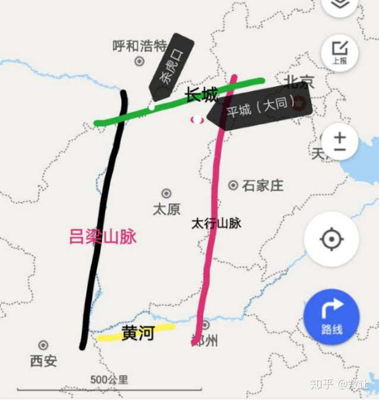
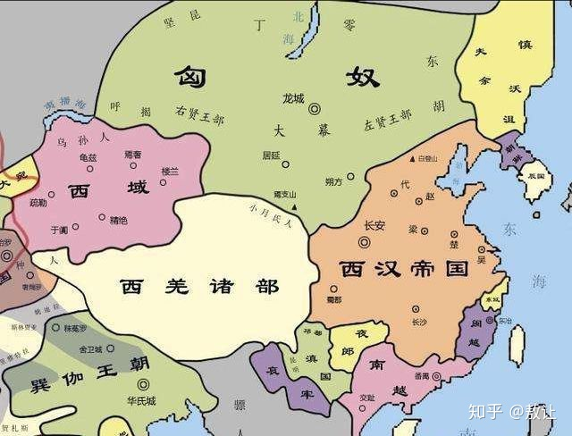

**白登之围：陈平秘计的秘密**

原创： 敖让 读史悟道 前天  

【材料】《资治通鉴》汉纪 太祖高皇帝  

温馨提示：文章不短  
上居晋阳，闻冒顿居代谷，欲击之。使人觇匈奴，冒顿匿其壮士、肥牛马，但见老弱及羸畜。  
使者十辈来，皆言匈奴可击。上复使刘敬往使匈奴，未还；汉悉兵三十二万北逐之，逾句注。  
刘敬还，报曰：&quot;两国相击，此宜夸矜，见所长。今臣往，徒见羸瘠、老弱，此必欲见短，伏奇兵以争利。愚以为匈奴不可击也。&quot;  
是时，汉兵已业行，上怒，骂刘敬曰：&quot;齐虏以口舌得官，今乃妄言沮吾军！&quot;械系敬广武。  
​汉悉兵三十二万北逐之，逾句注。帝先至平城，兵未尽到；冒顿纵精兵四十万骑，围帝于白登七日，汉兵中外不得相救饷。  
帝用陈平秘计，使使间厚遗阏氏。阏氏谓冒顿曰：&quot;两主不相困。今得汉地，而单于终非能居之也。且汉主亦有神灵，单于察之！&quot;  
冒顿与王黄、赵利期，而黄、利兵不来，疑其与汉有谋，乃解围之一角。  
会天大雾，汉使人往来，匈奴不觉。陈平请令强弩傅两矢，外乡，从解角直出。  
帝出围，欲驱；太仆滕公固徐行。至平城，汉大军亦到，胡骑遂解去。  

【译文】​皇帝在晋阳，听说冒顿在代谷，想攻打他。便派人侦察匈奴，冒顿把他的勇士、肥壮牛马都藏起来，但见年老体弱的士兵及瘦弱的牲畜。  

使者十多次回报，都说匈奴可以攻击。皇上又派刘敬出使匈奴，还没回来；刘邦率领全部兵力三十二万向北追击冒顿，已经越过了句注山。  

刘敬从匈奴处回来，报告说：&quot;两国交战，这个时候应该炫耀武力，展示优势。如今我去匈奴营帐，只看到老弱病残，这一定是冒顿故意示弱，暗中埋伏奇兵来争利。我认为这仗不能打。&quot;  

当时，汉军已经在路上，皇上发怒，骂刘敬说：&quot;你一个齐国降臣，靠着嘴巴做了官，如今竟敢胡言乱语乱我军心！&quot;于是把娄敬押送到广武。  

汉朝出动全部兵力三十二万北击匈奴，越过句注山。皇帝先到了平城，后续步兵还没有到；冒顿指挥四十万精锐骑兵，将皇帝围困在白登七天，汉军内外不能相互救援供应。  

皇帝用陈平的秘计，派使者秘密地贿赂阏氏。阏氏对冒顿说：&quot;两位君主不互相围困。现在即使得到了汉朝的土地，而单于终究是能留下来的。况且汉朝的君主也有神灵庇佑，请单于明察！  

之前，冒顿与王黄、赵利有约定，而王黄、赵利的军队迟迟不来，冒顿怀疑他们与汉朝有勾结，于是把包围圈打开一个缺口。  

适逢当天大雾，汉朝派遣人员往来试探，匈奴不能够发现。陈平请求刘邦下令，让所有弓弩手都搭上两支箭，面朝外环绕着刘邦，从包围圈的缺口径直走出。  

皇帝突出包围圈，想策马奔跑；太仆夏侯婴执意驱车缓行。到了平城，汉朝大军也赶到了，匈奴骑兵便解围离去。  

【解析】这段材料可以说的太多了，我甚至能根据这段记载写上一本书，由于时间有限，我挑大家一直疑惑的说：  

**为什么冒顿白白的放过了刘邦？**

从汉朝的史料记载来看，是因为陈平的&quot;秘计&quot;扭转了形势，让冒顿主动打开包围圈放刘邦跑路。  

那么，这&quot;秘计&quot;到底是什么？这个只有当事人才知道，已经无法证实了。史家说的贿赂阏氏，恐怕只是部分事实，通过先前的文章，相信读者们已经对冒顿有了初步的了解，冒顿单于不是那么好忽悠的。  

**我们先来看看阏氏对冒顿说的话：**

帝用陈平秘计，使使间厚遗阏氏。阏氏谓冒顿曰：&quot;两主不相困。今得汉地，而单于终非能居之也。且汉主亦有神灵，单于察之！&quot;  

这话主要表达了三个观点：  

1.两主不相困  

2.单于终不能居汉地  

3.汉主亦有神灵  

一、两主不相困  

关键词在哪里？关键在&quot;相困&quot;，什么意思？意思就是这个时候，不仅刘邦遇到困难了，冒顿单于也遇到困难了。  

刘邦遇到什么困难？大家都知道，刘邦冒进，跟先头部队一起被人包饺子了，跟后来的马谡一样。  

那冒顿有什么困难？冒顿的困难是把刘邦围在白登山，七天七夜还没有啃下来，这个时候会有出现什么困难？  

1.粮草上的困难  

冒顿这一次带了四十万骑兵南下，远道而来，光是在白登山就已经耗了七天，匈奴打仗是没有后勤供应的，都是士兵自己携带干粮，一般是牛肉干。这是匈奴的优势，也是缺点。优势是来去如风，千里转战。缺点是不能持久。  

试想：从草原来要时间，又围了刘邦七天，回去也要时间，而一个作战骑兵，能够带的干粮是非常有限的，必须不能影响奔跑骑射，人要吃马也要吃，带的干粮必然很少，吃了这么久，差不多了，冒顿家没有什么余粮了。  

2.战略态势上的困境  

刘邦也带了三十多万部队，以步兵为主。第一次跟匈奴对抗，因为轻敌，刘邦自己带着骑兵跑得太快，跟74军一样，和大部队脱节了，所以被围了。  

但是得注意，74军的战略是怎样的？老蒋要张灵甫中心开花。战略是没错的，就是执行人出了问题。  

刘邦的后续大部队正在赶来。骑兵打步兵靠的就是机动性，打得过就打，打不过就跑。这个时候，如果冒顿收到了消息，还死咬着刘邦不放，就失去了骑兵的机动性。  

一旦四十万骑兵，被三十万步兵结阵挡住了归路，那会被困死在山西，被汉朝源源不断的援兵围剿掉。为什么这么说？算了，先丢个图。  

山西这个地方是四塞之地，如果生逢乱世，是个搞独立的好地方。  

阎长官依托有利地形，虎踞山西，成为一方诸侯。  

自己随便画的地图哈，凑合着看。  

山西这个地方，连山带河，看看图，什么地形不用我多说了吧。  

匈奴从草原进入山西，必须从杀虎口进，杀虎口以前叫杀胡口，杀胡口什么意思？字面意思，多霸气的名字，为什么要改？走西口走的就是这里。必经之地。  

如果这个时候，汉朝大军赶到，迂回包抄，封锁杀虎口，同时封锁其他山脉的各个关隘，依托有利地形，把冒顿困在山西，诸侯王援兵不断赶来，如果你是冒顿，你会不会哭？会不会怕？  

而且这个时候，有一支军队不见了，冒顿就更害怕了，所以才觉得此地不宜久留，君子不立危墙之下。  

冒顿与王黄、赵利期，而黄、利兵不来，疑其与汉有谋，乃解围之一角。  

冒顿：tmd，这两鳖孙怎么一直不见人？是不是假投降？会不会其实是跟汉朝一伙的，故意吸引我进来山西，偷偷去把杀虎口封锁起来了？  

二、单于终不能居汉地  

这个就比较容易理解了，当时的游牧民族，还没有汉化，不像后世的五胡乱华时期、金辽蒙清时期的游牧民族一样，汉化没那么高，草原人民思维中还没有占据中原的意识，另外条件也不允许，冒顿的基本盘在草原，如果贸然在中原称王，大臣们愿不愿意？士兵们愿不愿意？又有多少人能够跟随冒顿定居中原？  

如果要经营中原，必然要把兵力和行政机构放在中原，那草原还要不要了？如果不把力量放在中原，如何能够稳住局面？如果草原没有足够力量，草原那边就要易主。能不能统治得了中原还是个未知数，如果到时候，草原那边不属于自己了，岂不是进退两难？  

所以，前期游牧民族，主要还是以掠夺中原为主，你说叫他们统治中原，对不起，没得兴趣。这就是​所谓的，终不能久居内地的意思。  

三、汉主亦有神灵  

意思就是说，汉朝皇帝也有神灵庇护，你看你，围着人家先头部队打了7天还没打下来，汉朝皇帝运气太好了，能得人心，现在你也处于困境，何必孤注一掷，和一个运气这么好的人拼运气呢，留得青山在，不怕没柴烧，再晚走可能就来不及了，只要回到草原，咱们还是最靓的仔，何必在这个危险的地方玩命，丢了小命连本带利亏得底掉，不值得。  

**综上所述，这是一个女人能说出的话吗？恐怕是陈平的意思，匈奴皇后只是转答而已。**

**所以，不光是刘邦处于困境，冒顿的情况也不太乐观，既然这样，不如大家握手言和，你回中原当你的老大，我回草原骑我的骏马。**

只是这样吗？当然不是，我堂堂匈奴大单于，控弦四十万，纵横天下，未曾受挫，现在四十万米的大刀都拔出来了，不见点血你让我怎么收回去？  

我冒顿单于不要面子的呀？  

那还能怎样？  

​《资治通鉴》  

娄敬对曰：&quot;陛下诚能以適长公主妻之，厚奉遗之，彼必慕，以为阏氏，生子，必为太子。陛下以岁时汉所馀，彼所鲜，数问遗，因使辨士风谕以礼节。冒顿在，固为子婿；死，则外孙为单于；岂尝闻外孙敢与大父抗礼者哉！可无战以渐臣也。若陛下不能遣长公主，而令宗室及后宫诈称公主，彼知，不肯贵近，无益也。&quot;  
帝曰：&quot;善！&quot;欲遣长公主。吕后日夜泣曰：&quot;妾唯太子、一女，奈何弃之匈奴！&quot;上竟不能遣。  
九年癸卯（前198年），上取家人子名为长公主，以妻单于；使刘敬往结和亲约。  

很简单  

1.和亲  

本来刘邦是想用鲁元公主和亲的，就是彭城大败跑路时，好几次被刘邦丢下车，又被夏侯婴抱回来的那个。  

但吕后死活不同意，竟然不了了之了，最后用了宗室女。到底是刘邦不同意，还是吕后不同意呢？还是都不同意？很难讲  

2.纳贡  

看看下图，匈奴的地缘政治，你觉得匈奴会缺啥？  

当然是要啥没啥，啥都缺啊。  

当然了，最缺的还是盐和铁，帝国再大，没有这两样东西，日子也难过。  

而东边也是游牧民族，具有不可调和的矛盾。要想从他们手上搞战略物资，搞不搞得到先不说，就算弄到了，价格也是黑得一笔，不死也要脱层皮。  

白登之围后，刘邦为了休养生息，采纳刘敬的建议，要嫁长公主与匈奴和亲，吕后不答应，日夜哭泣，刘邦改以宗室女为公主，嫁给冒顿单于，并派刘敬作为使者陪同前往。  

此外汉朝对匈奴开放关市，每年送给匈奴大批棉絮、丝绸、粮食、酒等。自此，汉与匈奴约定结为兄弟，各自以长城为界，两国的关系得到暂时的缓和。  

**可以说，白登之围，冒顿是最大的赢家。和亲公主，各种资源白送，还能从关市换取更多急** 需的战略物资。

如果冒顿在入侵中原之前，就是抱着要求汉朝开关纳贡的战略目的呢？  

如果冒顿最终的目的就是要求汉朝交保护费，开放关市，让他的子民过的好一点，让匈奴帝国更快的在草原称霸呢？  

那么，冒顿只有达到了目的，才会这么爽快的放刘邦一条生路。  

**为尊者讳，从结果看，我们是不是可以假设，史官是不是隐瞒了部分事实呢？**

冒顿发四十万骑兵来中原，抢劫需要带这么多人吗？人家只是来秀肌肉而已，不怕你毁约，我四条腿还怕你两条腿？等你来了我早已经抢完杀完，拍屁股走人了。  

落后就要挨打，不想挨打就要臣服，开关纳贡。  

我是佩服娄敬的，这人是个儒生，把大汉的女人送去给冒顿X，竟然可以说得这么清新脱俗，感情用的不是娄敬家女儿。  

《资治通鉴》娄敬是这么说的。  

冒顿在，固为子婿；死，则外孙为单于；岂尝闻外孙敢与大父抗礼者哉！可无战以渐臣也。  

人家冒顿单于是什么人？一言不合，老婆那是说送就送，说杀就杀，会跟你扯这些亲戚关系？就算生出个儿子来，还顺利继承了冒顿的位置，照样是该怎样就怎样，利益才是根本，有利则和，无利则战。因为人家从小在草原长大，是草原人民支持他当上单于，代表的是草原人民的根本利益。谁会跟你扯亲戚关系？不过是阿q异想天开罢了  

娄敬说这些，无非是为刘邦找一个由头，和亲的由头。不是把公主送去当人质，而是曲线救国，战略和亲。  

至于冒顿，和亲公主真假他不关心，反正随时能发兵骚扰攻打汉朝，送个假的过来正好，以后要发兵，随时可以当做借口。  

送真的公主过来也没什么用，只能确保汉朝在一些小事上守信用，真碰上大事，别说公主人质，就是太子当人质也不怎么管用。  

扯远了，话说回来  

如果史家因为利益相关，隐瞒了部分事实，实际上陈平不仅贿赂匈奴皇后，替汉朝传话，还传了一封信（议和请求）给冒顿呢？  

同一年，《资治通鉴》记载：  

帝南过曲逆，曰：&quot;壮哉县！吾行天下，独见洛阳与是耳。&quot;乃更封陈平为曲逆侯，尽食之。平从帝征伐，凡六出奇计，辄益封邑焉。  

陈平因功封侯，可见，还是陈平那边起了作用  

**最后：我认为，陈平所谓的&quot;秘计&quot;，其实就是一封替冒顿单于分析形势，并提出和谈条件的议和书。陈平的功劳，就是通过主持和匈奴议和，威逼利诱，捞了刘邦一命。**

只是，这事不太光彩，不可以上史书，所以，缺少了这份材料，让白登之围这段历史，看起来莫名其妙。  

看到刘邦被冒顿欺负得这么惨，我真的不想再写下去了，好想直接跳过这些年，直接去霍去病，直接去写陈汤，直接去写班超。  

但是历史就是历史，自有其连续性。不仅要写好的一面，也要正视不好的一面，读史以明智，读史以悟道，如果选择性失明，那看史将会失去意义。  

算了，就这样吧，越写越闹心，落后就要挨打，不想挨打就要跪着，而且跪也跪不安稳，只是暂时给你跪着的权力。  

万古如长夜，年年有今日，岁岁有今朝，手机一丢，差不多了，意思意思得了，不想再写下去了，就这样吧。  
